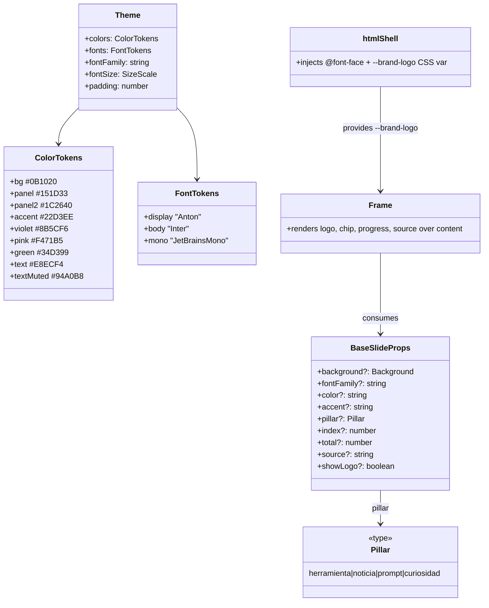

# Fundación del sistema de marca ia.es (tema, fuentes, logo, Frame)

## Requirements
- Establecer la base visual de marca del generador de carruseles, de forma puramente aditiva.
- Cargar la tipografía de marca (Anton / Inter / JetBrainsMono) embebida en el render.
- Versionar los logos de marca y mostrar el logo en todas las piezas vía el render.
- Reescribir el tema con los tokens de `design-brand.md` sin romper plantillas existentes.
- Dar a `Frame` la capacidad de pintar logo, chip de pilar, progreso (index/total) y fuente al pie.
- Mantener verde el gate (`npm run typecheck` + `npm run generate carousels/ejemplo.ts`).

## Entities

## Approach
1. Tema (tokens):
   - Reescribir `src/theme.ts` AÑADIENDO tokens nuevos y CONSERVANDO los actuales en uso (`fontFamily`, `colors.{text,textMuted,accent,bg}`, `fontSize.{title,heading,body,caption}`, `padding`).
   - Añadir `colors.{panel,panel2,violet,pink,green}`, `fonts.{display,body,mono}`, escala tipográfica ampliada (display/lead/label/code/kicker), `padding` 120. `accent` pasa a `#22D3EE`.
   - Helper `pillarColor(pillar)` → color de chip (herramienta→accent, noticia→violet, prompt→accent, curiosidad→pink).
2. Activos de marca (fuentes + logos):
   - Descargar woff2 estáticos a `src/fonts/`: `Anton-400`, `Inter-400/600/700`, `JetBrainsMono-500`. Fallback intacto si la descarga falla.
   - Crear `src/assets/` con los 3 logos versionados.
3. Embebido del logo:
   - `htmlShell` lee `src/assets/ia_es_logo_transparent.png` (async), lo embebe como data-URI en una variable CSS `--brand-logo` en `:root`. Patrón idéntico al de fuentes. Si falta el archivo, la var queda vacía y `Frame` no pinta logo (degradación elegante).
4. Frame (capa global):
   - Extender props y pintar, sobre el contenido: logo arriba-izquierda (56px alto), chip de pilar (si `pillar`), progreso `NN/MM` (si `index`+`total`), y fuente al pie (si `source`). Todo opcional; sin props nuevas el comportamiento actual no cambia.

## Structure
### Relaciones
1. `Frame` consume `BaseSlideProps` extendido y `theme`.
2. `htmlShell` depende de `fonts.ts` (existente) y de un nuevo `brandLogoCss()` (lee `src/assets`).
3. Cover/Bullet/Quote siguen envolviendo en `Frame`; al no pasar props nuevas, no cambian.
### Capas
1. Tokens: `src/theme.ts` (fuente única de diseño).
2. Activos: `src/fonts/`, `src/assets/`.
3. Render-shell: `src/render/htmlShell.ts` (+ embebido de logo), `src/render/fonts.ts` (sin cambios).
4. Componentes: `src/templates/Frame.tsx`, `src/templates/types.ts`.

## Operations

### Update Tokens - src/theme.ts
1. Responsabilidad: única fuente de tokens de diseño de marca.
2. Atributos:
   - `colors`: añadir `panel:"#151D33"`, `panel2:"#1C2640"`, `accent:"#22D3EE"` (reemplaza morado), `violet:"#8B5CF6"`, `pink:"#F471B5"`, `green:"#34D399"`; conservar `text:"#E8ECF4"` (actualizado), `textMuted:"#94A0B8"`, `bg:"#0B1020"`.
   - `fonts`: `{ display:"Anton", body:"Inter", mono:"JetBrainsMono" }`.
   - `fontFamily`: `'Inter, system-ui, -apple-system, "Segoe UI", Roboto, sans-serif'`.
   - `fontSize`: conservar `title:96, heading:64, body:44, caption:32` y AÑADIR `display:128, lead:50, label:28, code:34, kicker:40`.
   - `padding: 120`.
3. Método/export auxiliar:
   - `pillarColor(pillar?: Pillar): string` — Logic: switch pillar → herramienta/prompt: accent; noticia: violet; curiosidad: pink; default: accent.
4. Constraints: no eliminar ninguna clave hoy referenciada por Cover/Bullet/Quote/Frame.

### Update Types - src/templates/types.ts
1. Responsabilidad: contrato de props compartidas + tipo de pilar.
2. Añadir: `export type Pillar = "herramienta" | "noticia" | "prompt" | "curiosidad";`
3. Extender `BaseSlideProps` con opcionales: `pillar?: Pillar; index?: number; total?: number; source?: string; showLogo?: boolean;`
4. Constraints: todo opcional; no cambia `SlideSpec`/`CarouselSpec`.

### Update Component - src/templates/Frame.tsx
1. Responsabilidad: capa base; añadir overlays de marca sin romper el layout de children.
2. Props nuevas (de `BaseSlideProps`): `pillar`, `index`, `total`, `source`, `showLogo` (default true).
3. Methods/Logic:
   - Mantener fondo+overlay+children actuales.
   - Si `showLogo !== false`: pintar `
` posicionado arriba-izquierda, alto 56px, ancho auto, `backgroundImage:"var(--brand-logo)"`, `backgroundSize:"contain"`, `backgroundRepeat:"no-repeat"`. Va en capa relativa, no empuja children (posición absoluta dentro del padding).
   - Si `pillar`: chip (texto en mayúsculas del pilar) con color `pillarColor(pillar)`, esquina superior derecha.
   - Si `index` y `total`: badge de progreso `String(index).padStart(2,"0")+"/"+String(total).padStart(2,"0")` en `textMuted`, junto al chip o inferior.
   - Si `source`: línea al pie (`fontSize label`, `textMuted`).
   - El `children` se mantiene en su contenedor relativo actual; los overlays de marca son absolutos para no alterar el flujo.
4. Constraints: sin props nuevas, salida idéntica a la actual.

### Create Shell helper - src/render/htmlShell.ts (+ logo)
1. Responsabilidad: inyectar `--brand-logo` además de las fuentes.
2. Logic:
   - Nueva función async `brandLogoCss()`: resolver `src/assets/ia_es_logo_transparent.png` relativo al módulo; si existe, leer y devolver `:root{--brand-logo:url("data:image/png;base64,...")}`; si no, devolver `:root{--brand-logo:none}`.
   - En `htmlShell`, concatenar `brandLogoCss()` dentro del `<style>` junto a `fonts`.
3. Constraints: no romper la firma pública `htmlShell(slideMarkup)`.

### Acquire assets - fonts + logos
1. Descargar a `src/fonts/`: `Anton-400.woff2`, `Inter-400.woff2`, `Inter-600.woff2`, `Inter-700.woff2`, `JetBrainsMono-500.woff2` (woff2 estáticos de Google Fonts).
2. Copiar a `src/assets/`: `ia_es_logo_transparent.png`, `ia_es_logo_navy.png`, `ia_es_perfil.png`.
3. Verificación: archivos presentes y > 0 bytes.

## Norms
1. Estilo de componentes: inline styles con CSS-in-JS (patrón existente), valores desde `theme`.
2. Colores: SIEMPRE vía tokens de `theme.colors`, nunca hex crudos en componentes (salvo `theme.ts`).
3. Tipografía: titulares `theme.fonts.display`; cuerpo `theme.fonts.body`; código `theme.fonts.mono`.
4. Aditividad: nuevas props/tokens opcionales; no eliminar API pública existente.
5. Comentarios: en español, breves, explicando el "porqué" (consistente con el repo).
6. Convención de fuentes: `Familia-Peso.ext`, familia sin guion ni espacio.

## Safeguards
1. Funcionales: Cover/Bullet/Quote renderizan igual que antes si no reciben props nuevas.
2. Compatibilidad: `theme.ts` conserva todas las claves hoy referenciadas (verificado por `npm run typecheck`).
3. Render: `npm run generate carousels/ejemplo.ts` produce los PNG sin error (gate obligatorio).
4. Degradación: si faltan fuentes o el logo, el render no falla (fallback de fuente; `--brand-logo:none`).
5. Aislamiento de capas: los overlays de marca en `Frame` son absolutos; no alteran el flujo de `children`.
6. Datos: el logo por defecto es `ia_es_logo_transparent.png`; las otras variantes quedan disponibles como assets.
7. Técnicas: sin lectura de disco síncrona dentro de componentes React; el I/O de assets vive en `htmlShell`/descarga.
8. Alcance: NO crear plantillas nuevas (Hook/Step/...) en esta iteración; eso es iteración 2.
