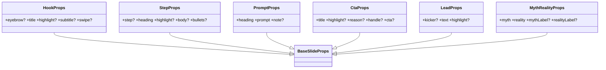

# Plantillas de marca ia.es (Hook, Step, Prompt, Cta, Lead, MythReality)

## Requirements
- Materializar los 6 roles de slide de la marca como componentes React reutilizables.
- Aplicar el sistema visual: titulares Anton MAYÚS, cuerpo Inter, prompt mono; palabra clave en cian.
- Reutilizar los elementos de marca de `Frame` (logo/chip/progreso/fuente) pasándole props base.
- Exportar las plantillas y sus tipos en `src/templates/index.ts`.
- Mantener verde el gate sin tocar las plantillas/ejemplo actuales.

## Entities

## Approach
1. Componentes presentacionales:
   - Cada plantilla es una función pura que retorna `<Frame {...base}>…</Frame>`, donde `base` son las props heredadas de `BaseSlideProps` (background, pillar, index, total, source, showLogo, color, fontFamily). La plantilla destructura sus props propias y pasa el resto como `...base`.
2. Tipografía y color:
   - Titulares: `fontFamily: theme.fonts.display`, `textTransform: "uppercase"`, tamaños `display/title/heading/kicker`.
   - Cuerpo: `fontFamily: theme.fonts.body` (Inter), tamaños `lead/body`, color `textMuted` para secundario.
   - Prompt: `fontFamily: theme.fonts.mono`, `fontSize: code`, sobre `theme.colors.panel`.
   - Resaltado: helper `highlightText(text, highlight, accent)` → parte el string y envuelve la coincidencia (case-insensitive, primera) en ``.
3. Reglas de marca:
   - `Hook`: contenido anclado abajo; "DESLIZA →" abajo-derecha si `swipe !== false`.
   - `Cta`: pastilla cian con `cta ?? "📩 Link en bio"` + `@handle`.
   - `MythReality`: dos paneles (`panel2`), etiquetas EL MITO / LA REALIDAD; realidad en `green`.

## Structure
### Relaciones
1. Hook/Step/Prompt/Cta/Lead/MythReality → envuelven `Frame`.
2. Todas → consumen `theme` + helper `highlightText` (en `src/templates/highlight.tsx` o inline por archivo).
3. `index.ts` → reexporta las 6 plantillas + tipos, junto a Cover/Bullet/Quote.
### Capas
1. Tokens: `theme.ts`. 2. Base: `Frame.tsx`. 3. Plantillas: los 6 nuevos `.tsx`. 4. Barrel: `index.ts`.

## Operations

### Create helper - src/templates/highlight.tsx
1. Export `highlightText(text: string, highlight: string | undefined, color: string): ReactNode`.
2. Logic: si no hay highlight o no hay coincidencia (case-insensitive) → devolver `text`. Si hay → `[antes, match, después]`.

### Create Template - Hook (src/templates/Hook.tsx)
1. Props: `eyebrow?`, `title`, `highlight?`, `subtitle?`, `swipe?=true` + BaseSlideProps.
2. Layout: `Frame` con `justifyContent:"flex-end"`; eyebrow (label, accent) → título (display Anton MAYÚS, lineHeight 1.0, `highlightText`) → subtitle (lead/body, textMuted). Abajo-derecha: "DESLIZA →" (label, textMuted) si swipe.
3. Constraint: swipe solo aquí.

### Create Template - Step (src/templates/Step.tsx)
1. Props: `step?`, `heading`, `highlight?`, `body?`, `bullets?` + Base.
2. Layout: centrado vertical; número `step` (kicker Anton, accent) → heading (heading Anton MAYÚS, highlight) → body (body Inter, textMuted) o lista `bullets` con marcador accent. El progreso lo pinta Frame vía index/total.

### Create Template - Prompt (src/templates/Prompt.tsx)
1. Props: `heading`, `prompt`, `note?` + Base.
2. Layout: heading (heading Anton MAYÚS) → label "COPIA ESTE PROMPT" (label, accent) → bloque `panel` con `prompt` (mono, code, text) → `note?` (body, textMuted).

### Create Template - Cta (src/templates/Cta.tsx)
1. Props: `title`, `highlight?`, `reason?`, `handle?`, `cta?` + Base.
2. Layout: centrado; título (title Anton MAYÚS, highlight) → reason (lead/body, textMuted) → pastilla cian con `cta ?? "📩 Link en bio"` (bg accent, texto bg) → `@handle` (label, textMuted).

### Create Template - Lead (src/templates/Lead.tsx)
1. Props: `kicker?`, `text`, `highlight?` + Base.
2. Layout: centrado; hairline corto (border `theme.colors`) ; kicker opcional (label, accent, ej "EN 30 SEGUNDOS"); `text` (lead Inter 600, highlight).

### Create Template - MythReality (src/templates/MythReality.tsx)
1. Props: `myth`, `reality`, `mythLabel?="EL MITO"`, `realityLabel?="LA REALIDAD"` + Base.
2. Layout: dos paneles apilados (`panel2`, radius, padding); panel mito: label (textMuted) + `myth` (heading, textMuted); panel realidad: label (green) + `reality` (heading, text). Línea hairline divisoria.

### Update barrel - src/templates/index.ts
1. Reexportar las 6 plantillas y sus *Props, además de Cover/Bullet/Quote/Frame/types.

### Verify - smoke render
1. Crear `carousels/_smoke-plantillas.ts` ejercitando las 6 plantillas (pilares variados, index/total, highlight, source).
2. `npm run typecheck` + `npm run generate carousels/_smoke-plantillas.ts` → PNGs sin error; inspección visual.

## Norms
1. Componentes presentacionales puros; sin estado ni I/O.
2. Colores y tamaños SIEMPRE desde `theme`; nada de hex crudos en plantillas.
3. Titulares con `theme.fonts.display` + uppercase; cuerpo `theme.fonts.body`; prompt `theme.fonts.mono`.
4. Props propias destructuradas; el resto se pasa como `...base` a `Frame`.
5. JSDoc en español por plantilla, explicando su rol de slide.
6. Aditivo: no modificar Cover/Bullet/Quote ni el `ejemplo.ts` en esta iteración.

## Safeguards
1. Funcionales: cada plantilla renderiza con solo sus props requeridas (`title`/`heading`/`prompt`/etc.).
2. Resaltado: si `highlight` no aparece en el texto, render plano sin error.
3. Compatibilidad: Cover/Bullet/Quote y `ejemplo.ts` intactos; gate `generate carousels/ejemplo.ts` sigue verde.
4. Render: `generate carousels/_smoke-plantillas.ts` produce 6+ PNGs sin error.
5. Layout: contenido dentro del lienzo 1080×1350; longitudes guiadas por las reglas de copy (entregable 02).
6. Marca: "DESLIZA →" solo en Hook; palabra clave en cian vía highlight; logo/chip/progreso vía Frame.
7. Técnicas: sin dependencias nuevas; TypeScript estricto (gate typecheck).
8. Alcance: NO incluir el sufijo de fondos IA ni el gold-standard final (iteración 3).
