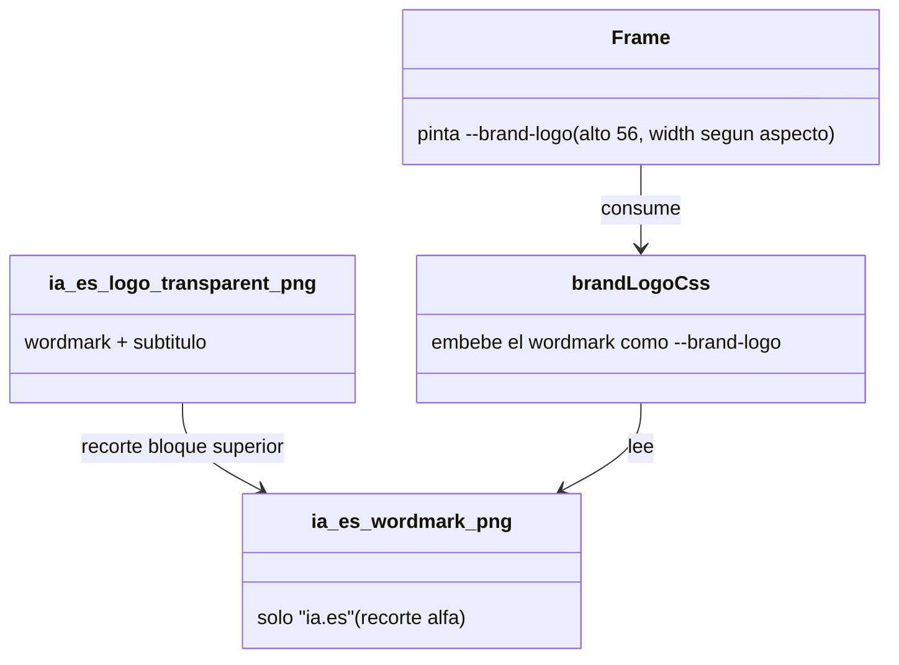

# Legibilidad del logo — variante wordmark a 56px

## Requirements
- Generar una variante solo-wordmark "ia.es" (con punto cian) legible a 56px de alto.
- Que `Frame` muestre esa variante en todas las piezas, sin deformación.
- Conservar los assets originales; cambio aditivo.

## Entities

## Approach
1. Generación del asset:
   - Script PIL one-off: abrir el logo transparente, obtener el canal alfa, calcular el perfil de filas con contenido (alfa>16), detectar el primer bloque (wordmark) y el hueco que lo separa del subtítulo, recortar ese bloque con padding ~6% y trim horizontal. Guardar `src/assets/ia_es_wordmark.png`. Imprimir el aspecto (w/h) resultante.
2. Embebido:
   - `brandLogoCss` lee `ia_es_wordmark.png` en vez de `ia_es_logo_transparent.png`.
3. Encaje:
   - Ajustar el `width` del `div` del logo en `Frame` a `round(56 * aspecto)` (alto 56). `backgroundSize:"contain"` evita deformación si el aspecto es aproximado.

## Structure
### Relaciones
1. `brandLogoCss` (htmlShell) → `ia_es_wordmark.png`.
2. `Frame` → `--brand-logo` (width nuevo).
### Capas
1. Activos: `src/assets/` (+ wordmark). 2. Generación: `scripts/` (one-off PIL). 3. Shell: `htmlShell.ts`. 4. Componente: `Frame.tsx`.

## Operations

### Create Script - scripts/make-wordmark.py
1. Responsabilidad: recortar el bloque wordmark del logo transparente.
2. Logic:
   - Abrir `src/assets/ia_es_logo_transparent.png` en RGBA; tomar alfa.
   - Por fila, contar píxeles con alfa>16; filas "con contenido" = cuenta>0.
   - Recorrer de arriba a abajo: primer run de filas con contenido = bloque wordmark; cuando aparezca un hueco (>~3% del alto sin contenido) tras ese run, cerrar el bloque.
   - bbox vertical = [inicio_wordmark, fin_wordmark]; bbox horizontal = min/max columnas con alfa>16 dentro de esa franja.
   - Añadir padding = round(0.06 * alto_bloque) en los 4 lados (clamp a la imagen).
   - Recortar y guardar `src/assets/ia_es_wordmark.png`. Imprimir `WIDTH,HEIGHT,ASPECT`.
3. Constraint: si no se detecta hueco (un solo bloque), usar el bbox del contenido completo.

### Update Shell - src/render/htmlShell.ts
1. En `brandLogoCss`, leer `ia_es_wordmark.png` (fallback `none` si falta).

### Update Component - src/templates/Frame.tsx
1. Cambiar el `width` del logo de 140 al valor proporcional al aspecto medido (alto 56). Mantener `height:56`, `backgroundSize:"contain"`, `backgroundPosition:"left center"`.

### Verify
1. Ejecutar el script → asset generado, aspecto impreso.
2. `npm run typecheck` + `npm run generate carousels/ejemplo.ts` → inspección visual del logo en la esquina.

## Norms
1. El asset se genera de forma reproducible (script versionado), no a mano.
2. Cambios aditivos; no borrar variantes existentes.
3. Sin deformar el logo (contain + aspecto correcto).

## Safeguards
1. Funcional: el wordmark se ve nítido a 56px; sin subtítulo ilegible.
2. Degradación: si falta el asset, `--brand-logo:none` (sin crash).
3. Compatibilidad: resto del render intacto; `_smoke-plantillas` y `ejemplo` siguen verdes.
4. Identidad: el recorte conserva el punto cian.
5. Reproducibilidad: `scripts/make-wordmark.py` documenta cómo se generó.
6. Gate: typecheck + generate ejemplo + revisión visual.
