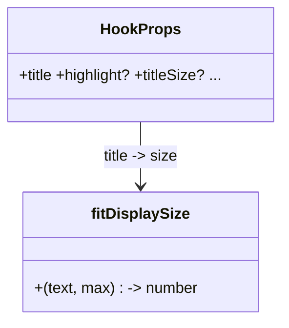

# Auto-tamaño del titular Hook

## Requirements
- Reducir automáticamente el tamaño del titular del `Hook` según su longitud.
- Mantener máximo impacto en titulares cortos; evitar recorte en los largos.
- Permitir override manual del tamaño.

## Entities

## Approach
1. Helper puro `fitDisplaySize(text, max=theme.fontSize.display)` en `src/templates/fit.ts`:
   buckets por longitud de caracteres calibrados para Anton en ~840px útiles.
2. `Hook`: `const size = titleSize ?? fitDisplaySize(title);` aplicado al `fontSize` del `<h1>`.
3. `titleSize?: number` opcional en `HookProps` (override).

## Structure
### Relaciones
1. `Hook` → `fitDisplaySize` (+ theme).
### Capas
1. Util: `src/templates/fit.ts`. 2. Componente: `Hook.tsx`. 3. Tipos: `HookProps`.

## Operations

### Create Util - src/templates/fit.ts
1. `export function fitDisplaySize(text: string, max = theme.fontSize.display): number`.
2. Logic: `const n = text.trim().length;` devolver según buckets:
   - n ≤ 16 → max (132/display)
   - n ≤ 26 → 116
   - n ≤ 40 → 96
   - n ≤ 56 → 78
   - resto → 64
   Nunca exceder `max`.

### Update Template - src/templates/Hook.tsx
1. Añadir `titleSize?: number` a `HookProps` (JSDoc: override del auto-tamaño).
2. `const titleFont = titleSize ?? fitDisplaySize(title);` y usarlo en el `<h1>` (`fontSize: titleFont`).

### Verify
1. `npm run typecheck`.
2. Render de prueba con titular corto / medio / largo → inspección visual (cortos grandes, largos sin recortar).
3. `npm run generate carousels/ejemplo.ts` sigue verde.

## Norms
1. Helper puro y determinista; sin medición DOM.
2. Cambio aislado a Hook; sin tocar otras plantillas.
3. Tamaños desde la escala del tema cuando aplique.

## Safeguards
1. Funcional: titular corto → grande; largo → reducido, ≤3 líneas.
2. Override: `titleSize` precede a la heurística.
3. Compatibilidad: `ejemplo` y `_smoke-plantillas` siguen renderizando.
4. Robustez: `overflow:hidden` del Frame protege ante longitudes fuera de contrato.
5. Gate: typecheck + generate + revisión visual de 3 longitudes.
