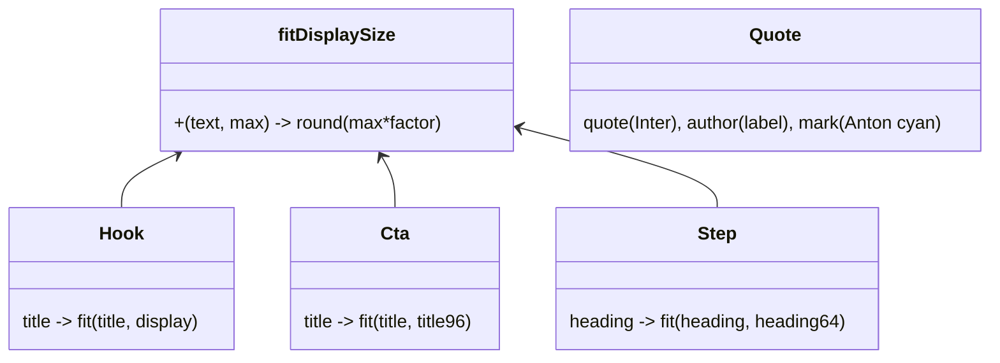

# Pulido — Quote a marca + auto-tamaño en Cta/Step

## Requirements
- Generalizar `fitDisplaySize` para reutilizarla a distintas escalas sin regresión en Hook.
- Aplicar auto-tamaño a los headings de `Cta` y `Step`.
- Migrar `Quote` al sistema visual de marca, manteniendo su API.

## Entities

## Approach
1. `fitDisplaySize(text, max)` → `Math.round(max * factor(n))`, con factores que reproducen los valores de Hook a `max=display`.
2. `Cta`: `fontSize` del título = `fitDisplaySize(title, theme.fontSize.title)`.
3. `Step`: `fontSize` del heading = `fitDisplaySize(heading, theme.fontSize.heading)`.
4. `Quote`: comilla gigante en `theme.fonts.display` + `accent`; cita en `theme.fonts.body` (600), tamaño `fitDisplaySize(quote, theme.fontSize.title)`; autor en `label`/`textMuted`.

## Structure
### Relaciones
1. `fit.ts` ← Hook, Cta, Step (compartido).
2. `Quote` → theme tokens + fit.
### Capas
Util `fit.ts`; plantillas `Hook/Cta/Step/Quote.tsx`.

## Operations

### Update Util - src/templates/fit.ts
1. Reemplazar buckets absolutos por: `const f = n<=16?1 : n<=26?0.88 : n<=40?0.727 : n<=56?0.591 : 0.485;` y `return Math.round(max * f);`.
2. Constraint: con `max = theme.fontSize.display` (132) debe dar 132/116/96/78/64 (sin regresión Hook).

### Update Template - src/templates/Cta.tsx
1. Importar `fitDisplaySize`; `fontSize: fitDisplaySize(title, theme.fontSize.title)` en el `<h2>`.

### Update Template - src/templates/Step.tsx
1. Importar `fitDisplaySize`; `fontSize: fitDisplaySize(heading, theme.fontSize.heading)` en el `<h2>`.

### Update Template - src/templates/Quote.tsx
1. Comilla "“" en `theme.fonts.display`, color `accent ?? theme.colors.accent`.
2. Cita en `theme.fonts.body`, `fontWeight:600`, `fontSize: fitDisplaySize(quote, theme.fontSize.title)`, color texto.
3. Autor en `theme.fonts.body`, `theme.fontSize.label`, `textMuted`, prefijo "— ".
4. Mantener API `quote`/`author` y el resto de props base.

### Verify
1. `npm run typecheck`.
2. `npm run generate carousels/ejemplo.ts` (Hook/Step/Cta) + `_smoke-plantillas` + un carrusel de prueba con Quote (corto/largo). Inspección visual; Hook sin regresión.

## Norms
1. Heurística de tamaño única y compartida; sin duplicación.
2. Migración de Quote aditiva (API estable).
3. Cita legible (Inter), no Anton.

## Safeguards
1. Funcional: Cta/Step/Quote ajustan su titular a la longitud; Hook idéntico.
2. Compatibilidad: API de Quote estable; `ejemplo`/`_smoke` verdes.
3. Legibilidad: cita en Inter; comilla cian de acento.
4. Gate: typecheck + render (ejemplo + smoke + quote test) + revisión visual de no-regresión en Hook.
