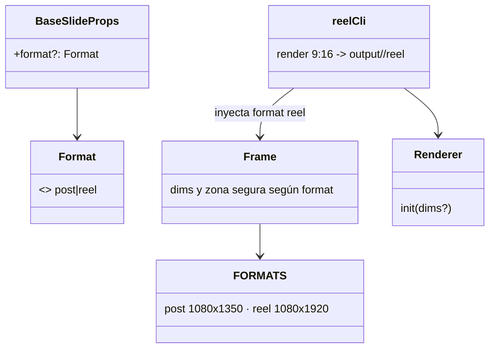

# Render nativo 9:16 para Reels

## Requirements
- Renderizar los slides de un carrusel en formato vertical 9:16 (1080×1920), reutilizando plantillas.
- Respetar la zona segura (sin contenido clave en los últimos 420px).
- Exponer `npm run reel <carrusel>` que vuelque PNGs verticales; no romper `generate` (4:5).

## Entities

## Approach
1. Tipos/formatos en `types.ts`: `Format`, `FORMATS = { post:{1080,1350}, reel:{1080,1920} }`, `CANVAS = FORMATS.post` (alias). `BaseSlideProps.format?`.
2. `Frame`: usar dims de `FORMATS[format ?? "post"]`; si `reel`, paddingBottom 440 (zona segura) manteniendo padding lateral/superior.
3. `Renderer`: `init(dims = FORMATS.post)` fija el viewport a esas dims.
4. CLI `src/reel/cli.ts`: carga el carrusel, crea `Renderer` 1080×1920, por slide hace `resolveBackground` + render con `format:"reel"`, escribe `output/<name>/reel/slide-NN.png`. Script `reel` en package.json.

## Structure
### Relaciones
1. `reelCli` → `Renderer.init(reel dims)` + `createElement(template, { ...props, format:"reel" })`.
2. `Frame` → `FORMATS[format]`.
### Capas
Tipos `types.ts`; componente `Frame.tsx`; render `renderSlide.ts`; CLI `src/reel/cli.ts`; `package.json`.

## Operations

### Update Types - src/templates/types.ts
1. `export type Format = "post" | "reel";`
2. `export const FORMATS = { post: { width:1080, height:1350 }, reel: { width:1080, height:1920 } } as const;`
3. `export const CANVAS = FORMATS.post;` (mantiene compatibilidad con imports actuales).
4. `BaseSlideProps`: añadir `format?: Format;`.

### Update Component - src/templates/Frame.tsx
1. Destructurar `format` de props (default "post").
2. `const dim = FORMATS[format];` usar `dim.width/height` en el div raíz (en vez de CANVAS).
3. Si `format==="reel"`: `paddingBottom: 440` (zona segura), resto de padding = theme.padding. Si no, padding uniforme actual.
4. Sin cambios para format post (idéntico).

### Update Renderer - src/render/renderSlide.ts
1. `init(dim: { width:number; height:number } = FORMATS.post)`: usar `dim` en el viewport.
2. Mantener API: `generate` llama `init()` (post por defecto).

### Create CLI - src/reel/cli.ts
1. Cargar carrusel (igual que cli.ts).
2. `const r = new Renderer(); await r.init(FORMATS.reel);`
3. Por slide: `props = { ...defaults, ...slide.props, format:"reel" }; props.background = await resolveBackground(props.background); png = await r.render(createElement(slide.template, props));` escribir `output/<name>/reel/slide-NN.png`.
4. Log de progreso; cerrar renderer.

### Update package.json
1. `"reel": "tsx src/reel/cli.ts"`.

### Verify
1. `npm run typecheck`.
2. `npm run reel carousels/estudiar-3-ias.ts` → PNGs 1080×1920 en output/estudiar-3-ias/reel/. Revisar dims (sips) + visual (zona segura, sin recortes).
3. `npm run generate carousels/ejemplo.ts` sigue 4:5 OK.

## Norms
1. Aditivo y backward-compatible (defaults a post).
2. Una sola fuente de dimensiones (`FORMATS`).
3. Reutilizar plantillas; no duplicar.

## Safeguards
1. `generate` 4:5 intacto (typecheck + render ejemplo).
2. Reel = 1080×1920 exacto (verificado con sips/ffprobe).
3. Zona segura respetada (contenido sobre los últimos 420px).
4. Degradación: sin `format`, comportamiento post.
5. Alcance: solo PNGs 9:16; la composición a mp4 es loop 2.
