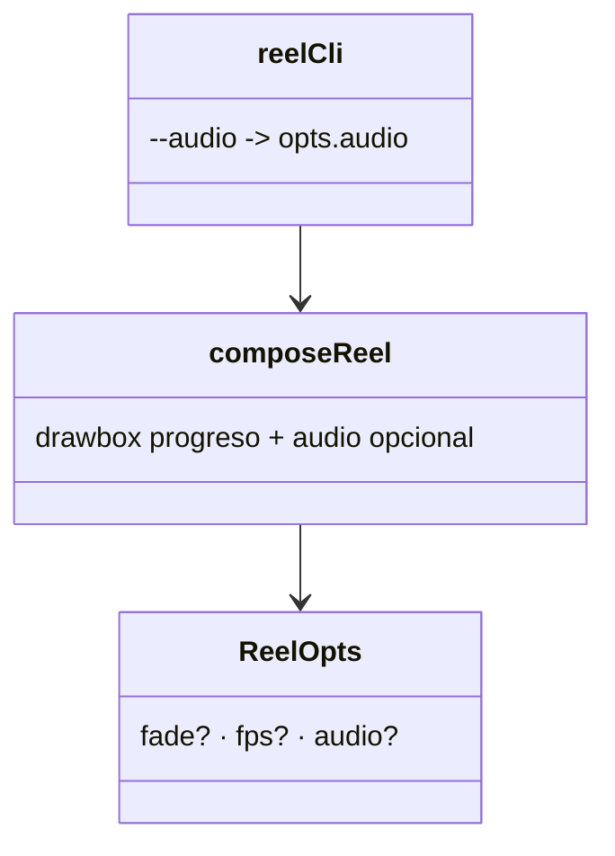

# Audio opcional + branding (barra de progreso cian)

## Requirements
- `--audio archivo.mp3`: muxear pista recortada a la duración del video con fade-out; default sin audio.
- Barra de progreso cian de marca que crece L→R durante todo el reel (branding + retención).
- No romper el comportamiento del loop 3.

## Entities

## Approach
1. `composeReel(frames, durations, outPath, opts)` con `opts.audio?: string`:
   - Calcular `DUR = sum(durations) - (N-1)*fade`.
   - Tras la cadena de video (xfade/zoompan), aplicar `drawbox` (barra cian creciente) a la etiqueta final → `[outb]`.
   - Si `opts.audio`: input extra `-i audio`; cadena `[idx:a]afade=out + atrim=0:DUR[aud]`; map `[aud]` + `-c:a aac -b:a 128k`. Si no: `-an`.
2. `reel/cli.ts`: flag `--audio=ruta` → `opts.audio`.

## Operations

### Update Module - src/reel/video.ts
1. `ReelOpts` añade `audio?: string`.
2. En `composeReel`:
   - `const DUR = +(durations.reduce((a,b)=>a+b,0) - (frames.length-1)*fade).toFixed(3);`
   - Tras fijar `finalLabel` (video), añadir: `graph += `;${finalLabel}drawbox=x=0:y=0:w='iw*min(t/${DUR}\\,1)':h=8:color=0x22D3EE:t=fill[outb]`;` y `videoOut = "[outb]"`.
   - Si `opts.audio`: `const ai = frames.length;` input `["-i", opts.audio]`; `graph += `;[${ai}:a]afade=t=out:st=${(DUR-0.6).toFixed(2)}:d=0.6,atrim=0:${DUR}[aud]`;`.
   - args: inputs imágenes + (audio? `["-i", opts.audio]`) + `["-filter_complex", graph, "-map", videoOut]` + (audio? `["-map","[aud]","-c:a","aac","-b:a","128k"]` : `["-an"]`) + `["-r",fps,"-c:v","libx264","-preset","medium","-pix_fmt","yuv420p","-movflags","+faststart","-y",outPath]`.
3. Mantener N=1 (drawbox sobre `[v0]`).

### Update CLI - src/reel/cli.ts
1. `strFlag("audio")` → si está, `opts.audio`.
2. Pasar a `composeReel(framePaths, durations, mp4, { fade, audio })`.
3. Log: indicar si lleva audio o "sin audio (añade trending en IG)".
4. Doc del uso con `--audio=ruta.mp3`.

### Verify
1. `npm run typecheck`.
2. `npm run reel carousels/estudiar-3-ias.ts` → mp4 sin audio (ffprobe: 0 streams a) + barra cian (frame).
3. Crear un mp3 de prueba (ffmpeg sine) y `npm run reel ... -- --audio=/tmp/test.mp3` → ffprobe muestra stream de audio AAC; limpiar el mp3 de prueba.

## Norms
1. Audio opt-in; default mejor-para-IG (sin audio).
2. Barra con el cian exacto de marca; sutil.
3. video.ts agnóstico al contenido; reproducible.

## Safeguards
1. Sin `--audio` → `-an` (sin stream de audio), barra presente.
2. Con `--audio` → AAC 128k, recortado a DUR + fade out.
3. Reel 1080×1920 h264 en ambos casos (ffprobe).
4. Error claro si la ruta de audio es inválida.
5. Gate: typecheck + ffprobe con y sin audio + frame con barra.
