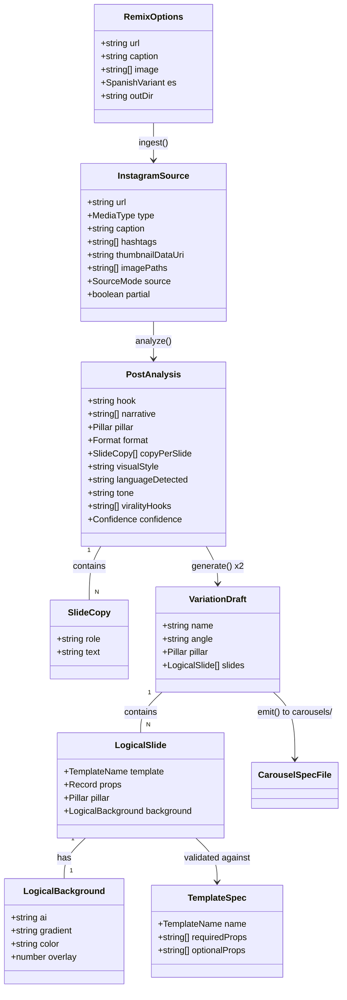

# Remix de Instagram — ingesta, análisis y 2 variaciones (Iteración 1/3)

## Requirements

Implementar un comando `remix` que, a partir de un link de Instagram (reel, post o carrusel), **ingiera** el contenido público (caption + thumbnail), **analice** su estructura (hook, narrativa, pilar, formato, copy, estilo visual) con un modelo multimodal, y **genere 2 variaciones diferenciadas** del contenido en español neutro (o chileno con flag), materializadas como archivos `CarouselSpec` `.ts` en `carousels/` listos para la maquinaria existente (`generate`/`reel`/`score`). El flujo debe ser robusto: si el fetch público falla, degrada a input manual y nunca se cae. Valor: convertir cualquier referente viral en contenido de marca ia.es en minutos — la fuente principal de uso del producto.

Boundary (Iteración 1): trabaja sobre **thumbnail principal + caption** (no multi-slide ni transcripción de video). No encadena render/reel automáticamente (eso lo corre el usuario con los comandos existentes); el remix solo emite los `.ts` y reporta el score.

## Entities

Notas de conservación (no refactorizar lo existente):
- `CarouselSpec`, `SlideSpec`, `BaseSlideProps`, `Pillar`, `Format`, `Background` ya existen en `src/templates/types.ts` — se **reutilizan**, no se redefinen. Las entidades nuevas (`InstagramSource`, `PostAnalysis`, `LogicalSlide`, `VariationDraft`) son tipos planos nuevos del módulo `remix`.
- `generateBackground` / cliente OpenAI de imágenes (`src/ai/openaiImage.ts`) **no se toca**; la nueva capacidad de análisis es un archivo aparte que crea su propio cliente OpenAI (mismo patrón, misma `OPENAI_API_KEY`).
- `scoreCarousel` / `THRESHOLD` (`src/score/virality.ts`) se reutilizan tal cual para reportar el score de cada variación.

## Approach

1. **Arquitectura de pipeline (CLI por etapas)**:
   - Nuevo módulo `src/remix/` con un orquestador (`cli.ts`) que encadena: `ingest → analyze → generate(x2) → emit + score`. Cada etapa es una función pura-ish con su propio archivo, testeable y cacheable.
   - Patrón consistente con los CLIs existentes (`src/cli.ts`, `src/reel/cli.ts`, `src/score/cli.ts`): leer `process.argv`, validar, ejecutar, imprimir progreso con `✓`/`⚠️`/`✗`, `process.exit(1)` en error con mensaje claro.

2. **Ingesta resiliente (`src/remix/ingest.ts`)**:
   - Detectar `MediaType` por patrón de URL (`/reel/` o `/reels/` → reel, `/p/` → post, `/tv/` → reel, carrusel se infiere igual como post).
   - `fetch` del HTML público con `User-Agent` de navegador; parsear `og:title`, `og:description` (caption), `og:image` (thumbnail) y `application/ld+json` (JSON-LD `caption`/`author`) por regex tolerante (sin dependencias nuevas de parsing).
   - Descargar el `og:image` y convertirlo a data URI (para pasarlo al modelo de visión).
   - **Fallback manual**: si falta `--url`, o el fetch falla / no devuelve caption ni imagen, usar `--caption` y `--image <ruta>` provistos por el usuario. Si tampoco hay nada, error claro.
   - Cache por hash de URL en `.cache/remix/<hash>.json` (mismo espíritu que la caché de imágenes).

3. **Análisis y generación con modelo multimodal (`src/ai/analyze.ts`)**:
   - Cliente OpenAI propio (lazy, valida `OPENAI_API_KEY` con mensaje claro). Modelo configurable por `REMIX_MODEL` (default `gpt-4o`), `chat.completions.create` con `response_format: { type: "json_object" }`.
   - `analyzePost(source)`: mensaje con caption + imagen (si hay) → `PostAnalysis` JSON. Cache por hash de input.
   - `generateVariations(analysis, opts)`: inyecta en el prompt el **catálogo de plantillas** (nombres + props válidas), las **reglas de marca/viralidad** (resumen de `.context/04-quality-gate-viral.md`: hook con número+enemigo+bucle, 6-8 slides, reframe, CTA de guardar/compartir, sin hype/miedo/jerga/clickbait, palabra clave en cian vía `highlight`), el idioma destino y la regla "fondos `ai` re-skineados al look navy+cian". Devuelve **2** `VariationDraft` con ángulos distintos.

4. **Validación + emisión determinista (`src/remix/templates-catalog.ts`, `src/remix/emit.ts`)**:
   - `TEMPLATE_CATALOG`: whitelist de `TemplateName` (`Hook`, `Lead`, `Step`, `Prompt`, `MythReality`, `Cta`) con props requeridas/opcionales (derivadas de los `*Props`).
   - `validateDraft(draft)`: descarta/normaliza slides con plantilla desconocida o props inválidas; garantiza ≥1 Hook y ≥1 Cta (si faltan, los inserta con defaults). Nunca emite algo que no compile.
   - `emitCarouselFile(draft, es)`: serializa a string `.ts` idiomático (imports desde `../src/templates/index.ts`, `export default`), escapando strings correctamente. Escribe `carousels/<slug>-v1.ts` / `-v2.ts`.
   - Tras emitir, importar dinámicamente el archivo y correr `scoreCarousel` (igual que `src/cli.ts`) para reportar el score de cada variación; advertir (no bloquear) si `< THRESHOLD`.

5. **Manejo de errores**: sin framework de excepciones (es un CLI Node/TS). Errores de dominio se lanzan como `Error` con mensaje accionable en español; el `main().catch` del CLI los imprime con `✗` y hace `process.exit(1)` (mismo patrón que `src/cli.ts`). Las etapas degradables (fetch IG) capturan y continúan en modo manual en vez de propagar.

## Structure

### Inheritance / type relationships
1. Los tipos nuevos (`InstagramSource`, `PostAnalysis`, `SlideCopy`, `LogicalSlide`, `LogicalBackground`, `VariationDraft`, `RemixOptions`, `TemplateSpec`) viven en `src/remix/types.ts` y reutilizan `Pillar`, `Format`, `Background`, `CarouselSpec` de `src/templates/types.ts` por import.
2. `TemplateName` es un union literal de los nombres de plantilla soportados, alineado con los exports de `src/templates/index.ts`.
3. No hay herencia de clases; el módulo es funcional (funciones + tipos), consistente con el resto del repo.

### Dependencies
1. `src/remix/cli.ts` → `ingest.ts`, `src/ai/analyze.ts`, `validate/emit`, y (para el score) `src/score/virality.ts` + `src/score/cli.ts#printReport`.
2. `src/remix/ingest.ts` → `node:fs/promises`, `node:crypto`, `fetch` global; sin dependencias nuevas en `package.json`.
3. `src/ai/analyze.ts` → `openai` (ya instalada), `node:crypto`, `node:fs/promises` (caché). Patrón calcado de `src/ai/openaiImage.ts`.
4. `src/remix/emit.ts` → `templates-catalog.ts`, `node:fs/promises`; importa dinámicamente el `.ts` emitido para puntuarlo (vía `pathToFileURL`, como `src/cli.ts`).
5. `package.json` → nuevo script `"remix": "tsx src/remix/cli.ts"`.

### Layered architecture (adaptada a CLI)
1. **Capa CLI / orquestación** (`src/remix/cli.ts`): parsea args, secuencia etapas, imprime progreso, maneja exit codes.
2. **Capa de ingesta** (`src/remix/ingest.ts`): IO de red/archivos → `InstagramSource` normalizado; aísla la fragilidad del scraping y el fallback.
3. **Capa de razonamiento IA** (`src/ai/analyze.ts`): llamadas al modelo multimodal → `PostAnalysis` y `VariationDraft[]`; caché.
4. **Capa de validación + emisión** (`src/remix/templates-catalog.ts`, `src/remix/emit.ts`): contrato con las plantillas; serialización segura a `.ts`.
5. **Capa de verificación** (reutilizada): `scoreCarousel` puntúa cada variación emitida.

## Operations

### Create Type Module - src/remix/types.ts
1. Responsibility: Definir los tipos del pipeline de remix, reutilizando los tipos de marca existentes.
2. Contenido:
   - `import type { Pillar, Format, CarouselSpec } from "../templates/types.ts";`
   - `export type MediaType = "reel" | "post" | "carousel" | "unknown";`
   - `export type SourceMode = "fetch" | "manual";`
   - `export type Confidence = "low" | "medium" | "high";`
   - `export type SpanishVariant = "neutro" | "cl";`
   - `export type TemplateName = "Hook" | "Lead" | "Step" | "Prompt" | "MythReality" | "Cta";`
   - `export interface InstagramSource { url?: string; type: MediaType; caption: string; hashtags: string[]; thumbnailDataUri?: string; imagePaths?: string[]; source: SourceMode; partial: boolean; }`
   - `export interface SlideCopy { role: string; text: string; }`
   - `export interface PostAnalysis { hook: string; narrative: string[]; pillar: Pillar; format: Format; copyPerSlide: SlideCopy[]; visualStyle: string; languageDetected: string; tone: string; viralityHooks: string[]; confidence: Confidence; }`
   - `export interface LogicalBackground { ai?: string; gradient?: string; color?: string; overlay?: number; }`
   - `export interface LogicalSlide { template: TemplateName; props: Record<string, string | string[] | number | boolean>; pillar?: Pillar; background?: LogicalBackground; }`
   - `export interface VariationDraft { name: string; angle: string; pillar: Pillar; slides: LogicalSlide[]; }`
   - `export interface RemixOptions { url?: string; caption?: string; image?: string[]; es: SpanishVariant; outDir: string; }`
3. Constraints: solo tipos (sin lógica). No redefinir tipos ya existentes en `templates/types.ts`.

### Create Module - src/remix/templates-catalog.ts
1. Responsibility: Catálogo whitelist de plantillas soportadas con sus props válidas, fuente única para validación y emisión.
2. Atributos:
   - `TEMPLATE_CATALOG: Record<TemplateName, { required: string[]; optional: string[] }>` con (derivado de los `*Props`):
     - `Hook`: required `["title"]`, optional `["eyebrow","highlight","subtitle","titleSize","swipe"]`
     - `Lead`: required `["text"]`, optional `["kicker","highlight"]`
     - `Step`: required `["heading"]`, optional `["step","highlight","body","bullets"]`
     - `Prompt`: required `["heading","prompt"]`, optional `["note"]`
     - `MythReality`: required `["myth","reality"]`, optional `["mythLabel","realityLabel"]`
     - `Cta`: required `["title"]`, optional `["highlight","reason","handle","cta"]`
   - Props base comunes permitidas en todas: `["background","pillar","index","total","source","showLogo","accent","color","fontFamily","format"]`
3. Métodos:
   - `isTemplateName(name: string): name is TemplateName` — type guard.
   - `validPropKeys(t: TemplateName): Set<string>` — union de required+optional+base.
4. Constraints: debe mantenerse alineado con `src/templates/index.ts`; si una plantilla no está aquí, el modelo no puede usarla.

### Create Module - src/remix/ingest.ts
1. Responsibility: Convertir una URL de IG (o input manual) en un `InstagramSource` normalizado, sin caerse.
2. Métodos:
   - `detectType(url: string): MediaType`
     - Logic: regex sobre el path: `/reels?/` o `/tv/` → `"reel"`; `/p/` → `"post"`; si no matchea pero es instagram.com → `"unknown"`.
   - `async ingest(opts: RemixOptions): Promise<InstagramSource>`
     - Logic:
       - Si `opts.url`: intentar `fetchPublic(url)` dentro de try/catch.
         - `fetchPublic`: `fetch(url, { headers: { "User-Agent": <navegador>, "Accept-Language": "es" } })`; si `!res.ok` lanzar; leer HTML; extraer `og:title`/`og:description`/`og:image` con regex `<meta property="og:..." content="...">`; extraer JSON-LD si existe.
         - Descargar `og:image` → data URI (`fetchImageAsDataUri`).
         - Construir `InstagramSource` con `source: "fetch"`, `partial: type==="reel" || !caption`.
       - Si no hay url o `fetchPublic` falló: imprimir `⚠️` explicando el fallback; usar `opts.caption` y `opts.image` (cargar imágenes locales a data URI). `source: "manual"`.
       - Si tras todo no hay **ni caption ni imagen** → lanzar `Error` con instrucciones (`pasa --caption "..." y/o --image ruta.png`).
       - Extraer `hashtags` del caption (`/#[\p{L}\d_]+/gu`).
       - Cachear el resultado por hash de URL en `.cache/remix/`.
3. Constraints: sin dependencias nuevas; el fallo de red nunca aborta el proceso (solo el "no hay nada que analizar" aborta).

### Create Module - src/ai/analyze.ts
1. Interface: capacidad de razonamiento multimodal, separada de `openaiImage.ts`.
2. Core methods:
   - `async analyzePost(source: InstagramSource): Promise<PostAnalysis>`
     - Input Validation: requiere caption no vacío **o** thumbnail; si no, error.
     - Business Logic: construir `messages` (system: "analista de contenido viral de IG, responde SOLO JSON con el shape PostAnalysis"; user: caption + hashtags + `image_url` con el data URI si existe). `chat.completions.create({ model, response_format: { type: "json_object" }, messages })`. Parsear y validar shape mínimo (campos presentes, `pillar` ∈ Pillar, `format` ∈ Format); rellenar defaults si faltan.
     - Caché: por hash de (caption + thumbnail + model) en `.cache/remix/analysis-<hash>.json`.
     - Return: `PostAnalysis`.
   - `async generateVariations(analysis: PostAnalysis, opts: { es: SpanishVariant; count?: number }): Promise<VariationDraft[]>`
     - Business Logic: prompt que incluye (a) el `PostAnalysis`, (b) el `TEMPLATE_CATALOG` serializado, (c) las **reglas de marca/viralidad** (resumen embebido), (d) idioma destino (neutro|chileno), (e) regla de fondos `ai` re-skineados navy+cian. Pedir `count` (default 2) variaciones con **ángulos distintos** (campo `angle`), cada una 6-8 slides empezando en `Hook` y terminando en `Cta`, con `highlight` en el hook, `index`/`total` en slides de desarrollo. `response_format: json_object` → `{ variations: VariationDraft[] }`.
     - Return: array de `VariationDraft`.
   - `getModel(): string` → `process.env.REMIX_MODEL ?? "gpt-4o"`.
   - `getClient(): OpenAI` → lazy, valida `OPENAI_API_KEY` (mensaje calcado de `openaiImage.ts`).
3. Dependency Injection: `openai`, `node:crypto`, `node:fs/promises`.
4. Constraints: nunca confiar ciegamente en el JSON del modelo — validar y normalizar antes de devolver.

### Create Module - src/remix/emit.ts
1. Responsibility: Validar un `VariationDraft` y serializarlo a un archivo `.ts` que exporta un `CarouselSpec` compilable.
2. Métodos:
   - `validateDraft(draft: VariationDraft): VariationDraft`
     - Logic: filtrar slides cuya `template` no esté en el catálogo; eliminar props fuera de `validPropKeys`; asegurar que cada slide tenga sus `required`; garantizar ≥1 `Hook` al inicio y ≥1 `Cta` al final (insertar con defaults de marca si faltan); recalcular `index`/`total` en slides de desarrollo.
   - `slugify(name: string): string` — kebab-case ascii.
   - `serializeBackground(bg?: LogicalBackground): string` — a literal de objeto `{ ai: "...", overlay: 0.5 }` / `{ gradient: "..." }` / `{ color: "..." }`.
   - `serializeSlide(slide: LogicalSlide): string` — `{ template: Hook, props: { ... } }` con strings escapados (`JSON.stringify` para valores string/array, identificador crudo para `template`).
   - `emitCarouselFile(draft: VariationDraft, es: SpanishVariant, outDir: string): Promise<string>`
     - Logic: construir el contenido del archivo (header comment con origen + ángulo + idioma + nota "generado por remix", imports de las plantillas usadas y de `CarouselSpec`, `const carousel: CarouselSpec = {...}; export default carousel;`). Escribir a `<outDir>/<slug>.ts`. Devolver la ruta.
     - **La ruta de import a `src/templates` se calcula RELATIVA a `outDir`** (no hardcodear `../src/templates`), para soportar carpetas anidadas (p. ej. `--out=carousels/remix`). Helper puro `templatesImportBase(outDir)` = `relative(resolve(outDir), resolve("src/templates"))` normalizado a separadores `/`. Así `carousels` → `../src/templates` y `carousels/sub` → `../../src/templates`.
3. Constraints: el archivo emitido DEBE pasar `tsc --noEmit`; los `template` referenciados deben estar importados; strings con comillas/acentos correctamente escapados.

### Create CLI - src/remix/cli.ts
1. Responsibility: Orquestar el pipeline y reportar.
2. Logic:
   - Parsear `process.argv`: primer arg posicional = url (opcional); flags `--caption`, `--image` (repetible), `--es=cl|neutro` (default neutro), `--out=carousels`.
   - Si no hay url ni caption ni image → imprimir uso y `exit(1)`.
   - `const source = await ingest(opts)` → imprimir resumen (`tipo`, `source`, `partial`).
   - `const analysis = await analyzePost(source)` → imprimir hook/pilar/confianza.
   - `const drafts = await generateVariations(analysis, { es })` (2) → para cada draft: `validateDraft`, `emitCarouselFile`, luego importar el archivo y `scoreCarousel` + `printReport`; advertir si `< THRESHOLD`.
   - Imprimir resumen final: rutas de los 2 archivos + comandos siguientes (`npm run generate carousels/<f>.ts`, `npm run reel ...`).
   - `main().catch` → `✗` + `exit(1)` (patrón de `src/cli.ts`).
3. Annotations: añadir script `"remix": "tsx src/remix/cli.ts"` en `package.json`.

### Update - package.json
1. Responsibility: exponer el comando.
2. Cambio: agregar `"remix": "tsx src/remix/cli.ts"` a `scripts` (sin tocar dependencias).

### Fix - src/score/cli.ts (guard de entrypoint)
1. Responsibility: evitar que `main()` se ejecute al importar el módulo (solo cuando se invoca directo).
2. Cambio: envolver la llamada `main().catch(...)` en una guarda `if (import.meta.url === pathToFileURL(process.argv[1] ?? "").href) { ... }`. `pathToFileURL` ya está importado. Sin cambios en `printReport` ni en la lógica de `main`.
3. Constraint: el comando `npm run score <archivo>` sigue funcionando idéntico; `generate` y `remix` pueden importar `printReport` sin efectos secundarios.

### Update - README.md
1. Responsibility: documentar el comando nuevo.
2. Cambio: sección "Remix de Instagram" con uso (`npm run remix <url>`, flags `--caption`/`--image`/`--es=cl`), el fallback manual, y la nota de que produce 2 archivos `.ts` listos para `generate`/`reel`.

## Norms

1. **Estilo de módulo**: funciones + tipos (sin clases), `import` con extensión `.ts` explícita y `import type` para tipos (consistente con el repo). ESM (`"type": "module"`).
2. **CLI**: leer `process.argv`, validar temprano, progreso con `✓`/`⚠️`/`✗`, `main().catch(err => { console.error("✗", ...); process.exit(1); })` igual que `src/cli.ts`.
3. **Cliente OpenAI**: lazy singleton con guardia de `OPENAI_API_KEY` y mensaje accionable en español (calcar `getClient` de `openaiImage.ts`). No instanciar al importar.
4. **Caché**: por hash SHA-256 de la entrada en `.cache/remix/` (mismo patrón que `openaiImage.ts`); `.cache/` ya está gitignored.
5. **Idioma de salida**: todo el copy generado en español neutro por defecto; `--es=cl` activa modismos chilenos. Nunca dejar el copy en el idioma original.
6. **Comentarios**: en español, densidad similar a las plantillas/CLIs existentes (docstring breve por función/módulo explicando el rol).
7. **Validación de salida del modelo**: nunca emitir a archivo sin pasar por `validateDraft`; preferir normalizar a fallar.
8. **Manejo de errores degradables vs. fatales**: red de IG = degradable (capturar → modo manual); "sin contenido analizable" y "sin API key" = fatales (lanzar Error con instrucción).
9. **Sin dependencias nuevas**: usar `fetch` global y regex; no agregar parsers HTML ni libs de scraping en iteración 1.

## Safeguards

1. **Functional**: el comando produce SIEMPRE ≥1 salida útil o un error accionable; con un input válido (url accesible o caption/imagen) genera exactamente 2 archivos `.ts` distintos en `carousels/`, cada uno con Hook inicial y Cta final, 6-8 slides.
2. **Robustez/degradación**: si el fetch de IG falla (login wall, 429, timeout, markup cambiado), el proceso continúa en modo manual sin lanzar; solo aborta si no hay caption ni imagen.
3. **Idioma**: 100% del copy emitido en español (neutro o cl); ningún slide queda en el idioma del original.
4. **Marca**: los fondos `ai` se generan re-skineados al look navy+cian (brandStyle por defecto on); no se copia branding/identidad del original; las variaciones usan solo plantillas del catálogo ia.es.
5. **Calidad**: cada variación se puntúa con `scoreCarousel`; score `< THRESHOLD` (75) emite advertencia visible pero no bloquea (consistente con `src/cli.ts`).
6. **Integración/compatibilidad**: NO modificar `src/templates/*`, `src/ai/openaiImage.ts`, `src/render/*`, `src/reel/*`; reutilizarlos. No agregar dependencias a `package.json` salvo el script `remix`. **Excepción necesaria (bug bloqueante descubierto en generate):** `src/score/cli.ts` ejecuta su `main()` al ser importado, lo que dispara `process.exit` y rompe a cualquier importador de `printReport` (incluido el `generate` ya existente, que queda sin renderizar). Se aplica el guard de entrypoint ESM estándar para que `main()` solo corra cuando el archivo se invoca directamente; así `printReport` es importable de forma segura y `generate` vuelve a funcionar. Es el cambio mínimo de raíz, sin alterar el comportamiento del comando `score` invocado directo.
7. **Constraint de compilación**: los archivos `.ts` emitidos y el módulo nuevo deben pasar `npm run typecheck` (gate de cierre). Plantillas referenciadas siempre importadas; strings escapados.
8. **Seguridad**: requerir `OPENAI_API_KEY`; no loguear la key ni el contenido binario de imágenes; mensajes de error sin exponer secretos.
9. **Coste/latencia**: cachear análisis y respeto del caché de imágenes existente; no generar fondos `ai` durante el remix (solo prompts) — la generación de imágenes ocurre al `generate`/`reel`.
10. **No-objetivos de Iteración 1 (explícitos)**: no capturar todas las slides de un carrusel (solo thumbnail), no transcribir audio/video, no encadenar render/reel automáticamente, no usar API oficial de IG ni headless browser.
