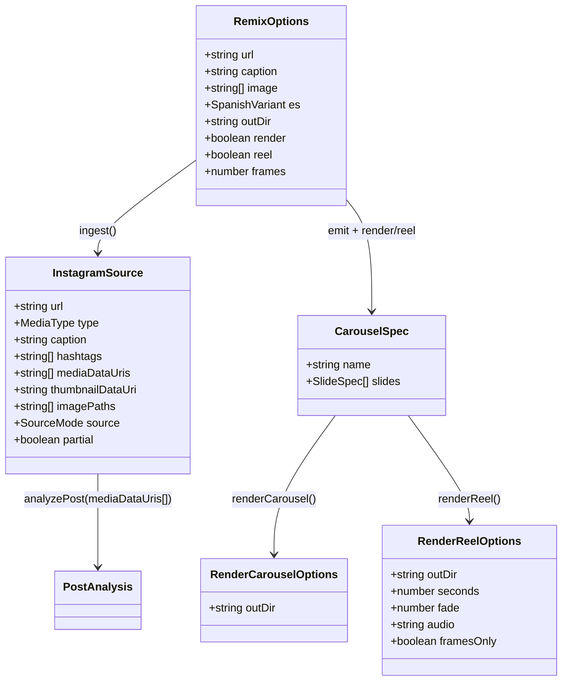

# Remix de Instagram — análisis profundo + flujo end-to-end (Iteración 2/3)

## Requirements

Profundizar el remix en dos frentes: (A) **ingesta multi-imagen** — capturar todas las imágenes de un carrusel y varios frames de un reel para que el análisis sea slide-por-slide, manteniendo el fallback manual; (B) **flujo de un solo comando** — flags `--render` y `--reel` en `npm run remix` que, tras emitir las 2 variaciones `.ts`, corran la maquinaria existente y dejen PNGs 4:5 y/o el Reel 9:16 listos sin pasos manuales. La reutilización es obligatoria: el render del remix pasa por las MISMAS funciones que `generate`/`reel` (se extraen a funciones; no se duplica). `npm run typecheck` verde y `generate`/`reel` intactos como gate.

Boundary: solo frames visuales del reel (no transcripción de audio); tope de imágenes al modelo; degradación cuando no haya múltiples imágenes/video/ffmpeg.

## Entities

Notas de conservación:
- `InstagramSource` se **extiende** con `mediaDataUris: string[]`; `thumbnailDataUri` se conserva (derivado de `mediaDataUris[0]`) para no romper la caché de `analyzePost`. Sin redefinir tipos de marca.
- `Renderer`, `resolveBackground`, `composeReel`, `reelDuration`, `FORMATS`, `CarouselSpec` se reutilizan **sin cambios**.
- `renderCarousel`/`renderReel` son **extracciones** de la lógica ya existente en `src/cli.ts` / `src/reel/cli.ts` (no lógica nueva); los `main()` pasan a delegar.

## Approach

1. **Extracción behavior-preserving de render/reel**:
   - Crear `src/render/renderCarousel.ts` con `renderCarousel(spec, opts)` = exactamente el loop hoy dentro del `main()` de `src/cli.ts` (score + mkdir + Renderer 4:5 + resolveBackground + screenshot por slide). Refactorizar `src/cli.ts#main` para delegar.
   - Crear `src/reel/renderReel.ts` con `renderReel(spec, opts)` = exactamente la lógica del `main()` de `src/reel/cli.ts` (Renderer 9:16 + resolveBackground + duraciones + composeReel). Refactorizar `src/reel/cli.ts#main` para delegar (parseo de flags se queda en el CLI).
   - Verificación: `generate` y `reel` deben producir el mismo output que antes.

2. **Ingesta profunda (`src/remix/ingest.ts`)**:
   - **Carrusel**: tras obtener el HTML, extraer todas las URLs de imagen candidatas del JSON embebido (`"display_url":"..."`, además de `og:image`), normalizar (unescape `&`/`\/`), deduplicar, filtrar por host de contenido (`*cdninstagram*`/`*fbcdn*`) y descartar miniaturas obvias. Descargar cada una a data URI (con tope).
   - **Reel**: extraer `og:video`/`"video_url":"..."`; si hay URL y ffmpeg disponible, descargar el MP4 a `.cache/remix/tmp-<hash>.mp4` y muestrear `frames` (default 5) imágenes equiespaciadas con `ffmpeg` (spawn, patrón de `video.ts`), cada una a data URI; limpiar el temporal. Si falla, degradar a thumbnail.
   - **Manual**: cargar TODAS las rutas `opts.image` a data URIs.
   - Poblar `mediaDataUris[]`; `thumbnailDataUri = mediaDataUris[0]`. `partial` = sin imágenes múltiples NI caption rico.

3. **Análisis multi-imagen (`src/ai/analyze.ts`)**:
   - `analyzePost` adjunta CADA `mediaDataUri` (hasta `MAX_IMAGES = 8`) como `image_url`, pidiendo análisis slide-por-slide. Caché por hash de (caption + join(mediaDataUris) + model). Mantener compat si solo hay 1 imagen.

4. **Orquestación end-to-end (`src/remix/cli.ts`)**:
   - Parsear `--render`, `--reel`, `--frames=N`. Tras `emitCarouselFile`, importar el spec emitido y, según flags, llamar `renderCarousel(spec, { outDir: "output" })` y/o `renderReel(spec, { outDir: "output" })`. Imprimir rutas de PNGs/MP4. Errores de render se propagan al `main().catch`.

5. **Manejo de errores**: degradables (sin multi-imagen, sin video, sin ffmpeg para frames) → `⚠️` + continuar; fatales (sin API key con fondos `ai`, ffmpeg ausente al componer) → `Error` propagado y `process.exit(1)`.

## Structure

### Inheritance / type relationships
1. `RenderCarouselOptions` y `RenderReelOptions` son interfaces nuevas (en sus respectivos módulos o en `remix/types.ts`); `RemixOptions` se extiende con `render`/`reel`/`frames`.
2. `InstagramSource` gana `mediaDataUris: string[]`; `thumbnailDataUri` queda opcional derivado.
3. Sin clases nuevas salvo reutilizar `Renderer`.

### Dependencies
1. `src/render/renderCarousel.ts` → `Renderer`, `resolveBackground`, `scoreCarousel`/`THRESHOLD`, `printReport`, `createElement`, `node:fs/promises`, `node:path`.
2. `src/reel/renderReel.ts` → `Renderer`, `resolveBackground`, `composeReel`, `reelDuration`, `FORMATS`, `createElement`, `node:fs/promises`, `node:path`.
3. `src/cli.ts` → `renderCarousel` (delega). `src/reel/cli.ts` → `renderReel` (delega).
4. `src/remix/cli.ts` → `renderCarousel`, `renderReel` (además de lo de iter.1).
5. `src/remix/ingest.ts` → `node:child_process` (ffmpeg), `node:fs/promises`, `node:os` (tmp), `fetch`. Sin dependencias nuevas en `package.json`.

### Layered architecture
1. **Render reutilizable** (`src/render/renderCarousel.ts`, `src/reel/renderReel.ts`): funciones puras de orquestación de render; consumidas por los 3 CLIs.
2. **CLIs** (`src/cli.ts`, `src/reel/cli.ts`, `src/remix/cli.ts`): parseo de args + delegación.
3. **Ingesta** (`src/remix/ingest.ts`): IO de red/ffmpeg → `InstagramSource` multi-imagen.
4. **Razonamiento** (`src/ai/analyze.ts`): N imágenes → `PostAnalysis`.

## Operations

### Create Module - src/render/renderCarousel.ts
1. Responsibility: render reutilizable de un carrusel a PNGs 4:5 (lógica extraída de `src/cli.ts`).
2. Methods:
   - `export interface RenderCarouselOptions { outDir?: string }`
   - `async renderCarousel(spec: CarouselSpec, opts?: RenderCarouselOptions): Promise<string[]>`
     - Logic (idéntica a la actual de `src/cli.ts#main`, sin el parseo de argv ni el `import` del archivo):
       - `const score = scoreCarousel(spec); printReport(spec.name, score);` y la advertencia `< THRESHOLD` (respetando `SCORE_STRICT`: si está y score < THRESHOLD, lanzar Error con el mismo mensaje actual).
       - `const outDir = join(opts?.outDir ?? "output", spec.name)` bajo `process.cwd()`; `mkdir(recursive)`.
       - `new Renderer(); await init();` loop de slides: `props = { ...defaults, ...slide.props }`, `props.background = await resolveBackground(props.background)`, `render(createElement(...))`, escribir `slide-NN.png`, `console.log` de progreso; `finally close()`.
       - Devolver las rutas escritas.
3. Constraints: comportamiento idéntico al `generate` actual (mismos logs, mismo `SCORE_STRICT`, misma estructura de carpeta).

### Update - src/cli.ts (delegar en renderCarousel)
1. Responsibility: el CLI `generate` parsea argv, importa el archivo y delega.
2. Cambio: `main()` mantiene la validación de argv y el `import` del spec; reemplaza el loop de score+render por `await renderCarousel(spec)`. Mantener el `main().catch` actual. (Opcional: guard de entrypoint como score/cli, por consistencia.)
3. Constraint: salida observable idéntica.

### Create Module - src/reel/renderReel.ts
1. Responsibility: render reutilizable de un Reel 9:16 (lógica extraída de `src/reel/cli.ts`).
2. Methods:
   - `export interface RenderReelOptions { outDir?: string; seconds?: number; fade?: number; audio?: string; framesOnly?: boolean }`
   - `slideSeconds(props, hold): number` y el array `TEXT_KEYS` se mueven aquí (hoy viven en el CLI).
   - `async renderReel(spec: CarouselSpec, opts?: RenderReelOptions): Promise<string>`
     - Logic (idéntica al `main()` actual de `src/reel/cli.ts`, sin parseo de argv): crear `reelDir`, `Renderer.init(FORMATS.reel)`, loop render con `format:"reel"`, `resolveBackground`; si `framesOnly` retornar el dir; calcular `durations` (usando `opts.seconds` o `slideSeconds`), `composeReel(framePaths, durations, mp4, { fade: opts.fade ?? 0.4, audio: opts.audio })`, logs idénticos. Devolver la ruta del mp4 (o del dir si framesOnly).
3. Constraint: comportamiento idéntico al `reel` actual.

### Update - src/reel/cli.ts (delegar en renderReel)
1. Responsibility: el CLI `reel` parsea flags (`--seconds`/`--fade`/`--audio`/`--frames-only`) y delega.
2. Cambio: `main()` mantiene `numFlag`/`strFlag`/validación/`import` del spec; reemplaza el cuerpo de render+compose por `await renderReel(spec, { seconds, fade, audio, framesOnly })`. Mantener `main().catch`.
3. Constraint: salida observable idéntica.

### Update - src/remix/types.ts (extender tipos)
1. Cambios:
   - `InstagramSource`: añadir `mediaDataUris: string[];` (mantener `thumbnailDataUri?` como derivado del primero).
   - `RemixOptions`: añadir `render?: boolean; reel?: boolean; frames?: number;`.
2. Constraint: no romper los consumidores existentes; `thumbnailDataUri` sigue presente.

### Update - src/remix/ingest.ts (ingesta profunda)
1. Responsibility: poblar `mediaDataUris[]` con todas las imágenes del carrusel o los frames del reel.
2. Methods nuevos/cambios:
   - `extractImageUrls(html: string): string[]` — junta `og:image` + todas las `"display_url":"..."`, unescapea (`&`→`&`, `\/`→`/`), filtra por host de contenido, deduplica.
   - `async extractReelFrames(videoUrl: string, n: number): Promise<string[]>` — descarga el MP4 a un temporal en `.cache/remix/`, `ffmpeg -i tmp -vf fps=... ` o `-frames` equiespaciados → PNGs temporales → data URIs; limpia temporales; si ffmpeg/descarga falla, devolver `[]`.
   - `hasFfmpeg(): Promise<boolean>` — `spawn("ffmpeg", ["-version"])` (best-effort).
   - `ingest(opts)`:
     - fetch del HTML (igual que hoy). Para `type==="reel"`: intentar `og:video`/`video_url` → `extractReelFrames(url, opts.frames ?? 5)`. Si vacío, caer a imágenes.
     - Para carrusel/post: `extractImageUrls(html)` → descargar (hasta tope) a data URIs.
     - Manual: cargar todas las `opts.image`.
     - `mediaDataUris` = lo obtenido (deduplicado, tope); `thumbnailDataUri = mediaDataUris[0]`.
     - Mensajes `⚠️` cuando se degrada (sin video, sin ffmpeg, login wall).
3. Constraints: sin dependencias nuevas; nunca colgar; el flujo solo aborta si no hay NI imágenes NI caption.

### Update - src/ai/analyze.ts (multi-imagen)
1. Cambio en `analyzePost`:
   - `const MAX_IMAGES = 8;` adjuntar `source.mediaDataUris.slice(0, MAX_IMAGES)` como `image_url` (si `mediaDataUris` está vacío pero hay `thumbnailDataUri`, usar ese — compat).
   - Caché por hash de (caption + `mediaDataUris.join("|")` + model).
   - Prompt: pedir explícitamente análisis slide-por-slide cuando hay múltiples imágenes (poblar `copyPerSlide` con una entrada por slide observada).
2. Constraint: si solo hay 1 imagen, comportamiento equivalente al actual.

### Update - src/remix/cli.ts (flags + orquestación)
1. Cambios:
   - `parseArgs`: reconocer `--render`, `--reel`, `--frames=N`. Setear `opts.render`/`opts.reel`/`opts.frames`.
   - Tras emitir cada variación: si `opts.render` → `await renderCarousel(spec, { outDir: "output" })`; si `opts.reel` → `await renderReel(spec, { outDir: "output" })`. Imprimir rutas.
   - Pasar `opts.frames` a `ingest`.
   - `usage()` actualizado con los flags nuevos.
2. Constraint: sin flags, comportamiento = iteración 1 (solo emite .ts).

### Update - README.md
1. Cambio: documentar `--render`, `--reel`, `--frames=N`, y la ingesta multi-imagen (carrusel completo + frames de reel) con sus degradaciones.

## Norms

1. **Extracción 1:1**: `renderCarousel`/`renderReel` deben ser copia fiel de la lógica existente (mismos logs, mismas rutas, mismos defaults); no "mejorar" de paso salvo parametrizar `outDir`.
2. **Estilo**: funciones + tipos, imports con `.ts`, `import type`, ESM; comentarios en español (docstring por función).
3. **Degradable vs fatal**: red/ffmpeg-para-frames/sin-video = degradable (`⚠️` + seguir); sin API key con `ai` y ffmpeg ausente al componer = fatal (Error → exit 1).
4. **Caché**: `.cache/remix/` para temporales de video/frames y para el análisis (por conjunto de imágenes); limpiar temporales de video tras extraer frames.
5. **Topes**: `MAX_IMAGES = 8` al modelo; `frames` default 5. Loguear cuando se recorta.
6. **Sin dependencias nuevas**: ffmpeg vía `spawn` (ya presente), `fetch` global, regex.
7. **Idioma de salida**: sin cambios — copy SIEMPRE en español (heredado).

## Safeguards

1. **Functional**: con un carrusel accesible, `analyzePost` recibe >1 imagen; con un reel accesible + ffmpeg, recibe >1 frame; en ambos `copyPerSlide` refleja estructura slide-por-slide. Con `--render`/`--reel`, se producen PNGs/MP4 en `output/<name>/` para las 2 variaciones.
2. **Reutilización**: el render del remix invoca `renderCarousel`/`renderReel`, las MISMAS funciones que usan `generate`/`reel`. Prohibido duplicar el loop de render.
3. **No regresión**: `generate` y `reel` deben producir output idéntico tras la extracción (verificar corriendo ambos sobre un carrusel; PNGs/MP4 presentes, mismos logs).
4. **Degradación**: sin multi-imagen / sin video / sin ffmpeg-para-frames / login wall → `⚠️` y continúa con lo disponible; solo aborta si no hay imágenes ni caption.
5. **Coste/latencia**: ≤8 imágenes al modelo; caché de análisis por conjunto; temporales de video limpiados; fondos `ai` solo en render.
6. **Compatibilidad**: `thumbnailDataUri` se mantiene (= `mediaDataUris[0]`); la caché de análisis previa puede invalidarse (clave nueva) pero no debe romper.
7. **Integración**: NO modificar `src/templates/*`, `src/render/renderSlide.ts`, `src/render/background.ts`, `src/reel/video.ts`, `src/score/*`, `src/ai/openaiImage.ts`. Sí se actualizan `src/cli.ts` y `src/reel/cli.ts` (delegación) y `src/ai/analyze.ts`, `src/remix/*` (feature).
8. **Compilación**: `npm run typecheck` verde (gate). Sin dependencias nuevas en `package.json`.
9. **Seguridad**: requerir `OPENAI_API_KEY` para análisis/fondos; no loguear binarios ni la key; limpiar temporales.
10. **No-objetivos**: sin transcripción de audio; sin API oficial de IG ni headless browser (queda para iteración 3).
