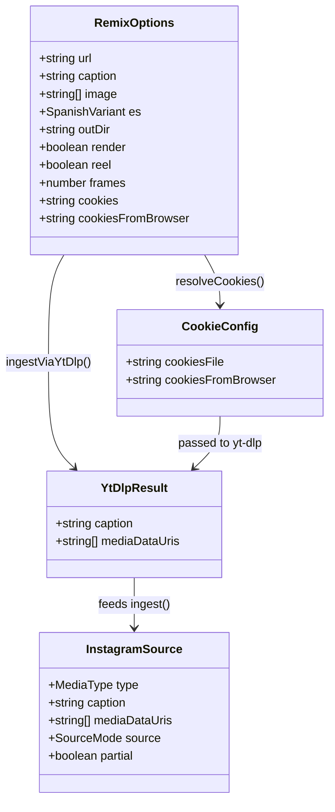

# Remix de Instagram — ingesta robusta con yt-dlp (Iteración 3/3)

## Requirements

Hacer la ingesta del remix robusta frente al login wall y el anti-scraping de Instagram, anteponiendo **yt-dlp** (binario externo opcional, como ffmpeg) como fuente preferente: obtiene caption/metadata (`yt-dlp -J`) y descarga TODOS los medios del post (imágenes del carrusel y/o el video del reel) a un temporal; imágenes → data URIs, videos → frames vía ffmpeg (reutilizando la lógica existente). Soporta cookies (`--cookies`, `--cookies-from-browser`, y env) para vencer el login wall. Degradación estricta: **yt-dlp → scraping público → manual**, sin caerse nunca. Sin dependencias npm nuevas; `mediaDataUris[]` y todo el pipeline aguas abajo intactos. Gate: `npm run typecheck` verde y `generate`/`reel`/`remix` siguen funcionando.

## Entities

Notas de conservación:
- `InstagramSource.mediaDataUris[]` NO cambia; yt-dlp lo puebla igual que el scraping. `source` admite el valor existente `"fetch"` para el media obtenido por yt-dlp (no se añaden nuevos modos para no romper consumidores).
- `RemixOptions` se **extiende** con `cookies?`/`cookiesFromBrowser?` (opcionales, backward-compatible).
- `framesFromLocalVideo`, `localImageToDataUri`, `MAX_INGEST_IMAGES` se **extraen/exportan** de `ingest.ts` para reutilizarlos en `ytdlp.ts` (sin cambiar su comportamiento).
- `hasFfmpeg`, `probeDuration`, `runFfmpeg` se reutilizan tal cual.

## Approach

1. **Proveedor yt-dlp aislado (`src/remix/ytdlp.ts`)**:
   - `ytDlpAvailable()`: `spawn("yt-dlp", ["--version"])` best-effort (patrón de `hasFfmpeg`).
   - `resolveCookies(opts)`: combina `opts.cookies`/`REMIX_COOKIES` (archivo) y `opts.cookiesFromBrowser`/`REMIX_COOKIES_FROM_BROWSER` (navegador) → array de flags para yt-dlp.
   - `ingestViaYtDlp(url, opts)`:
     1. `yt-dlp -J --no-warnings [cookieFlags] <url>` (con timeout) → `caption = description ?? title`.
     2. Descargar media a tmp dir único en `.cache/remix/`: `yt-dlp -o "<tmp>/%(autonumber)s.%(ext)s" --no-warnings [cookieFlags] <url>` (con timeout).
     3. Recorrer el tmp dir ordenado: imágenes (jpg/jpeg/png/webp) → `localImageToDataUri`; videos (mp4/mov/webm/mkv) → `framesFromLocalVideo(path, opts.frames ?? 5)`. Concatenar en orden; aplicar `MAX_INGEST_IMAGES`.
     4. `finally`: `rm` recursivo del tmp dir. Devolver `{ caption, mediaDataUris }`.
   - Cualquier fallo (no instalado, error de yt-dlp, timeout) → devolver `null`/lanzar capturado para degradar.

2. **Refactor reutilizable en `ingest.ts`**:
   - Extraer `framesFromLocalVideo(path, n)` (la lógica ffmpeg actual de `extractReelFrames`: `probeDuration` → fps → `runFfmpeg` → leer PNGs → data URIs → limpiar framesDir). `extractReelFrames(url, n)` pasa a: descargar MP4 a tmp + delegar en `framesFromLocalVideo` + limpiar.
   - Exportar `framesFromLocalVideo`, `localImageToDataUri`, `MAX_INGEST_IMAGES`.

3. **Cadena de degradación en `ingest()`**:
   - Al inicio del bloque `if (opts.url)`: si `ytDlpAvailable()`, intentar `ingestViaYtDlp(opts.url, opts)` (try/catch). Si devuelve caption/media, usarlos y marcar `mode = "fetch"`.
   - Si no hay media tras yt-dlp: `fetchPublic(url)` (scraping actual).
   - Si sigue sin media: input manual (`--caption`/`--image`).
   - Solo aborta si al final no hay imágenes ni caption (regla heredada).

4. **CLI (`src/remix/cli.ts`)**: parsear `--cookies=` y `--cookies-from-browser=` → `RemixOptions`; `usage()` documenta los flags. Mensaje informativo cuando se usan cookies (sin exponer contenido).

5. **Errores**: degradables (yt-dlp ausente/falla/timeout, sin ffmpeg para frames) → `ℹ️`/`⚠️` + continuar la cadena; fatales heredados (sin API key con `ai`) sin cambios.

## Structure

### Inheritance / type relationships
1. `YtDlpResult` y `CookieConfig` son tipos nuevos locales a `ytdlp.ts` (o en `remix/types.ts`). `RemixOptions` extendido con `cookies`/`cookiesFromBrowser`.
2. Sin clases nuevas; módulo funcional.

### Dependencies
1. `src/remix/ytdlp.ts` → `node:child_process` (spawn), `node:fs/promises`, `node:crypto`, y de `ingest.ts`: `framesFromLocalVideo`, `localImageToDataUri`, `MAX_INGEST_IMAGES`.
2. `src/remix/ingest.ts` → ahora importa de `ytdlp.ts`: `ytDlpAvailable`, `ingestViaYtDlp`. (Cuidado: evitar ciclo — ver Norms: `ytdlp.ts` importa helpers de `ingest.ts`, e `ingest.ts` importa el proveedor de `ytdlp.ts`. Los helpers reutilizados no dependen del proveedor, así que el ciclo es seguro en ESM, pero para limpieza los helpers compartidos pueden moverse a un `media.ts`; ver decisión abajo.)
3. `src/remix/cli.ts` → sin nuevas dependencias salvo el parseo de flags.
4. Sin cambios en `package.json` (binarios externos).

### Layered architecture
1. **Proveedores de ingesta** (`ytdlp.ts` + funciones de `ingest.ts`): obtienen media de fuentes diversas.
2. **Orquestador** (`ingest.ts#ingest`): cadena de degradación → `InstagramSource`.
3. **CLI** (`cli.ts`): flags + orquestación general (sin cambios estructurales).
4. Aguas abajo (analyze/emit/render): intactos.

## Operations

### Refactor - src/remix/ingest.ts (extraer framesFromLocalVideo + exports)
1. Responsibility: separar la lógica ffmpeg de muestreo para reutilizarla, sin cambiar comportamiento.
2. Cambios:
   - Crear `export async function framesFromLocalVideo(path: string, n: number): Promise<string[]>` con la lógica actual de muestreo de `extractReelFrames` (requiere ffmpeg; `probeDuration` → `fps = dur ? n/dur : 1` → `runFfmpeg(["-i", path, "-vf", "fps="+fps, "-frames:v", n, "-y", framesDir/frame-%02d.png])` → leer PNGs ordenados → data URIs; `finally` limpia framesDir). Si no hay ffmpeg → `[]` con `⚠️`.
   - Reescribir `extractReelFrames(videoUrl, n)`: descargar el MP4 a tmp en `.cache/remix/`, llamar `framesFromLocalVideo(tmp, n)`, `finally` limpiar el tmp. Comportamiento externo idéntico.
   - `export` de `localImageToDataUri` y `MAX_INGEST_IMAGES`.
3. Constraint: el path de reel por URL (iteración 2) sigue produciendo lo mismo.

### Create Module - src/remix/ytdlp.ts
1. Responsibility: proveedor de ingesta vía yt-dlp (fuente preferente, opcional).
2. Methods:
   - `export async function ytDlpAvailable(): Promise<boolean>` — `spawn("yt-dlp", ["--version"])`; resolve true si code 0; error → false.
   - `function resolveCookies(opts: RemixOptions): string[]` — flags: si `opts.cookies ?? process.env.REMIX_COOKIES` → `["--cookies", ruta]`; si `opts.cookiesFromBrowser ?? process.env.REMIX_COOKIES_FROM_BROWSER` → `["--cookies-from-browser", navegador]`. Puede combinar ambos.
   - `function runYtDlp(args: string[], opts: { timeoutMs?: number }): Promise<{ code: number; stdout: string; stderr: string }>` — spawn con captura de stdout/stderr y timeout (kill si expira).
   - `export async function ingestViaYtDlp(url: string, opts: RemixOptions): Promise<{ caption: string; mediaDataUris: string[] } | null>`
     - Logic:
       - `const cookies = resolveCookies(opts)`.
       - Metadata: `runYtDlp(["-J", "--no-warnings", ...cookies, url], { timeoutMs })`; parsear stdout JSON; `caption = json.description ?? json.title ?? ""`. Si falla el JSON, `caption = ""`.
       - tmp dir único `.cache/remix/ytdlp-<hash(url)>-<rand-by-no-rand>` → usar hash de url + el contador de intentos; (no `Math.random`/`Date.now` en módulos de workflow no aplica aquí; en runtime normal sí, pero preferir hash de url para determinismo).
       - Descarga: `runYtDlp(["-o", join(tmp, "%(autonumber)s.%(ext)s"), "--no-warnings", ...cookies, url], { timeoutMs })`. Si code ≠ 0 y no hay archivos → devolver `caption ? { caption, mediaDataUris: [] } : null`.
       - Recorrer `readdir(tmp)` ordenado: por extensión, imagen → `localImageToDataUri`; video → `framesFromLocalVideo(path, opts.frames ?? 5)`. Concatenar; `slice(0, MAX_INGEST_IMAGES)`.
       - `finally`: `rm(tmp, {recursive:true, force:true})`.
       - Si cookies activas, `console.log("ℹ️  yt-dlp con cookies")` (sin contenido).
       - Devolver `{ caption, mediaDataUris }` si hay algo; si no hay media ni caption, `null`.
3. Constraints: nunca lanzar hacia afuera sin capturar (devolver `null` para degradar); no loguear contenido de cookies; timeout para no colgar.

### Update - src/remix/types.ts (cookies en RemixOptions)
1. Cambio: añadir `cookies?: string;` y `cookiesFromBrowser?: string;` a `RemixOptions`.
2. Constraint: opcionales; no rompe consumidores.

### Update - src/remix/ingest.ts (anteponer yt-dlp en la cadena)
1. Cambio en `ingest(opts)`: dentro de `if (opts.url)`, ANTES de `fetchPublic`:
   - `if (await ytDlpAvailable()) { try { const r = await ingestViaYtDlp(opts.url, opts); if (r && (r.mediaDataUris.length || r.caption)) { caption = r.caption; mediaDataUris = r.mediaDataUris; mode = "fetch"; console.log(\`✓ yt-dlp: \${mediaDataUris.length} medio(s).\`); } } catch (e) { console.warn("⚠️  yt-dlp falló; sigo con scraping."); } }`
   - Si tras yt-dlp `!mediaDataUris.length && !caption` (o falta media), continuar con `fetchPublic` (envolver el scraping en un `if` que respete lo ya obtenido).
2. Constraint: si yt-dlp no está, el comportamiento es exactamente el de iteración 2.

### Update - src/remix/cli.ts (flags de cookies)
1. Cambios:
   - `parseArgs`: `--cookies=` → `opts.cookies`; `--cookies-from-browser=` → `opts.cookiesFromBrowser`.
   - `usage()`: documentar ambos flags y las env vars.
2. Constraint: sin cookies, comportamiento previo.

### Update - README.md
1. Cambio: sección de ingesta — explicar que el remix usa yt-dlp si está instalado (más confiable; vence login wall con cookies), con la cadena de degradación y ejemplos: `--cookies=cookies.txt`, `--cookies-from-browser=chrome`, env `REMIX_COOKIES`/`REMIX_COOKIES_FROM_BROWSER`, y nota de instalación (`pip install -U yt-dlp`).

## Norms

1. **Binarios externos opcionales**: detectar con `spawn(bin, ["--version"|"-version"])`; ausencia degrada, no rompe. Sin dependencias npm.
2. **Evitar ciclo de imports**: `ytdlp.ts` importa SOLO helpers puros de `ingest.ts` (`framesFromLocalVideo`, `localImageToDataUri`, `MAX_INGEST_IMAGES`) que no dependen del proveedor; `ingest.ts` importa el proveedor. ESM tolera este ciclo porque los helpers no se ejecutan en tiempo de import. (Si surge problema, mover los helpers a `src/remix/media.ts`.)
3. **Timeouts**: todo `spawn` de yt-dlp con timeout (p. ej. 120s) y kill al expirar.
4. **Seguridad de cookies**: pasar flags a yt-dlp sin loguear su contenido ni la ruta completa; no cachear cookies.
5. **Caché/temporales**: tmp dirs en `.cache/remix/`, limpieza en `finally`. La caché de ingesta por URL ya existente sigue aplicando.
6. **Degradable vs fatal**: yt-dlp (ausente/falla/timeout) y sin-ffmpeg-para-frames = degradable; sin API key con `ai` = fatal (heredado).
7. **Estilo**: funciones + tipos, imports `.ts`, `import type`, ESM; comentarios en español.
8. **Sin determinismo prohibido**: nombrar tmp dirs por hash de URL (estable), evitando depender de timestamps aleatorios.

## Safeguards

1. **Functional**: con yt-dlp instalado y un post accesible (o cookies válidas), la ingesta obtiene caption + medios (carrusel completo o frames del reel) de forma confiable, poblando `mediaDataUris[]`.
2. **Degradación**: yt-dlp ausente/falla/timeout → scraping público → manual. El proceso nunca se cae por la ingesta; solo aborta si no hay imágenes ni caption.
3. **Cookies**: `--cookies`/`REMIX_COOKIES` (archivo) y `--cookies-from-browser`/`REMIX_COOKIES_FROM_BROWSER` (navegador) se pasan a yt-dlp; su contenido no se loguea.
4. **Reutilización**: los frames de video salen de `framesFromLocalVideo` (misma lógica ffmpeg de iteración 2); prohibido duplicar la extracción.
5. **Compatibilidad**: `InstagramSource`/`mediaDataUris[]` y el pipeline aguas abajo (analyze/emit/render) NO cambian; el path de iteración 2 sigue igual cuando yt-dlp no está.
6. **Integración**: NO modificar `src/templates/*`, `src/render/*` (salvo lo ya hecho), `src/reel/video.ts`, `src/score/*`, `src/ai/openaiImage.ts`. Cambios acotados a `src/remix/*` (+ README).
7. **Compilación**: `npm run typecheck` verde (gate). Verificar que `generate`/`reel`/`remix` corren (sin regresión).
8. **Performance**: timeout en yt-dlp; tope `MAX_INGEST_IMAGES`; limpieza de temporales.
9. **Sin dependencias npm nuevas**: yt-dlp y ffmpeg son binarios externos opcionales detectados en runtime.
10. **No-objetivos**: no integrar API oficial de IG ni Playwright; no persistir cookies ni credenciales.
