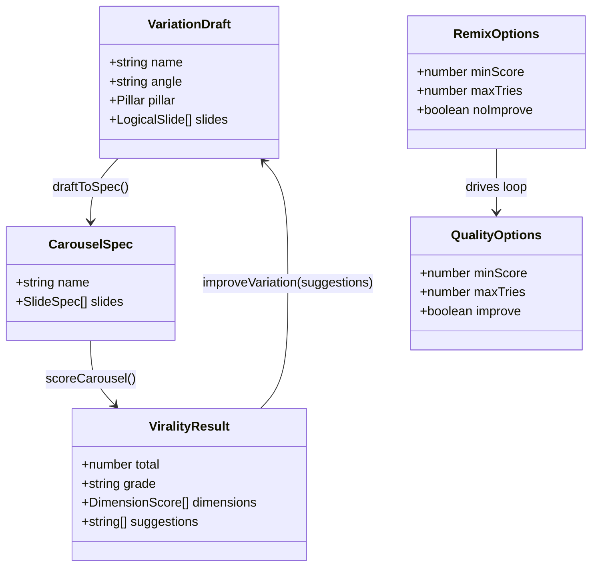

# Remix de Instagram — loop de calidad ≥ umbral (Tanda 2 · Iteración 1/3)

## Requirements

Garantizar que cada variación generada por `npm run remix` alcance el umbral de viralidad (`scoreCarousel` ≥ 75) mediante un loop de mejora dirigido: puntuar el draft en memoria, y si está por debajo, re-promptar al modelo con las `suggestions` concretas del score, hasta pasar el umbral o agotar un tope de intentos; emitir el **mejor** draft visto. Configurable (`--min-score`, `--max-tries`, `--no-improve`), sin bloquear si no se alcanza (advierte). Integra `scoreCarousel`/`THRESHOLD` y el cliente de `analyze.ts`; no rompe `generate`/`reel`/`remix`. Gate: `npm run typecheck` verde.

## Entities

Notas de conservación:
- `VariationDraft`, `ViralityResult`, `CarouselSpec`, `Pillar` ya existen; no se redefinen.
- `RemixOptions` se **extiende** con `minScore?`, `maxTries?`, `noImprove?` (opcionales, backward-compatible).
- `scoreCarousel`, `THRESHOLD`, `validateDraft`, `generateVariations`, `normalizeVariations` se reutilizan.
- `draftToSpec` mapea solo para puntuar (no resuelve fondos `ai`).

## Approach

1. **Puntuación en memoria (`src/remix/registry.ts`)**:
   - `TEMPLATE_COMPONENTS: Record<TemplateName, ComponentType<any>>` importando los componentes de `../templates/index.ts`, alineado con `TEMPLATE_CATALOG`.
   - `draftToSpec(draft)`: arma un `CarouselSpec` con `slides[].template = TEMPLATE_COMPONENTS[name]` y `props = { ...logicalProps, ...(pillar ? {pillar} : {}) }`; `defaults = { pillar: draft.pillar }`. Background omitido (no afecta el score).
   - `scoreDraft(draft)`: `scoreCarousel(draftToSpec(validateDraft(draft)))`.

2. **Mejora dirigida (`src/ai/analyze.ts`)**:
   - `improveVariation(analysis, draft, suggestions, opts)`: re-prompt con el catálogo de plantillas, las reglas de marca/viralidad (las mismas embebidas), el idioma, el draft actual (JSON) y las `suggestions` del score; pide UNA variación mejorada que conserve el `angle` y corrija esas debilidades. `response_format json_object` → normalizar con `normalizeVariations`; devolver la primera variación válida o el draft original si no hay.

3. **Loop de calidad (`src/remix/cli.ts`)**:
   - Por cada draft de `generateVariations`: `best = validateDraft(draft)`, `bestScore = scoreDraft(best)`. Si `improve` y `bestScore.total < minScore`: hasta `maxTries-1` reintentos → `cand = validateDraft(await improveVariation(...))`, `candScore = scoreDraft(cand)`; si `candScore.total > bestScore.total` actualizar best; `break` al alcanzar `minScore`. Emitir `best`; reportar score; render/reel según flags.
   - Flags: `--min-score=N` (default `THRESHOLD`), `--max-tries=N` (default 3), `--no-improve`.

4. **Errores**: el loop solo corre tras una generación exitosa (precondición `OPENAI_API_KEY` ya cubierta). `improveVariation` que falle/vacíe → conservar el mejor previo, continuar (degradable). No bloquear si no se alcanza el umbral (warning, patrón de `generate`).

## Structure

### Inheritance / type relationships
1. `QualityOptions` es un tipo auxiliar (en `cli.ts` o `registry.ts`); `RemixOptions` extendido con `minScore`/`maxTries`/`noImprove`.
2. `draftToSpec`/`scoreDraft` funciones puras en `registry.ts`; sin clases.

### Dependencies
1. `src/remix/registry.ts` → `../templates/index.ts` (componentes), `./templates-catalog.ts` (TemplateName), `./emit.ts` (`validateDraft`), `../score/virality.ts` (`scoreCarousel`), `./types.ts`.
2. `src/ai/analyze.ts` → reutiliza su cliente/`getModel`/`normalizeVariations`/`TEMPLATE_CATALOG`/`BRAND_RULES`; añade `improveVariation`.
3. `src/remix/cli.ts` → `scoreDraft` (registry), `improveVariation` (analyze), `validateDraft` (emit), `scoreCarousel`/`THRESHOLD`, `emitCarouselFile`.
4. Sin cambios en `package.json`.

### Layered architecture
1. **Scoring en memoria** (`registry.ts`): draft → spec → score.
2. **Razonamiento** (`analyze.ts`): `generateVariations` + `improveVariation`.
3. **Orquestación** (`cli.ts`): loop calidad → emit del mejor → render/reel.
4. **Emisión/validación** (`emit.ts`): sin cambios.

## Operations

### Create Module - src/remix/registry.ts
1. Responsibility: convertir un `VariationDraft` a `CarouselSpec` en memoria y puntuarlo, sin escribir archivos.
2. Methods:
   - `import { Hook, Lead, Step, Prompt, MythReality, Cta } from "../templates/index.ts";`
   - `export const TEMPLATE_COMPONENTS: Record<TemplateName, ComponentType<any>> = { Hook, Lead, Step, Prompt, MythReality, Cta };`
   - `export function draftToSpec(draft: VariationDraft): CarouselSpec`
     - Logic: `slides = draft.slides.map(s => ({ template: TEMPLATE_COMPONENTS[s.template], props: { ...s.props, ...(s.pillar ? { pillar: s.pillar } : {}) } }))`; `return { name: draft.name || "remix", defaults: { pillar: draft.pillar }, slides }`.
   - `export function scoreDraft(draft: VariationDraft): ViralityResult`
     - Logic: `return scoreCarousel(draftToSpec(validateDraft(draft)))`.
3. Constraints: `TEMPLATE_COMPONENTS` cubre TODO `TemplateName` (typecheck lo verifica); no resolver fondos.

### Update - src/ai/analyze.ts (improveVariation)
1. Responsibility: producir una versión mejorada de un draft usando el feedback del score.
2. Method:
   - `export async function improveVariation(analysis: PostAnalysis, draft: VariationDraft, suggestions: string[], opts: { es: SpanishVariant }): Promise<VariationDraft>`
     - Logic: construir prompt con (a) catálogo `TEMPLATE_CATALOG`, (b) `BRAND_RULES`, (c) idioma (`opts.es`), (d) el draft actual `JSON.stringify(draft)`, (e) `suggestions` del score como lista de correcciones obligatorias, (f) instrucción: "Devuelve UNA sola variación mejorada que CONSERVE el angle y CORRIJA cada debilidad listada; mismo shape JSON { variations: [VariationDraft] }". `chat.completions.create({ model, response_format: json_object })`.
     - Parsear con `normalizeVariations`; `return variations[0] ?? draft` (si vacío, devolver el original).
3. Constraints: reutiliza cliente/`getModel`/`BRAND_RULES`/`TEMPLATE_CATALOG`/`normalizeVariations` ya presentes; no duplica.

### Update - src/remix/types.ts (opciones del loop)
1. Cambio: añadir a `RemixOptions`: `minScore?: number; maxTries?: number; noImprove?: boolean;`.
2. Constraint: opcionales; no rompe consumidores.

### Update - src/remix/cli.ts (loop de calidad + flags)
1. Cambios:
   - `parseArgs`: `--min-score=N` → `opts.minScore`; `--max-tries=N` → `opts.maxTries`; `--no-improve` → `opts.noImprove = true`.
   - Reemplazar el bloque "emit→score" por:
     - `const minScore = opts.minScore ?? THRESHOLD; const maxTries = Math.max(1, opts.maxTries ?? 3); const improve = !opts.noImprove;`
     - Por cada draft: `let best = validateDraft(draft); let bestScore = scoreDraft(best);`
     - `if (improve) { for (let t = 1; t < maxTries && bestScore.total < minScore; t++) { console.log(\`  ↻ Mejorando (intento \${t+1}/\${maxTries}, score \${bestScore.total}/\${minScore})…\`); const cand = validateDraft(await improveVariation(analysis, best, bestScore.suggestions, { es: opts.es })); const cs = scoreDraft(cand); if (cs.total > bestScore.total) { best = cand; bestScore = cs; } } }`
     - Nombre: aplicar el sufijo `-vN` a `best.name` (como hoy).
     - `emitCarouselFile(best, ...)`; importar y `printReport` (o reportar `bestScore`); warning si `< minScore`.
     - render/reel igual que hoy.
   - `usage()`: documentar `--min-score`, `--max-tries`, `--no-improve`.
2. Constraint: con `--no-improve`, comportamiento = tanda anterior. El score reportado debe ser el del draft emitido.

### Update - README.md
1. Cambio: en la sección Remix, documentar el loop de calidad (cada variación se itera hasta ≥75) y los flags `--min-score`, `--max-tries`, `--no-improve`.

## Norms

1. **Reutilización**: el loop usa `scoreCarousel` (mismo gate que `generate`) y el cliente/`BRAND_RULES`/`normalizeVariations` ya presentes; prohibido duplicar la lógica de scoring o de prompt de marca.
2. **Conservar el mejor**: nunca emitir un draft con score menor al mejor visto en el loop.
3. **Validar antes de puntuar**: siempre `validateDraft` antes de `scoreDraft`/emit, para que el score coincida con el `.ts` final.
4. **Degradable**: `improveVariation` que falle/vacíe no aborta; se conserva el mejor previo.
5. **No bloquear**: si no se alcanza el umbral tras `maxTries`, emitir el mejor + `⚠️` (patrón de `cli.ts`/`generate`).
6. **Estilo**: funciones + tipos, imports `.ts`, `import type`, ESM; comentarios en español.
7. **Coste**: break temprano al alcanzar `minScore`; tope `maxTries` (default 3); `--no-improve` para pruebas sin coste extra.

## Safeguards

1. **Functional**: con el loop activo, cada variación emitida tiene el score más alto alcanzable en `maxTries` intentos; si algún intento alcanza `minScore`, se corta. El score reportado y el del `.ts` emitido coinciden.
2. **Calidad**: objetivo por defecto = `THRESHOLD` (75); configurable con `--min-score`. No se emite nunca un draft peor que el mejor evaluado.
3. **No bloqueo**: si no se alcanza el umbral, se emite el mejor draft con advertencia visible; el proceso no aborta.
4. **Coste/latencia**: ≤ `maxTries` llamadas de mejora por variación; break temprano; `--no-improve` lo desactiva.
5. **Compatibilidad**: `draftToSpec` no resuelve fondos `ai`; el pipeline emit/render/reel no cambia; con `--no-improve` el comportamiento es el de la tanda anterior.
6. **Integración**: NO modificar `src/templates/*`, `src/render/*`, `src/reel/*`, `src/score/*`, `src/ai/openaiImage.ts`. Cambios en `src/remix/*` (registry/cli/types), `src/ai/analyze.ts` (añadir función), README.
7. **Compilación**: `npm run typecheck` verde; `TEMPLATE_COMPONENTS` cubre todo `TemplateName` (chequeado por el tipo `Record<TemplateName, …>`).
8. **Consistencia de score**: `scoreDraft` y el score post-emisión usan `scoreCarousel` sobre el mismo draft validado.
9. **Seguridad**: sin cambios; reutiliza el cliente OpenAI existente (misma `OPENAI_API_KEY`).
10. **No-objetivos**: no cambiar el algoritmo de `scoreCarousel`; no subir `count` de variaciones; no tocar la ingesta.
