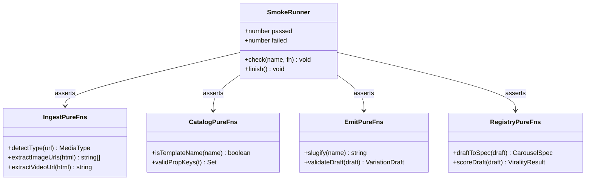

# Remix de Instagram — smoke tests del pipeline (Tanda 2 · Iteración 2/3)

## Requirements

Blindar la base del remix con un set de smoke tests deterministas, offline (sin OpenAI/ffmpeg/yt-dlp/red), que cubra las funciones puras del pipeline (parsing de ingesta, catálogo, validación/serialización y scoring en memoria). Implementar un runner mínimo sin dependencias nuevas (tsx + `node:assert/strict`) expuesto como `npm run test`, que falle con exit≠0 ante cualquier regresión, y sumarlo al quality gate junto a `npm run typecheck`. No modificar el código de producción (si un test revela un bug, se corrige por SPDD).

## Entities

Notas de conservación:
- No se crean entidades de dominio; el test consume la API pública ya exportada.
- `tsconfig.include` se extiende con `"test"` (cambio de config, no de código).
- No se tocan `src/*` salvo que un test exponga un bug (entonces se corrige vía SPDD).

## Approach

1. **Runner casero (`test/smoke.ts`)**:
   - `node:assert/strict` + helper `check(name, fn)`: ejecuta `fn`, cuenta passed/failed, imprime `✓`/`✗ + error`. Al final imprime resumen y `process.exit(failed ? 1 : 0)`.
   - Fixtures embebidos (HTML de IG, drafts strong/weak) como literales.

2. **Cobertura por módulo** (solo funciones exportadas, puras):
   - `ingest`: `detectType`, `extractImageUrls`, `extractVideoUrl`.
   - `templates-catalog`: `isTemplateName`, `validPropKeys`.
   - `emit`: `slugify`, `validateDraft`.
   - `registry`: `draftToSpec`, `scoreDraft`.

3. **Gate**: añadir `"test": "tsx test/smoke.ts"`; el gate de la iteración es `npm run typecheck` && `npm run test`.

4. **Errores**: el runner no lanza; acumula y reporta; exit 1 si hay fallos (rojo), 0 si todo pasa (verde).

## Structure

### Inheritance / type relationships
1. Sin clases ni herencia; `test/smoke.ts` es un script funcional con un contador local y un helper `check`.
2. Importa exclusivamente APIs públicas de `src/remix/*` y `src/score/virality.ts`.

### Dependencies
1. `test/smoke.ts` → `node:assert/strict`; `../src/remix/ingest.ts` (`detectType`, `extractImageUrls`, `extractVideoUrl`); `../src/remix/templates-catalog.ts` (`isTemplateName`, `validPropKeys`); `../src/remix/emit.ts` (`slugify`, `validateDraft`); `../src/remix/registry.ts` (`draftToSpec`, `scoreDraft`); `../src/score/virality.ts` (`THRESHOLD`); tipos de `../src/remix/types.ts`.
2. `package.json` → script `test`.
3. `tsconfig.json` → `include` += `"test"`.

### Layered architecture
1. **Test runner** (`test/smoke.ts`): orquesta casos y exit code.
2. **Bajo test**: capas puras existentes (ingest parsing, catalog, emit validate, registry scoring).
3. Sin capas nuevas de producción.

## Operations

### Create Module - test/smoke.ts
1. Responsibility: ejecutar smoke tests deterministas de las funciones puras del pipeline y fijar el exit code para el gate.
2. Helper:
   - `let passed = 0, failed = 0;`
   - `function check(name: string, fn: () => void): void` — `try { fn(); passed++; console.log("✓", name); } catch (e) { failed++; console.error("✗", name, "—", e instanceof Error ? e.message : e); }`
3. Casos (usar `assert` de `node:assert/strict`):
   - **detectType**: `detectType("https://www.instagram.com/reel/AbC/") === "reel"`; `/reels/` → reel; `/tv/` → reel; `/p/` → post; URL no-IG → unknown.
   - **extractImageUrls**: sobre un HTML fixture con `og:image` repetido (con `&amp;`), dos `"display_url"` (con `\/`), y un `` de `static.cdninstagram.com/rsrc.php` (ícono): el resultado (a) deduplica el og:image (aparece 1 vez), (b) incluye las 2 display_url unescapeadas (sin `\/`, con `&`), (c) NO incluye el ícono `rsrc.php`/host no-CDN, (d) longitud esperada = 3.
   - **extractVideoUrl**: HTML con `og:video` → esa URL; HTML solo con `"video_url":"...\/...mp4"` → unescapeada; HTML sin video → `undefined`.
   - **isTemplateName**: `true` para "Hook","Cta"; `false` para "Foo".
   - **validPropKeys**: `validPropKeys("Hook")` contiene "title","highlight" (de Hook) y "background","pillar" (base); NO contiene "myth".
   - **slugify**: `slugify("Á remix Ñoño 2024!")` → ascii kebab sin acentos ni símbolos (p. ej. `"a-remix-nono-2024"`); cadena vacía → `"remix"`.
   - **validateDraft**:
     - Draft con un Step que trae una prop inventada (`bogus`) y SIN Hook ni Cta → resultado: primer slide `.template === "Hook"`, último `.template === "Cta"`; el Step ya no tiene `bogus`; los slides de desarrollo tienen `index`/`total` numéricos con `total === slides.length`.
     - Draft que ya empieza con Hook y termina con Cta → conserva ese orden.
   - **draftToSpec**: para un draft validado, `spec.slides.length === draft.slides.length`, cada `slide.template` es una función (componente), y `spec.defaults.pillar === draft.pillar`.
   - **scoreDraft**: `scoreDraft(weak).total < scoreDraft(strong).total`; `scoreDraft(strong).total >= THRESHOLD` (fixture strong con número en hook + enemigo + bucle + highlight + reframe MythReality + CTA de guardar + handle).
4. Cierre: `console.log(\`\n\${passed} ok, \${failed} fallos\`); process.exit(failed ? 1 : 0);`
5. Constraints: 100% offline; sin red/OpenAI/ffmpeg/yt-dlp; aserciones por comportamiento; usar `THRESHOLD` importado.

### Update - package.json (script test)
1. Cambio: añadir `"test": "tsx test/smoke.ts"` a `scripts`.
2. Constraint: sin dependencias nuevas.

### Update - tsconfig.json (incluir test)
1. Cambio: `"include": ["src", "carousels", "test"]`.
2. Constraint: que `npm run typecheck` cubra el test; no alterar otras opciones.

### Update - README.md (sección tests)
1. Cambio: breve nota "Tests" — `npm run test` corre smoke tests offline de las funciones puras del pipeline (parsing de ingesta, validación, scoring); parte del gate junto a `npm run typecheck`.

## Norms

1. **Sin dependencias nuevas**: solo `node:assert/strict` + tsx (ya presentes).
2. **Determinismo**: nada de red/OpenAI/ffmpeg/yt-dlp/tiempo/aleatorio; fixtures embebidos.
3. **Aserciones por comportamiento**: dedup/unescape/conteos/estructura/umbrales relativos; evitar fijar strings frágiles o el contenido por defecto que inserta `validateDraft`.
4. **Exit code como gate**: `process.exit(1)` si algún caso falla; `0` si todos pasan.
5. **Solo API pública**: importar funciones exportadas; no reimplementar lógica.
6. **Estilo**: ESM, imports `.ts`, `import type` para tipos, comentarios en español.
7. **No tocar producción**: si un test revela un bug real, se corrige por el flujo SPDD (no se ablanda el test).

## Safeguards

1. **Functional**: `npm run test` ejecuta todos los casos y termina en exit 0 cuando el pipeline está sano; exit 1 ante cualquier fallo.
2. **Cobertura mínima**: detectType, extractImageUrls, extractVideoUrl, isTemplateName, validPropKeys, slugify, validateDraft, draftToSpec, scoreDraft — todas con al menos un caso significativo.
3. **Offline/rápido**: corre en segundos, sin red ni binarios externos ni API keys.
4. **Robustez de aserciones**: el caso de score combina absoluto (`strong ≥ THRESHOLD`) y relativo (`weak < strong`) para resistir reajustes del algoritmo.
5. **Integración con el gate**: la iteración cierra solo si `npm run typecheck` Y `npm run test` están verdes.
6. **No regresión**: `generate`/`reel`/`remix` siguen funcionando; el cambio es aditivo (test/ + script + include).
7. **Compilación**: con `test` en `include`, `tsc --noEmit` también typechequea el runner.
8. **Mantenibilidad**: un solo archivo, helper simple; ampliable a más casos sin framework.
9. **No-objetivos**: no cubrir funciones que requieran IO/red/binarios (extractReelFrames, ingestViaYtDlp, analyzePost, emitCarouselFile a disco); no añadir Vitest/Jest.
