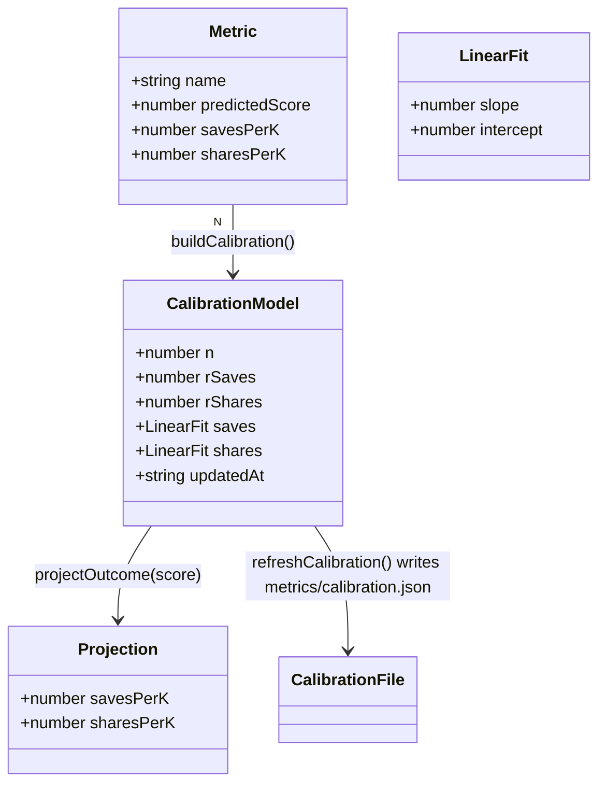

# Score de viralidad — cerrar el bucle predicho↔real (Tanda 2 · Iteración 3/3)

## Requirements

Cerrar el bucle de aprendizaje del indicador de viralidad: a partir de las métricas reales registradas (`record`), aprender un mapeo del score predicho a las tasas reales (saves/1k, shares/1k), persistirlo, y proyectarlo en cada reporte de score (`score`, `generate`, `remix`) de forma robusta con pocos datos (n≥3, etiqueta de confianza). No auto-tunear los pesos de `scoreCarousel` (overfit). Cambios aditivos; `npm run typecheck` y `npm run test` verdes; `record`/`calibrate`/`generate`/`reel`/`remix` siguen funcionando.

## Entities

Notas de conservación:
- `Metric` es la forma que ya escribe `record.ts`; se reutiliza (no se redefine su escritura).
- `scoreCarousel`/`ViralityResult`/`THRESHOLD` intactos.
- `pearson` se centraliza en `calibration.ts` (antes en `calibrate.ts`).
- `calibration.json` es dato derivado en runtime (no se commitea data real).

## Approach

1. **Módulo de calibración (`src/score/calibration.ts`)**:
   - Matemática pura: `pearson(xs,ys)`, `linearFit(xs,ys)` (mínimos cuadrados; null si <2 puntos o varianza 0).
   - `buildCalibration(metrics)`: con n≥3 ajusta `predicted→savesPerK` y `predicted→sharesPerK` + `rSaves`/`rShares`; null si insuficiente.
   - `refreshCalibration()`: lee `metrics/*.json` (excluye `calibration.json`), construye y escribe `metrics/calibration.json`.
   - `loadCalibration()`: lectura sync tolerante (`readFileSync`) → `CalibrationModel|null`.
   - `projectOutcome(model, score)`: aplica las rectas, clamp ≥0.

2. **Realimentación en `record.ts`**: tras escribir el metric, `await refreshCalibration()` (cierra el bucle automáticamente) e informar al usuario.

3. **`calibrate.ts`**: importa `pearson`/`buildCalibration`/`refreshCalibration`; persiste el modelo y muestra proyección para scores de referencia (THRESHOLD y 90) cuando hay modelo.

4. **Proyección en `printReport` (`src/score/cli.ts`)**: si `loadCalibration()` da modelo con `n≥3`, añadir una línea: `≈ X saves/1k · Y shares/1k (según N carruseles, r=…)`, con etiqueta "preliminar" si `n<5` o `|rSaves|<0.3`. Defensivo (try/catch → no mostrar nada si algo falla).

5. **Tests (`test/smoke.ts`)**: casos puros para `linearFit` (recta exacta), `projectOutcome` (clamp ≥0) y `pearson` (n<3 → null; correlación perfecta → 1).

6. **Errores**: toda la lectura/escritura de calibración es tolerante (try/catch → null/no-op); nunca rompe el reporte ni los CLIs.

## Structure

### Inheritance / type relationships
1. Tipos nuevos `LinearFit`, `CalibrationModel`, `Projection`, `Metric` en `calibration.ts` (módulo funcional, sin clases).
2. `calibrate.ts` deja de definir `pearson`/`Metric` localmente y los importa de `calibration.ts`.

### Dependencies
1. `src/score/calibration.ts` → `node:fs` (`existsSync`,`readFileSync`), `node:fs/promises` (`readdir`,`readFile`,`writeFile`,`mkdir`), `node:path`.
2. `src/score/record.ts` → `refreshCalibration` (además de lo actual).
3. `src/score/calibrate.ts` → `pearson`, `buildCalibration`, `refreshCalibration`, tipos, de `calibration.ts`.
4. `src/score/cli.ts` (`printReport`) → `loadCalibration`, `projectOutcome` de `calibration.ts`.
5. `test/smoke.ts` → `linearFit`, `projectOutcome`, `pearson` de `calibration.ts`.

### Layered architecture
1. **Calibración (modelo + matemática)** (`calibration.ts`): aprende y proyecta.
2. **Registro** (`record.ts`): captura real + refresca modelo.
3. **Diagnóstico** (`calibrate.ts`): tabla + correlación + persistencia.
4. **Reporte** (`cli.ts#printReport`): muestra score + proyección.

## Operations

### Create Module - src/score/calibration.ts
1. Responsibility: aprender, persistir, cargar y proyectar el mapeo predicho→real.
2. Tipos:
   - `export interface Metric { name: string; predictedScore: number; saves: number; shares: number; reach: number; savesPerK: number; sharesPerK: number; }`
   - `export interface LinearFit { slope: number; intercept: number; }`
   - `export interface CalibrationModel { n: number; rSaves: number | null; rShares: number | null; saves: LinearFit; shares: LinearFit; updatedAt: string; }`
3. Métodos:
   - `export function pearson(xs: number[], ys: number[]): number | null` — (la actual de calibrate.ts; n<3 → null; den 0 → null; redondeo .toFixed(2)).
   - `export function linearFit(xs: number[], ys: number[]): LinearFit | null` — mínimos cuadrados: `slope = Σ(x-mx)(y-my)/Σ(x-mx)²`, `intercept = my - slope*mx`; null si `xs.length<2` o `Σ(x-mx)²===0`.
   - `export function buildCalibration(metrics: Metric[]): CalibrationModel | null` — si `metrics.length<3` → null; `xs=predictedScore`; `saves=linearFit(xs, savesPerK)`, `shares=linearFit(xs, sharesPerK)`; si algún fit es null → null; `rSaves=pearson(...)`, `rShares=pearson(...)`; `updatedAt` recibido por parámetro o fijado por el caller (evitar `new Date()` directo aquí no es obligatorio en runtime CLI; usar `new Date().toISOString()` está permitido en CLIs).
   - `export async function refreshCalibration(metricsDir?: string): Promise<CalibrationModel | null>` — `dir = metricsDir ?? join(cwd,"metrics")`; leer `*.json` excepto `calibration.json`; parsear a `Metric[]`; `model=buildCalibration(...)`; si model, `writeFile(dir/calibration.json, JSON)`; devolver model (o null).
   - `export function loadCalibration(metricsDir?: string): CalibrationModel | null` — sync: si existe `calibration.json`, `JSON.parse(readFileSync(...))` dentro de try/catch; si no, null.
   - `export function projectOutcome(model: CalibrationModel, score: number): { savesPerK: number; sharesPerK: number }` — `savesPerK = max(0, slope*score+intercept)` (saves) y análogo shares; redondear a 1 decimal.
4. Constraints: matemática pura y determinista (pearson/linearFit/projectOutcome); IO tolerante.

### Update - src/score/calibrate.ts (usar el módulo + persistir)
1. Cambios:
   - Eliminar la `pearson` local y la interface `Metric` local; importarlas de `calibration.ts`.
   - Tras imprimir la tabla y las correlaciones, `const model = await refreshCalibration();` y, si `model`, imprimir proyección de referencia: para `score` en `[THRESHOLD, 90]`, `projectOutcome(model, score)` → "score 75 ≈ X saves/1k · Y shares/1k".
   - Mantener el aviso actual si `rSaves<0.3`.
2. Constraint: salida sigue siendo informativa; ahora además deja `calibration.json`.

### Update - src/score/record.ts (refrescar calibración)
1. Cambio: tras `writeFile` del metric, `const model = await refreshCalibration();` y si `model` loggear "Calibración actualizada (n=…)"; si no, sugerir registrar más (≥3) para activar la proyección.
2. Constraint: no cambia el formato del metric; aditivo.

### Update - src/score/cli.ts (proyección en printReport)
1. Cambio en `printReport(name, r)`: al final, `const model = loadCalibration();` envuelto en try/catch; si `model && model.n >= 3`, imprimir:
   - `const p = projectOutcome(model, r.total);`
   - línea: `📈 Según tus datos (n=${model.n}${model.n<5 ? ", preliminar" : ""}): ≈ ${p.savesPerK} saves/1k · ${p.sharesPerK} shares/1k` y, si `rSaves!=null`, `(r=${model.rSaves})`.
2. Constraint: si no hay modelo o algo falla, no se imprime nada extra (comportamiento actual intacto). No romper el guard de entrypoint ya existente.

### Update - test/smoke.ts (tests de calibración)
1. Cambios: importar `linearFit`, `projectOutcome`, `pearson` de `../src/score/calibration.ts`; añadir casos:
   - `linearFit([0,1,2],[1,3,5])` → `slope≈2`, `intercept≈1` (tolerancia 1e-9).
   - `linearFit([1,1,1],[1,2,3])` → null (varianza 0).
   - `projectOutcome({saves:{slope:2,intercept:1},shares:{slope:0,intercept:0.5}, n:3, rSaves:1, rShares:1, updatedAt:""}, 10)` → `savesPerK=21`, `sharesPerK=0.5`; y un caso con slope negativo que clampa a 0.
   - `pearson([1,2,3],[2,4,6])` → 1; `pearson([1,2],[1,2])` → null (n<3).
2. Constraint: puros, offline; el gate `npm run test` sigue verde.

### Update - README.md (bucle de aprendizaje)
1. Cambio: en la sección de viralidad/score, documentar que `record` refresca la calibración y que el reporte muestra la proyección saves/1k·shares/1k según los datos reales (n≥3).

## Norms

1. **No tocar `scoreCarousel`**: la calibración es capa de proyección; los pesos no se auto-ajustan.
2. **Una sola `pearson`**: vive en `calibration.ts`; `calibrate.ts` la importa.
3. **IO tolerante**: lectura/escritura de calibración en try/catch; `loadCalibration` nunca lanza.
4. **Determinismo en la matemática**: `linearFit`/`projectOutcome`/`pearson` puras y testeadas; sin tiempo/red en ellas (`updatedAt` lo fija el flujo IO, no la matemática pura).
5. **Robustez estadística**: proyectar solo con `n≥3`; etiquetar preliminar si `n<5` o `|r|<0.3`.
6. **Aditivo**: `printReport` solo añade líneas; sin cambiar lo existente.
7. **Estilo**: ESM, imports `.ts`, `import type`, comentarios en español.

## Safeguards

1. **Functional**: con ≥3 métricas registradas, `record`/`calibrate` dejan `metrics/calibration.json` y `printReport` muestra la proyección saves/1k·shares/1k para el score actual; con <3, no se proyecta (sin romper nada).
2. **No auto-tuning**: `scoreCarousel` y sus pesos quedan idénticos; la calibración no los modifica.
3. **Robustez**: `loadCalibration`/`refreshCalibration` toleran ausencia/corrupción de archivos (try/catch → null/no-op); `linearFit`/`pearson` devuelven null ante datos degenerados.
4. **Determinismo testeado**: smoke tests cubren `linearFit`, `projectOutcome` (incl. clamp ≥0) y `pearson`; `npm run test` verde.
5. **Compatibilidad**: `record`/`calibrate`/`generate`/`reel`/`remix` siguen funcionando; cambios aditivos; el guard de entrypoint de `score/cli.ts` se mantiene.
6. **Integración**: NO modificar `src/templates/*`, `src/render/*`, `src/reel/*`, `src/remix/*`, `src/ai/*`, ni `src/score/virality.ts`. Cambios en `src/score/{calibration.ts,calibrate.ts,record.ts,cli.ts}`, `test/smoke.ts`, README.
7. **Compilación**: `npm run typecheck` verde (incluye `test/` y los nuevos tipos).
8. **Privacidad de datos**: `calibration.json` y `metrics/<name>.json` son datos del usuario generados en runtime; no se commitea data real en esta iteración.
9. **Performance**: `printReport` solo lee un JSON pequeño (sync) y tolera su ausencia; sin escaneo de directorio en el hot path.
10. **No-objetivos**: no regresión multivariable sobre las dimensiones; no modificar el algoritmo del score; no red ni servicios externos.
