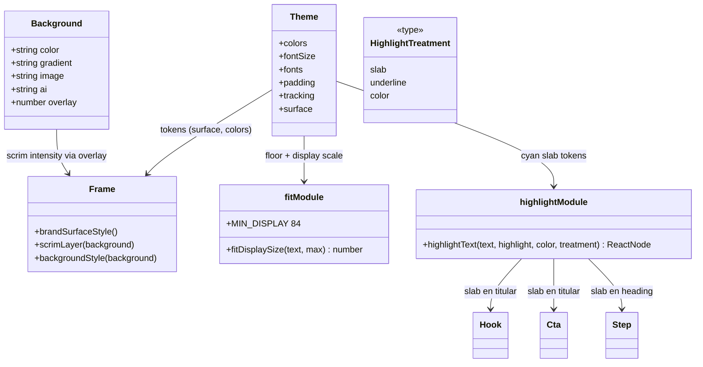

# Rediseño visual de plantillas — P1 stop-scroll (Iteración 1/3)

## Requirements

Elevar el "stop-scroll" y el valor percibido de los carruseles/Reels de ia.es atacando los 3 problemas de mayor impacto, sobre el sistema de plantillas existente y sin romper contratos: (1) **fondos gráficos de marca + scrim direccional** (reemplazar stock fotográfico por superficie abstracta navy+glow+grano, y el overlay negro plano por un scrim de abajo→arriba que garantice contraste ≥4.5:1); (2) **tipografía type-as-hero** (titular dominante: Anton lineHeight ~0.92, tracking negativo, `fitDisplaySize` con piso 84px); (3) **acento cian contundente** (la palabra `highlight` sobre slab cian / subrayado grueso como firma de marca). Backward-compatible (`CarouselSpec`/`BaseSlideProps`/`Background` intactos); `generate`/`reel`/`remix` siguen funcionando; gate `npm run typecheck` + `npm run test` verdes; fidelidad de marca (navy+cian, Anton/Inter/JetBrainsMono, 60-30-10, sin morado neón).

## Entities

Notas de conservación:
- `Background` NO cambia de forma; `overlay` se reinterpreta (intensidad del scrim direccional), documentado en el tipo.
- `highlightText` gana un 4º parámetro **opcional** (`treatment`) con default = comportamiento actual (`color`) → los 4 llamadores compilan sin cambios.
- `theme` se **extiende** con tokens nuevos (`tracking`, `surface`); no se renombran los existentes.
- `CarouselSpec`/`BaseSlideProps`/`SlideSpec` sin cambios.

## Approach

1. **Tokens de marca (`src/theme.ts`)**:
   - Añadir `theme.tracking = { display: "-0.02em", tight: "-0.01em" }`.
   - Añadir `theme.surface` con piezas reutilizables: `bgDeep: "#070A12"`, y helpers de string para gradiente base + glow cian. (Solo tokens/strings; el ensamblado CSS vive en Frame/htmlShell.)
   - Subir dominancia del display (mantener `display: 128` como `max`, pero el piso lo pone `fit.ts`).

2. **Superficie de marca + scrim (`src/templates/Frame.tsx` + `src/render/htmlShell.ts`)**:
   - **htmlShell**: inyectar una utilidad CSS global de grano determinista (`data:image/svg+xml` con `feTurbulence` seed fijo, opacidad ~0.05) como variable `--brand-grain`, y una clase/var de glow.
   - **Frame**: cuando NO hay `background`, pintar la **superficie de marca** (linear-gradient navy→`#070A12` + radial glow cian arriba/lateral + capa de grano) en vez de `backgroundColor` plano.
   - **scrimLayer** reemplaza `overlayLayer`: si el fondo es `{image}` (o trae `overlay`), pintar `linear-gradient(180deg, transparent 28%, rgba(7,10,18,α) 100%)` (α derivado de `overlay`, default 0.9) + viñeta radial sutil. Para fondos `{color}`/`{gradient}` sin `overlay`, no añadir scrim (igual que hoy).

3. **Type-as-hero (`src/templates/fit.ts` + `src/templates/Hook.tsx`)**:
   - `fit.ts`: exportar `MIN_DISPLAY = 84`; `fitDisplaySize` aplica `Math.max(MIN_DISPLAY, round(max*factor))`.
   - `Hook.tsx`: `lineHeight: 0.92`, `letterSpacing: theme.tracking.display`; subtitle con color `textMuted` y tamaño contenido (ratio H1:cuerpo alto).

4. **Slab cian (`src/templates/highlight.tsx` + titulares)**:
   - `highlightText(text, highlight, color, treatment?)` con `treatment: "slab"|"underline"|"color"` (default `"color"`).
     - `slab`: `backgroundColor: color`, `color: theme.colors.bg`, `padding: "0 0.12em"`, `borderRadius: 6`, `boxDecorationBreak: "clone"` (+ `WebkitBoxDecorationBreak`).
     - `underline`: `borderBottom: 0.09em solid color`, `paddingBottom: 0.04em`.
     - `color`: actual.
   - Hook (título), Cta (título), Step (heading) pasan `"slab"`. Lead mantiene `color`/`underline`.

5. **Estilo IA abstracto (`src/render/background.ts`)**:
   - `BRAND_IMAGE_STYLE` → `"abstract branded backdrop, deep navy #0B1020 to near-black gradient, soft cyan #22D3EE glow orb, subtle film grain, faint bokeh light specks, NO objects, NO devices, NO people, NO text, generous dark negative space for text overlay, poster aesthetic, high contrast"`.

## Structure

### Type relationships
1. `HighlightTreatment = "slab" | "underline" | "color"` (nuevo, en `highlight.tsx`).
2. `theme` extendido con `tracking` y `surface` (objetos `as const`).
3. `fit.ts` exporta `MIN_DISPLAY`.

### Dependencies
1. `Frame.tsx` → `theme` (surface/colors), `Background`, helpers de grano de `htmlShell` (vía CSS var).
2. `htmlShell.ts` → genera CSS de grano (autocontenido, sin nuevas deps).
3. `Hook.tsx`/`Cta.tsx`/`Step.tsx` → `highlightText(..., "slab")`, `theme.tracking`.
4. `background.ts` → solo cambia la constante de estilo.
5. `test/smoke.ts` → añade casos de `fitDisplaySize` (piso) y `highlightText` (estructura slab).

### Layered architecture
1. **Tokens** (`theme.ts`): única fuente de verdad visual.
2. **Shell/CSS** (`htmlShell.ts`): utilidades globales (grano).
3. **Frame** (`Frame.tsx`): superficie + scrim + marca.
4. **Plantillas** (`Hook`/`Cta`/`Step`/`Lead`): consumen tokens + highlight.
5. **Pipeline IA** (`background.ts`): estilo del prompt.

## Operations

### Update - src/theme.ts (tokens type-as-hero + superficie)
1. Responsibility: añadir tokens nuevos sin renombrar los existentes.
2. Cambios:
   - Añadir `tracking: { display: "-0.02em", tight: "-0.01em" } as const`.
   - Añadir `surface: { bgDeep: "#070A12", glow: "rgba(34,211,238,0.16)" } as const`.
3. Constraint: no cambiar `colors`/`fontSize`/`padding`/`fonts` existentes.

### Update - src/templates/fit.ts (piso de display)
1. Responsibility: que el titular nunca baje de 84px.
2. Cambios:
   - `export const MIN_DISPLAY = 84;`
   - `fitDisplaySize`: `return Math.max(MIN_DISPLAY, Math.round(max * factor));`
3. Constraint: para `max` menores (Step/heading usa `theme.fontSize.heading=64`), el piso no debe inflar tamaños pequeños indebidamente → aplicar el piso SOLO cuando `max >= theme.fontSize.title` (titulares grandes); para `max` chico, comportamiento actual. (Implementar: `const floor = max >= theme.fontSize.title ? MIN_DISPLAY : 0;`)

### Update - src/templates/highlight.tsx (tratamientos)
1. Responsibility: convertir el highlight en firma de marca (slab/underline) manteniendo compat.
2. Method: `highlightText(text: string, highlight: string | undefined, color: string, treatment: HighlightTreatment = "color"): ReactNode`
   - `slab`: `` — `navyBg` importado de `theme.colors.bg`.
   - `underline`: ``.
   - `color`: actual (``).
3. Constraint: default `"color"` (compat con los 4 llamadores actuales).

### Update - src/render/htmlShell.ts (grano determinista)
1. Responsibility: utilidad global de grano y deep-bg como CSS vars.
2. Cambios: añadir al `<style>` una `:root` con `--brand-grain: url("data:image/svg+xml;utf8,<svg ...><filter feTurbulence baseFrequency=0.9 numOctaves=2 seed=7/>...></svg>")` (grano monocromo, tileable) y, opcional, `--brand-bg-deep: #070A12`.
3. Constraint: SVG con `seed` fijo (determinista); escapado correcto del data URI; sin binarios nuevos.

### Update - src/templates/Frame.tsx (superficie de marca + scrim direccional)
1. Responsibility: fondo premium por defecto + scrim que garantiza legibilidad.
2. Cambios:
   - `brandSurfaceStyle(): CSSProperties` → `backgroundColor: theme.colors.bg` + `backgroundImage` compuesto: `radial-gradient(120% 80% at 70% 0%, theme.surface.glow, transparent 55%), linear-gradient(180deg, theme.colors.bg, theme.surface.bgDeep), var(--brand-grain)`.
   - En el `div` raíz: si `background` es undefined → aplicar `brandSurfaceStyle()`; si está definido → `backgroundStyle(background)` (actual) + (para image) capa de grano encima opcional.
   - Reemplazar `overlayLayer` por `scrimLayer(bg)`:
     - Si `bg` tiene `image` o `overlay`: render `
` con `α = overlay ?? 0.9` (clamp 0..1).
     - Si no, `null`.
3. Constraint: el contenido (logo/chip/progreso/fuente/children) sigue sobre una capa `position:relative` por encima del scrim; render de carruseles existentes mejora, no se rompe.

### Update - src/templates/Hook.tsx (type-as-hero + slab)
1. Cambios:
   - `<h1>`: `lineHeight: 0.92`, `letterSpacing: theme.tracking.display`.
   - `highlightText(title, highlight, cyan, "slab")`.
2. Constraint: mantener eyebrow/subtitle/swipe; subtitle en `textMuted`.

### Update - src/templates/Cta.tsx y src/templates/Step.tsx (slab en titulares)
1. Cambios: en el titular/heading, usar `highlightText(..., "slab")` y aplicar `letterSpacing: theme.tracking.display` al display.
2. Constraint: no alterar el resto de props/estructura.

### Update - src/render/background.ts (estilo IA abstracto)
1. Cambio: reemplazar `BRAND_IMAGE_STYLE` por el string abstracto definido en Approach §5.
2. Constraint: `applyBrandStyle`/`resolveBackground`/caché sin cambios de lógica.

### Update - test/smoke.ts (cubrir lo nuevo y determinista)
1. Cambios:
   - `fitDisplaySize`: titular largo con `max=theme.fontSize.display` → `>= 84`; con `max=theme.fontSize.heading` (chico) → comportamiento sin piso (no inflar).
   - `highlightText(text, "x", "#22D3EE", "slab")` → nodo no-string (estructura) y no lanza; `treatment` default no rompe.
2. Constraint: offline, deterministas; `npm run test` verde.

### Update - README.md (nota de diseño)
1. Cambio: breve nota en la sección de marca/plantillas: superficie de marca por defecto, scrim direccional (semántica de `overlay`), slab cian como firma, type-as-hero.

## Norms

1. **Tokens primero**: colores/medidas nuevas van a `theme.ts`; las plantillas consumen tokens, no hex crudos nuevos (salvo el grano SVG y `bgDeep` ya tokenizados).
2. **Backward-compatible**: parámetros nuevos siempre opcionales con default = comportamiento previo; nada que rompa los `CarouselSpec` existentes.
3. **Determinismo del render**: grano con `seed` fijo; nada de `Math.random()`/tiempo en el render.
4. **Contraste**: el scrim garantiza ≥4.5:1 para el texto anclado abajo sobre `{image}`/`{ai}`.
5. **Marca**: cian como acento (10%), slab en 1-2 palabras; sin morado neón; respetar `pillarColor`.
6. **Estilo de código**: ESM, imports `.ts`, `import type`, comentarios en español; React inline styles como en el resto.
7. **Sin dependencias nuevas**: CSS/SVG inline; no librerías.

## Safeguards

1. **Functional**: slides sin `background` muestran la superficie de marca (gradiente+glow+grano); slides con `{image}`/`{ai}` llevan scrim direccional; los titulares no bajan de 84px y la palabra `highlight` aparece como slab/subrayado cian en Hook/Cta/Step.
2. **Contraste**: texto principal ≥4.5:1 sobre el fondo gracias al scrim/superficie (verificable visualmente en el render real).
3. **Backward-compatibility**: `Background`/`BaseSlideProps`/`CarouselSpec` sin cambios incompatibles; `highlightText` y `fitDisplaySize` mantienen su firma/uso actual (parámetros nuevos opcionales). Carruseles existentes (`mentiras-ia`, `estudiar-3-ias`, `_smoke-plantillas`) renderizan sin romper.
4. **Determinismo**: grano SVG con `seed` fijo; render reproducible en Playwright.
5. **Gate**: `npm run typecheck` y `npm run test` verdes; `npm run generate` del smoke carousel y `npm run reel --frames-only` corren sin error (verificación de no-regresión).
6. **Marca**: paleta navy+cian, tipografías Anton/Inter/JetBrainsMono, 60-30-10, sin morado neón cripto.
7. **Integración**: cambios acotados a `theme.ts`, `fit.ts`, `highlight.tsx`, `htmlShell.ts`, `Frame.tsx`, `Hook.tsx`, `Cta.tsx`, `Step.tsx`, `background.ts`, `test/smoke.ts`, `README.md`. NO tocar `renderSlide.ts`, `renderCarousel.ts`, `renderReel.ts`, `score/*`, `remix/*`, `ai/*`.
8. **Performance**: grano/scrim/glow son CSS; sin impacto perceptible en el tiempo de render.
9. **No-objetivos (van en P2/P3)**: número-como-gráfico, capa de profundidad avanzada, cita Playfair (P2); theming por pilar, grilla/espaciado, CTA invertido (P3). Aquí solo se respeta `pillarColor`.
