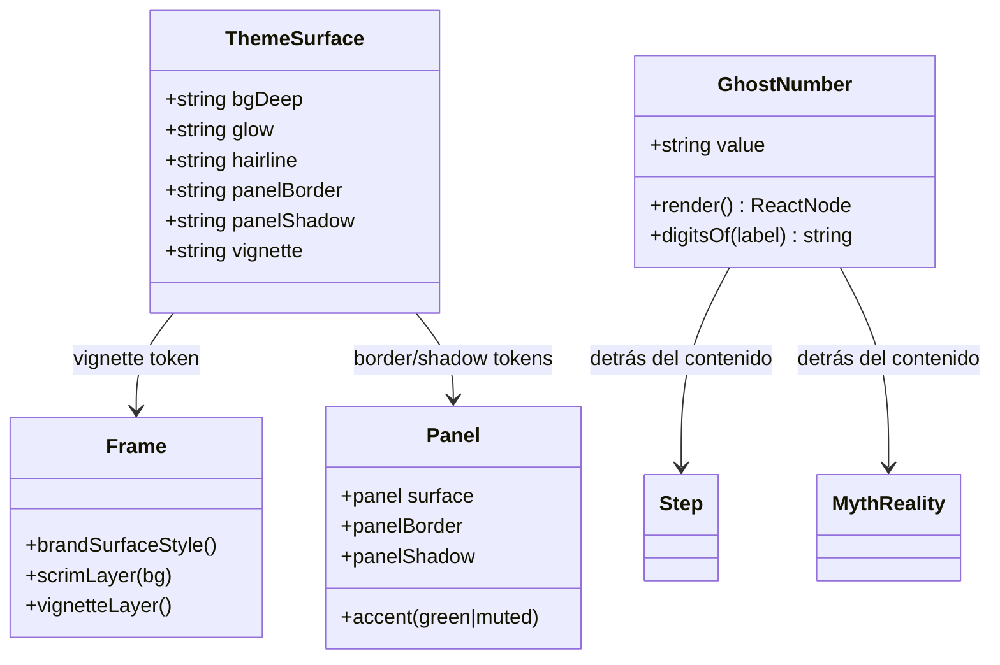

# Rediseño visual de plantillas — P2 profundidad editorial (Iteración 2/3)

## Requirements

Subir la profundidad y el "acabado premium" de los slides sobre lo hecho en P1, sin tocar contratos: (1) **número/índice como elemento gráfico** (ghost number Anton gigante detrás de Step y MythReality, cian a baja opacidad = textura editorial); (2) **profundidad premium reutilizable** (viñeta global sutil, hairlines y paneles con borde+sombra para MythReality y Prompt, que hoy se ven planos); (3) **refuerzo editorial de Lead** (hairline intencional, mejor jerarquía, palabra clave con tratamiento de marca underline). Backward-compatible; `generate`/`reel`/`remix` siguen funcionando; gate `npm run typecheck` + `npm run test` verdes; fidelidad de marca (navy+cian, verde solo para "realidad", sin morado neón, el ghost number es textura no acento).

## Entities

Notas de conservación:
- `theme.surface` (creado en P1) se **extiende** con `hairline`/`panelBorder`/`panelShadow`/`vignette`; no se renombra nada.
- `MythRealityProps`/`StepProps`/`PromptProps`/`LeadProps` y `Background`/`BaseSlideProps`/`CarouselSpec` **sin cambios**.
- `GhostNumber` es un subcomponente presentacional nuevo (módulo `src/templates/GhostNumber.tsx`), reutilizado por Step y MythReality.
- `highlightText` (P1) se reutiliza con `treatment="underline"` en Lead.

## Approach

1. **Tokens de profundidad (`src/theme.ts`)**: extender `surface` con:
   - `hairline: "rgba(255,255,255,0.08)"`, `panelBorder: "rgba(255,255,255,0.06)"`,
   - `panelShadow: "0 12px 40px rgba(0,0,0,0.35), inset 0 1px rgba(255,255,255,0.05)"`,
   - `vignette: "radial-gradient(120% 90% at 50% 45%, transparent 60%, rgba(0,0,0,0.35) 100%)"`.

2. **GhostNumber (`src/templates/GhostNumber.tsx`)**: subcomponente que pinta un `` Anton absoluto detrás del contenido. `digitsOf(label)` extrae 1-2 dígitos (regex `\d{1,2}`); si no hay dígito → no renderiza. Estilo: `position:absolute`, `top` en la mitad superior, `right`/`left` controlado, `fontFamily: Anton`, `fontSize ~300`, `lineHeight:1`, `color: accent`, `opacity:0.12`, `pointerEvents:none`, `zIndex:0`, `userSelect:none`.

3. **Profundidad en Frame (`src/templates/Frame.tsx`)**: añadir `vignetteLayer()` — capa `absolute inset:0 pointerEvents:none` con `backgroundImage: theme.surface.vignette`, SIEMPRE presente, entre el fondo y el contenido (después del scrim, antes del contenido).

4. **Paneles con profundidad**:
   - `MythReality.Panel`: `border: 1px solid panelBorder`, `boxShadow: panelShadow`; para "realidad", borde/acento verde tenue (`border-color` verde a baja opacidad o un borde-izquierdo verde); "mito" mantiene apagado.
   - `Prompt`: bloque mono gana `border: 1px solid panelBorder` (manteniendo `borderLeft 6px cian`) + `boxShadow: panelShadow`.

5. **Step + MythReality usan GhostNumber**: insertar `<GhostNumber value={...} />` como primer hijo de la capa de contenido (queda detrás por orden + zIndex), con el texto en `position:relative zIndex:1`. Step: `value = step`; MythReality: `value = digitsOf(mythLabel)`.

6. **Lead editorial (`src/templates/Lead.tsx`)**: hairline cian más intencional (línea + respiro), frase con `highlightText(text, highlight, cyan, "underline")`, jerarquía/aire afinados (sin fuentes nuevas).

## Structure

### Type relationships
1. `theme.surface` extendido (objeto `as const`), retrocompatible.
2. `GhostNumber` componente nuevo con prop `{ value?: string }` y export `digitsOf(label?: string): string`.
3. Sin cambios en interfaces de props de plantillas.

### Dependencies
1. `GhostNumber.tsx` → `theme` (Anton, accent).
2. `Step.tsx`/`MythReality.tsx` → `GhostNumber`.
3. `Frame.tsx` → `theme.surface.vignette`.
4. `MythReality.tsx`/`Prompt.tsx` → `theme.surface` (panelBorder/panelShadow), `theme.colors.green`.
5. `Lead.tsx` → `highlightText(..., "underline")`.
6. `test/smoke.ts` → `digitsOf` (pura).

### Layered architecture
1. **Tokens** (`theme.ts`): profundidad premium.
2. **Frame** (`Frame.tsx`): superficie + scrim (P1) + viñeta (P2).
3. **Primitivos** (`GhostNumber.tsx`): textura editorial reutilizable.
4. **Plantillas** (`Step`/`MythReality`/`Prompt`/`Lead`): consumen tokens + primitivos.

## Operations

### Update - src/theme.ts (tokens de profundidad)
1. Responsibility: añadir tokens de profundidad a `surface` sin renombrar.
2. Cambios: en `surface`, añadir `hairline`, `panelBorder`, `panelShadow`, `vignette` (valores de Approach §1).
3. Constraint: no alterar `bgDeep`/`glow` ni el resto de tokens.

### Create Module - src/templates/GhostNumber.tsx
1. Responsibility: textura editorial = número grande Anton detrás del contenido.
2. Exports:
   - `export function digitsOf(label?: string): string` — `label?.match(/\d{1,2}/)?.[0] ?? ""`.
   - `export function GhostNumber({ value }: { value?: string })` — si `!value` → `null`; si no, `` con el estilo de Approach §2.
3. Constraints: `pointerEvents:none`, `userSelect:none`, `zIndex:0`; tamaño/posición en mitad superior (no invade zona segura del Reel); recortado por `overflow:hidden` del Frame.

### Update - src/templates/Frame.tsx (viñeta global)
1. Responsibility: profundidad uniforme en todos los slides.
2. Cambios: añadir `function vignetteLayer()` (capa absoluta con `theme.surface.vignette`, `pointerEvents:none`); renderizarla justo después de `{scrimLayer(background)}` y antes de la capa de contenido `position:relative`.
3. Constraint: muy sutil; no resta legibilidad; siempre presente.

### Update - src/templates/Step.tsx (ghost number)
1. Cambios: importar `GhostNumber`; dentro de la capa de contenido, primer hijo `<GhostNumber value={step} />`; envolver el contenido visible en un `
` (o aplicar zIndex al contenedor existente) para que quede sobre el ghost.
2. Constraint: no cambiar props ni el resto del layout; el `step` pequeño cian se mantiene.

### Update - src/templates/MythReality.tsx (ghost number + paneles con profundidad)
1. Cambios:
   - Importar `GhostNumber`/`digitsOf`; añadir `<GhostNumber value={digitsOf(mythLabel)} />` detrás, con el contenido en `position:relative zIndex:1`.
   - `Panel`: añadir `border: 1px solid theme.surface.panelBorder`, `boxShadow: theme.surface.panelShadow`. Para realidad, acento verde tenue (p. ej. `borderColor` derivado o `borderLeft: 4px solid green`); mito apagado (sin acento).
2. Constraint: preservar jerarquía (realidad verde destaca, mito apagado); padding/tipografía actuales.

### Update - src/templates/Prompt.tsx (code block premium)
1. Cambios: al bloque mono, añadir `border: 1px solid theme.surface.panelBorder` y `boxShadow: theme.surface.panelShadow` (mantener `borderLeft 6px cian` y `backgroundColor panel`).
2. Constraint: no alterar el contenido/mono ni el `borderRadius`.

### Update - src/templates/Lead.tsx (refuerzo editorial)
1. Cambios:
   - Hairline cian más intencional (mantener la barra; opcional sumar una línea fina hairline bajo el kicker).
   - Frase: `highlightText(text, highlight, cyan, "underline")`.
   - Afinar jerarquía/aire (gap/lineHeight) sin cambiar la fuente.
2. Constraint: sin fuentes nuevas; props intactas.

### Update - test/smoke.ts (digitsOf)
1. Cambios: casos para `digitsOf`: `"Nº1"→"1"`, `"01"→"01"`, `"Mentira Nº3"→"3"`, `"sin número"→""`, `undefined→""`.
2. Constraint: offline/determinista; `npm run test` verde.

### Update - README.md (nota de diseño P2)
1. Cambio: ampliar la sección de marca: ghost number editorial, viñeta + hairlines, paneles con profundidad, Lead reforzado.

## Norms

1. **Tokens primero**: profundidad (hairline/panelBorder/panelShadow/vignette) vive en `theme.surface`; las plantillas la consumen.
2. **Ghost = textura**: opacidad baja, detrás del contenido (zIndex), `pointerEvents/userSelect:none`; no cuenta como acento 60-30-10.
3. **Backward-compatible**: nada de cambios en props/tipos; carruseles existentes mejoran, no rompen.
4. **Determinismo**: CSS estático; sin random/tiempo.
5. **Jerarquía de marca**: realidad verde destaca, mito apagado; navy+cian, sin morado neón.
6. **Zona segura Reel**: ghost number en mitad superior; viñeta uniforme no empuja contenido.
7. **Estilo**: ESM, imports `.ts`/`.tsx`, `import type`, comentarios en español, React inline styles.
8. **Sin dependencias ni fuentes nuevas**.

## Safeguards

1. **Functional**: Step y MythReality muestran un ghost number Anton detrás (cuando hay dígito); MythReality y Prompt tienen paneles con borde hairline + sombra; el Frame aplica viñeta sutil en todos los slides; Lead resalta la palabra clave con underline cian.
2. **Legibilidad**: el texto principal queda sobre el ghost/viñeta (zIndex) con contraste intacto (≥4.5:1).
3. **Jerarquía**: el panel "realidad" sigue destacando en verde; "mito" apagado.
4. **Backward-compatibility**: `CarouselSpec`/`BaseSlideProps`/`Background` y las props de las plantillas sin cambios; `mentiras-ia`, `estudiar-3-ias`, `_smoke-plantillas` renderizan sin romper (mejor).
5. **Determinismo**: todo CSS estático; render reproducible.
6. **Gate**: `npm run typecheck` y `npm run test` verdes; `npm run generate` del smoke carousel y `npm run reel --frames-only` corren sin error.
7. **Marca**: navy+cian (+verde realidad), sin morado neón; ghost number = textura, no acento.
8. **Integración**: cambios acotados a `theme.ts`, `GhostNumber.tsx` (nuevo), `Frame.tsx`, `Step.tsx`, `MythReality.tsx`, `Prompt.tsx`, `Lead.tsx`, `test/smoke.ts`, `README.md`. NO tocar `render*`, `score/*`, `remix/*`, `ai/*`, ni los tipos.
9. **Performance**: viñeta/sombra/ghost son CSS; sin impacto perceptible.
10. **No-objetivos (P3)**: theming completo por pilar, grilla/espaciado global, CTA invertido.
