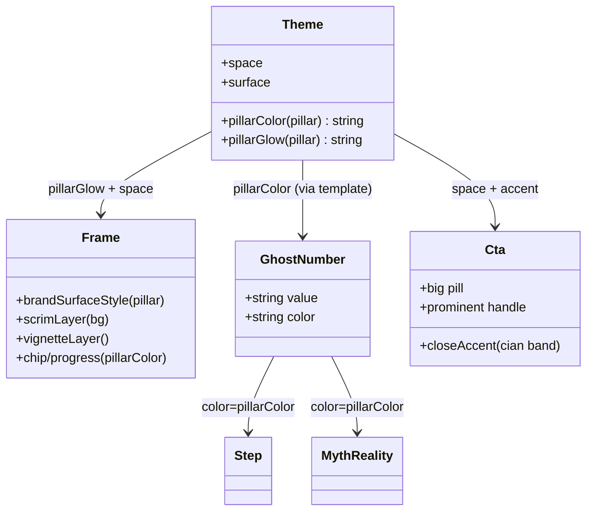

# Rediseño visual de plantillas — P3 sistema y consistencia (Iteración 3/3)

## Requirements

Cerrar el rediseño volviéndolo un sistema coherente y reconocible por pilar, sin tocar contratos: (1) **theming por pilar** — el pilar tiñe elementos SECUNDARIOS (glow de la superficie, ghost number, chip, progreso) con `pillarColor` (cian/violeta/rosa), manteniendo el **keyword del titular SIEMPRE en cian** (slab intacto); (2) **escala de espaciado 8-pt** (`theme.space`) aplicada a los gaps de las plantillas para ritmo coherente; (3) **Cta de cierre distinto** y contundente (realce cian acotado + pastilla grande + handle prominente) sin romper 60-30-10. Backward-compatible; `generate`/`reel`/`remix` funcionan; gate `npm run typecheck` + `npm run test` verdes; fidelidad de marca (navy + keyword cian; violeta `#8B5CF6`/rosa sutiles; sin morado neón).

## Entities

Notas de conservación:
- `pillarColor` ya existe; se añade `pillarGlow` y `theme.space` (no se renombra nada).
- `Background`/`BaseSlideProps`/`CarouselSpec` y las props de plantillas **sin cambios**.
- `GhostNumber` gana prop **opcional** `color` (default cian) → P2 sigue compilando.
- Keyword del titular (slab cian, P1) **intacto**: el pilar no lo toca.

## Approach

1. **theme.ts**:
   - `pillarGlow(pillar?: Pillar): string` — mapa pilar→rgba ~0.16: cian `rgba(34,211,238,0.16)` (herramienta/prompt/default), violeta `rgba(139,92,246,0.16)` (noticia), rosa `rgba(244,113,181,0.16)` (curiosidad).
   - `space = { xs:8, sm:16, md:24, lg:40, xl:64, xxl:96 } as const` (margen del lienzo sigue en `padding:120`).

2. **Frame.tsx**:
   - `brandSurfaceStyle(pillar?)` usa `pillarGlow(pillar)` en el radial superior (en vez de `surface.glow` fijo). `Frame` le pasa su `pillar`.
   - Progreso NN/MM: color con guiño tenue al pilar (p. ej. `pillarColor(pillar)` a opacidad/uso sutil) manteniendo legibilidad; chip ya usa `pillarColor`.

3. **GhostNumber.tsx**: añadir prop `color?: string` (default `theme.colors.accent`); usarla en el `color` del span. Step/MythReality pasan `pillarColor(pillar)`.

4. **Spacing**: aplicar `theme.space` a los `gap` de los contenedores de Hook/Lead/Step/Prompt/MythReality/Cta (mapeo conservador): 32→`lg`(40) o `md`(24) según rol, 36→`lg`, 28→`md`, 20→`sm`/`md`. Mantener layouts; solo tokenizar.

5. **Cta.tsx (modo cierre)**: añadir un realce cian acotado (p. ej. barra/hairline cian gruesa superior o marco sutil), agrandar la pastilla (padding/fontSize mayor), y `handle` prominente (color `text` + peso) con más aire (usando `space`). Cian reforzado pero sin fondo completo.

## Structure

### Type relationships
1. `pillarGlow(pillar?: Pillar): string` y `space` nuevos en `theme.ts` (export dentro de `theme`/funciones del módulo).
2. `GhostNumber` prop `color?` opcional.
3. Sin cambios en interfaces de props de plantillas ni en tipos de dominio.

### Dependencies
1. `Frame.tsx` → `theme` (`pillarGlow`, `pillarColor`, `space`, `surface`).
2. `GhostNumber.tsx` → `theme.colors.accent` (default).
3. `Step.tsx`/`MythReality.tsx` → `pillarColor` (pasan color al GhostNumber); `theme.space`.
4. `Hook/Lead/Prompt/Cta` → `theme.space`; `Cta` además acentos de cierre.
5. `test/smoke.ts` → `pillarGlow` (pura).

### Layered architecture
1. **Tokens** (`theme.ts`): `pillarColor`/`pillarGlow`/`space`/`surface`.
2. **Frame** (`Frame.tsx`): superficie tematizada + scrim + viñeta + chip/progreso.
3. **Primitivos** (`GhostNumber`): textura tintada por pilar.
4. **Plantillas**: consumen tokens; Cta con modo cierre.

## Operations

### Update - src/theme.ts (pillarGlow + space)
1. Responsibility: tokens de ambiente por pilar y escala de espaciado.
2. Cambios:
   - Añadir `space: { xs: 8, sm: 16, md: 24, lg: 40, xl: 64, xxl: 96 } as const` dentro de `theme`.
   - Añadir `export function pillarGlow(pillar?: Pillar): string` con el mapa de Approach §1 (default cian).
3. Constraint: no alterar `pillarColor`, `colors`, `surface`, `padding`, `fontSize`, `tracking`.

### Update - src/templates/Frame.tsx (superficie tematizada + progreso)
1. Cambios:
   - `brandSurfaceStyle(pillar?: Pillar)`: usar `pillarGlow(pillar)` en el radial de glow (resto igual). En el render, llamar `brandSurfaceStyle(pillar)`.
   - Progreso NN/MM: color con guiño tenue al pilar (p. ej. `color: pillarColor(pillar)` con opacidad/uso moderado) — sutil, sin perder legibilidad. Importar `pillarGlow`.
2. Constraint: chip sin cambios (ya pillarColor); scrim/viñeta intactos; default (sin pilar) = cian como hoy.

### Update - src/templates/GhostNumber.tsx (color por pilar)
1. Cambios: firma `GhostNumber({ value, color }: { value?: string; color?: string })`; usar `color ?? theme.colors.accent` en el `color` del span.
2. Constraint: default cian (P2 sin cambios); sigue textura (opacidad 0.12).

### Update - src/templates/Step.tsx (ghost tintado + space)
1. Cambios: `<GhostNumber value={step} color={pillarColor(base.pillar)} />` (obtener `pillar` de props/base); tokenizar gaps con `theme.space`.
2. Constraint: importar `pillarColor`; no cambiar props ni el resto del layout.

### Update - src/templates/MythReality.tsx (ghost tintado + space)
1. Cambios: `<GhostNumber value={digitsOf(mythLabel)} color={pillarColor(base.pillar)} />`; tokenizar gaps con `theme.space`. (Panel: el acento verde de "realidad" se mantiene — es semántico, no de pilar.)
2. Constraint: preservar jerarquía mito/realidad.

### Update - src/templates/Hook.tsx / Lead.tsx / Prompt.tsx (space)
1. Cambios: reemplazar gaps mágicos por `theme.space` (mapeo conservador). Keyword cian del Hook intacto.
2. Constraint: sin cambios de props ni de tipografía.

### Update - src/templates/Cta.tsx (modo cierre)
1. Cambios:
   - Añadir un **realce cian de cierre** acotado: una barra/hairline cian gruesa (p. ej. `height 8`, `width 120`, cian) arriba del título, o un marco sutil — señal de "final".
   - **Pastilla más grande/dominante**: subir padding (`space.md`/`lg`) y `fontSize` (p. ej. `theme.fontSize.lead`).
   - **Handle prominente**: color `theme.colors.text` (no muted) y peso 700, con aire (`space`).
   - Tokenizar gaps con `theme.space`.
2. Constraint: cian reforzado pero acotado (no fondo cian completo); respeta 60-30-10; props intactas; keyword del título sigue slab cian.

### Update - test/smoke.ts (pillarGlow)
1. Cambios: casos para `pillarGlow`: `noticia`→incluye `139,92,246`; `curiosidad`→`244,113,181`; `herramienta`/`undefined`→`34,211,238`.
2. Constraint: offline/determinista; `npm run test` verde.

### Update - README.md (nota P3)
1. Cambio: documentar theming por pilar (ambiente secundario; keyword siempre cian), escala `theme.space`, y el Cta de cierre.

## Norms

1. **Keyword siempre cian**: el slab del titular no se tinta por pilar (regla de marca). El pilar solo afecta glow/ghost/chip/progreso.
2. **Tokens primero**: `pillarGlow`/`space` en `theme`; las plantillas los consumen (sin hex/números mágicos nuevos).
3. **Ambiente sutil**: violeta/rosa a baja opacidad (glow ~0.16, ghost 0.12); sin morado neón; 60-30-10.
4. **Backward-compatible**: props/tipos sin cambios; `GhostNumber.color` opcional; default = comportamiento P2.
5. **Determinismo**: CSS estático; sin random/tiempo.
6. **Spacing conservador**: mapear gaps a valores cercanos para no romper layouts.
7. **Estilo**: ESM, imports `.ts`/`.tsx`, `import type`, comentarios en español, inline styles.
8. **Sin dependencias ni fuentes nuevas**.

## Safeguards

1. **Functional**: la superficie y el ghost number toman el color del pilar (cian/violeta/rosa); el chip y el progreso reflejan el pilar; el keyword del titular sigue en cian; los gaps usan `theme.space`; el slide Cta se ve distinto (realce cian + pastilla grande + handle prominente).
2. **Regla de marca**: keyword del titular SIEMPRE cian; violeta/rosa solo ambiente secundario y sutil; 60-30-10 respetado (cian sigue acento, el Cta no es fondo cian completo).
3. **Backward-compatibility**: `CarouselSpec`/`BaseSlideProps`/`Background` y props de plantillas sin cambios; `GhostNumber` con `color` opcional; carruseles existentes renderizan (mejor).
4. **Legibilidad**: tintes a baja opacidad no reducen el contraste del texto (≥4.5:1).
5. **Determinismo**: render reproducible (CSS estático).
6. **Gate**: `npm run typecheck` y `npm run test` verdes; `npm run generate` del smoke carousel corre sin error (verificación visual de los 3 pilares si es posible).
7. **Integración**: cambios acotados a `theme.ts`, `Frame.tsx`, `GhostNumber.tsx`, `Step.tsx`, `MythReality.tsx`, `Hook.tsx`, `Lead.tsx`, `Prompt.tsx`, `Cta.tsx`, `test/smoke.ts`, `README.md`. NO tocar `render*`, `score/*`, `remix/*`, `ai/*`, ni los tipos.
8. **Performance**: glow/space/acentos son CSS; sin impacto perceptible.
9. **Zona segura Reel**: el realce de cierre del Cta no invade `REEL_SAFE_BOTTOM`.
10. **No-objetivos (evolutivo)**: motivos gráficos/íconos por pilar; refactor total de layouts.
