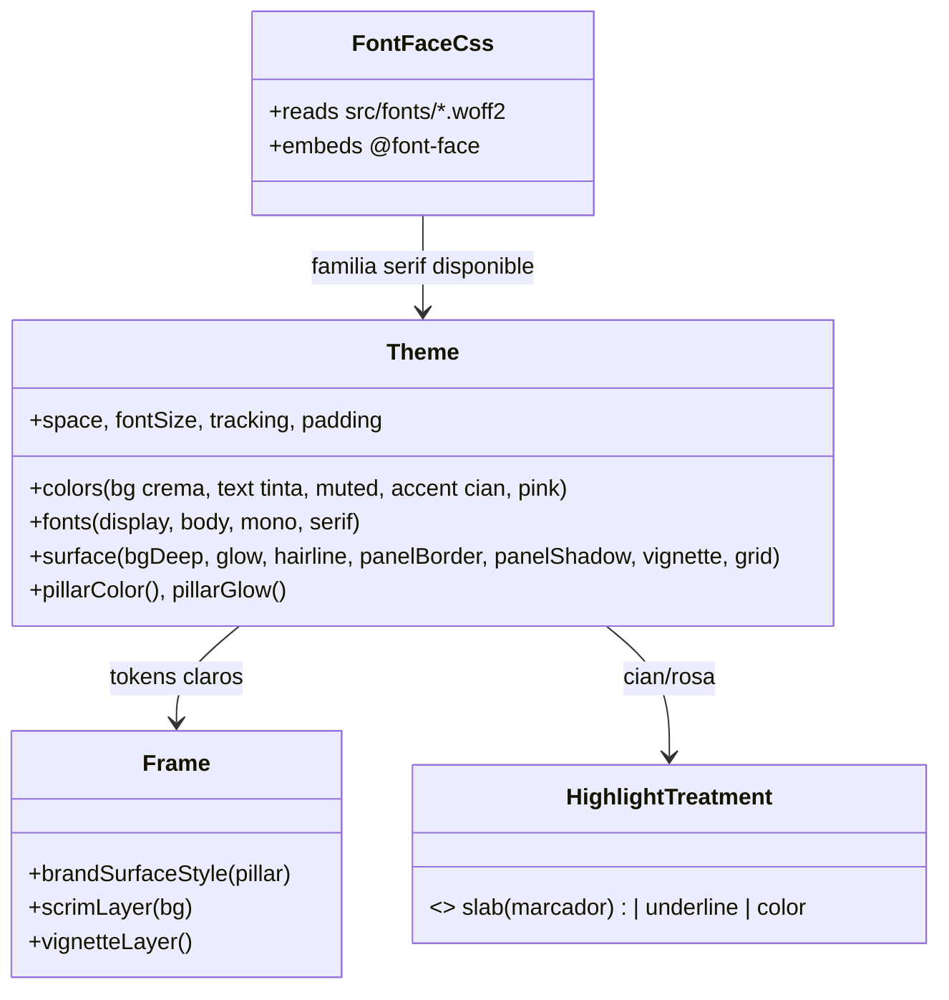

# Rebrand ia.es claro/editorial — Fundación (Iteración 1/3)

## Requirements

Reescribir la **capa de fundación** del sistema visual a la nueva identidad CLARA/editorial aprobada (Camino 3 + rosa): tema claro (crema, tinta oscura), tipografía serif (Playfair Display) + Inter, dos acentos de marca (cian #22D3EE primario, rosa #F471B5 secundario) como marcador/subrayado a mano. Cambiar VALORES de token conservando NOMBRES (cero ruptura), añadir la familia serif local, y adaptar Frame/highlight/htmlShell a claro. Las plantillas concretas se reescriben en Iteración 2; aquí solo deben seguir compilando y renderizando. Gate: `npm run typecheck` + `npm run test` verdes; `generate`/`reel`/`remix` funcionan; tipos intactos. Handle de marca = @ia.punto.es.

## Entities

Notas de conservación:
- Se cambian VALORES de `colors`/`surface`, se AÑADE `fonts.serif` y `surface.grid`; nombres de token intactos.
- `Background`/`BaseSlideProps`/`CarouselSpec` y la firma de `highlightText`/`fitDisplaySize`/`pillarColor`/`pillarGlow` NO cambian.
- `fonts.ts` no requiere cambios de código (auto-embebe los nuevos woff2).
- Las 6 plantillas NO se reescriben aquí (Iter.2); deben compilar/renderizar.

## Approach

1. **Fuente serif local (`src/fonts/` + descarga)**: bajar de Google Fonts (fonts.gstatic.com) los woff2 de Playfair Display y guardarlos como `PlayfairDisplay-600.woff2`, `PlayfairDisplay-700.woff2`, `PlayfairDisplay-800.woff2`, `PlayfairDisplay-600italic.woff2`. `fontFaceCss` los embebe automáticamente.
2. **Tokens claros (`src/theme.ts`)**: reescribir `colors` y `surface` a valores claros (manteniendo nombres), añadir `fonts.serif` y `surface.grid`. `pillarGlow` mantiene sus rgba (no romper test) pero el sistema usa cian/rosa.
3. **Shell claro (`src/render/htmlShell.ts`)**: `body background` claro; mantener grano (`--brand-grain`) y añadir `--brand-grid` (cuadrícula sutil).
4. **Frame claro (`src/templates/Frame.tsx`)**: `brandSurfaceStyle` = crema + glow tenue + grano + grilla; `scrimLayer` invertido (velo claro inferior para texto oscuro sobre imágenes); `vignetteLayer` casi nula; color de texto default = `colors.text` (tinta).
5. **Marcador (`src/templates/highlight.tsx`)**: `slab` → swash highlighter (gradiente, esquinas suaves, fondo cian/rosa, texto tinta encima); `underline` → subrayado grueso. Firma intacta.
6. **Plantillas (mínimo)**: que compilen/rendericen con tokens nuevos; si quedara texto claro-sobre-claro, ajuste mínimo (no rediseño).

## Structure

### Type relationships
1. `theme.fonts` gana `serif: "PlayfairDisplay"`; `theme.surface` gana `grid`. Resto de tokens: mismos nombres, valores claros.
2. `HighlightTreatment` sin cambios de tipo; cambia el estilo que produce `slab`/`underline`.

### Dependencies
1. `fonts.ts` → lee `src/fonts/*.woff2` (incluye los nuevos). Sin cambios de código.
2. `htmlShell.ts` → `fontFaceCss`, grano/grilla.
3. `Frame.tsx` → `theme` (colors/surface/pillarGlow).
4. `highlight.tsx` → `theme.colors`.
5. Plantillas → `theme.fonts`/`colors` (siguen consumiendo display/body; serif se usa en Iter.2).

### Layered architecture
1. **Fuentes** (`src/fonts/` + `fonts.ts`): familia serif disponible.
2. **Tokens** (`theme.ts`): identidad clara.
3. **Shell** (`htmlShell.ts`): fondo/grano/grilla claros.
4. **Frame + highlight**: superficie + marcador claros.
5. **Plantillas**: intactas (Iter.2).

## Operations

### Download - Playfair Display woff2 → src/fonts/
1. Responsibility: tener la serif local para render reproducible.
2. Pasos:
   - Obtener las URLs woff2 desde la API CSS de Google con User-Agent moderno: `https://fonts.googleapis.com/css2?family=Playfair+Display:ital,wght@0,600;0,700;0,800;1,600`.
   - Descargar cada woff2 a `src/fonts/` con naming: peso 600→`PlayfairDisplay-600.woff2`, 700→`PlayfairDisplay-700.woff2`, 800→`PlayfairDisplay-800.woff2`, italic 600→`PlayfairDisplay-600italic.woff2`.
3. Constraint: 4 archivos presentes; si la red falla, registrar y usar fallback serif del sistema (no bloquea el resto, pero el objetivo es tenerlos).

### Update - src/theme.ts (identidad clara)
1. Cambios en `colors` (mismos nombres, valores claros):
   - `bg: "#FBFAF7"`, `panel: "#FFFFFF"`, `panel2: "#F4F1EA"`, `accent: "#22D3EE"`, `violet: "#8B5CF6"`, `pink: "#F471B5"`, `green: "#1FA97A"` (verde con contraste sobre claro), `text: "#0B1020"` (tinta), `textMuted: "#5B6472"`.
2. `fonts`: añadir `serif: "PlayfairDisplay"` (mantener display/body/mono).
3. `surface`: `bgDeep: "#F1EDE3"` (crema profunda para gradiente), `glow: "rgba(34,211,238,0.10)"` (tenue), `hairline: "rgba(11,16,32,0.10)"`, `panelBorder: "rgba(11,16,32,0.08)"`, `panelShadow: "0 14px 40px rgba(11,16,32,0.08)"`, `vignette: "radial-gradient(120% 90% at 50% 45%, transparent 70%, rgba(11,16,32,0.05) 100%)"`, añadir `grid: "repeating-linear-gradient(0deg, rgba(11,16,32,0.035) 0 1px, transparent 1px 46px), repeating-linear-gradient(90deg, rgba(11,16,32,0.035) 0 1px, transparent 1px 46px)"`.
4. `pillarGlow`: mantener los rgba existentes (cian/violeta/rosa) para no romper el test; bajar a 0.10 si hace falta tenue (si se cambia el alpha, actualizar el test).
5. Constraint: no tocar nombres de token; tipos intactos.

### Update - src/render/htmlShell.ts (shell claro)
1. Cambios: `html,body{...background:#FBFAF7...}` (en vez de `#000`); mantener `--brand-grain`; añadir `--brand-grid` con el valor de grilla (o exponer `theme.surface.grid` vía Frame). Grano con opacidad apta para claro.
2. Constraint: data URIs deterministas; sin red en render.

### Update - src/templates/Frame.tsx (superficie + scrim claros)
1. Cambios:
   - `brandSurfaceStyle(pillar)`: `backgroundColor: colors.bg`; `backgroundImage`: `radial-gradient(glow pillar) , linear-gradient(180deg, bg, surface.bgDeep), var(--brand-grain)` y la grilla (`surface.grid`).
   - `scrimLayer(bg)`: para `{image}`/`overlay`, velo CLARO desde abajo: `linear-gradient(180deg, transparent 30%, rgba(251,250,247,α) 100%)` (α = overlay ?? 0.85) — protege texto OSCURO.
   - `vignetteLayer()`: usar `surface.vignette` (clarísima).
   - Color de texto default: ya usa `color ?? colors.text` (tinta) — correcto sobre claro.
2. Constraint: chip/progreso/logo/source siguen; render no sale en blanco.

### Update - src/templates/highlight.tsx (marcador highlighter)
1. Cambios en `treatmentStyle`:
   - `slab`: marcador swash → `background: linear-gradient(100deg, transparent 1%, ${color} 1.6%, ${color} 96%, transparent 97%)`, `color: theme.colors.text` (tinta encima del marcador), `padding: "0 .08em"`, `borderRadius: 4`, `boxDecorationBreak: clone`.
   - `underline`: `borderBottom: 0.12em solid ${color}`, `paddingBottom: .02em` (subrayado grueso).
   - `color`: igual.
2. Constraint: firma `highlightText(text, highlight, color, treatment?)` intacta; recibe cian o rosa.

### Update - test/smoke.ts (ajuste si cambian rgba/colores)
1. Cambios: si `pillarGlow` mantiene rgba → test intacto. Si algún assert dependiera de un color cambiado, actualizarlo. Añadir (opcional) un assert de que `theme.fonts.serif === "PlayfairDisplay"`.
2. Constraint: `npm run test` verde.

### Update - README.md (nota de identidad nueva)
1. Cambio: actualizar la sección de marca: identidad CLARA + serif (Playfair) + cian/rosa marcador + demostrativo; handle @ia.punto.es. (La descripción detallada por plantilla se completa en Iter.2.)

## Norms

1. **Tokens primero**: todo color/medida en `theme.ts`; cambiar VALORES, no nombres.
2. **Backward-compatible**: tipos y firmas intactos; solo estilos/valores cambian.
3. **Determinismo**: fuentes locales (woff2) + grano/grilla CSS; sin red en render.
4. **Contraste**: texto tinta sobre claro ≥4.5:1; marcador con texto tinta legible; scrim claro protege texto oscuro sobre imágenes.
5. **Marca**: cian (primario) + rosa (secundario); sin morado neón; verde solo semántico (realidad).
6. **Alcance**: NO reescribir plantillas (Iter.2); solo lo mínimo para compilar/renderizar.
7. **Estilo**: ESM, imports `.ts`/`.tsx`, comentarios en español.

## Safeguards

1. **Functional**: tras Iter.1, el sistema renderiza en CLARO (fondo crema + grano/grilla), la serif está disponible localmente, y el marcador `slab`/`underline` produce highlighter cian/rosa sobre tinta.
2. **Compilación/Gate**: `npm run typecheck` y `npm run test` verdes; `npm run generate` del smoke carousel NO sale en blanco (texto tinta legible).
3. **Backward-compatibility**: tipos/firmas/props intactos; carruseles existentes renderizan (se verán "a medias" hasta Iter.2, pero legibles).
4. **Fuente serif**: 4 woff2 en `src/fonts/`; si falla la descarga, fallback serif del sistema (registrar).
5. **Determinismo**: render reproducible (woff2 local, CSS estático).
6. **Marca**: paleta clara + cian/rosa; handle @ia.punto.es fijado.
7. **Integración**: cambios acotados a `src/theme.ts`, `src/render/fonts.ts` (sin cambios de código, solo se añaden fuentes), `src/render/htmlShell.ts`, `src/templates/Frame.tsx`, `src/templates/highlight.tsx`, `src/fonts/` (woff2 nuevos), `test/smoke.ts`, `README.md`. NO tocar tipos, render*, score/*, remix/*, ai/* ni las plantillas concretas.
8. **No-objetivos (Iter.2/3)**: reescritura de Hook/Lead/Step/Prompt/MythReality/Cta (Iter.2); ajustes del remix y copy demostrativo (Iter.3).
