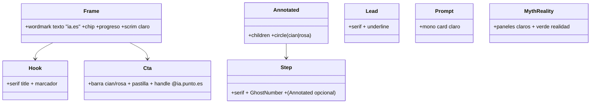

# Rebrand ia.es claro — Reescritura de plantillas (Iteración 2/3)

## Requirements
Reescribir las 6 plantillas (Hook, Lead, Step, Prompt, MythReality, Cta) al look editorial CLARO aprobado: titulares SERIF (PlayfairDisplay) mixed-case (sin uppercase/Anton), Inter para cuerpo/labels, palabra clave con MARCADOR cian/rosa, wordmark de texto "ia.es" visible sobre claro, CTA de cierre y handle @ia.punto.es. Crear el primitivo `Annotated` (tarjeta + círculo a mano). Props/tipos/contrato intactos; gate `npm run typecheck` + `npm run test` verdes; render del smoke se ve como los mockups c3.

## Entities

Notas: firmas de props intactas; `Annotated` nuevo; `theme.fonts.serif` ya existe (iter-1).

## Approach
1. **Titulares serif**: en Hook/Step/Cta/MythReality(paneles)/Prompt(heading), `fontFamily: theme.fonts.serif`, `fontWeight: 800`, sin `textTransform`, `letterSpacing: theme.tracking.tight` o normal, `lineHeight ~1.0`. `fitDisplaySize` sigue.
2. **Palabra clave**: `highlightText(text, highlight, color, "slab")` con `color` cian (primario) o rosa.
3. **Lead**: serif (puede italic para la frase), `highlightText(..., "underline")`, hairline cian.
4. **Frame wordmark**: reemplazar el div `--brand-logo` por texto "ia.es" (Inter 800, tinta, "." en cian). Progreso/chip legibles sobre claro.
5. **Annotated.tsx**: tarjeta blanca (panel + borde hairline + sombra) con un `<svg>` de círculo a mano (elipse stroke cian/rosa, rotada) superpuesto; props `{ children, circle?: "cyan"|"pink" }`.
6. **Step**: GhostNumber en serif+pilar (ya recibe color); titular serif; opcionalmente envolver el cuerpo en Annotated si se pasa (no romper StepProps → no se añade prop nueva obligatoria; Annotated queda disponible para iter-3/uso manual).
7. **Cta**: barra cian+rosa, titular serif con marcador, `reason` Inter, pastilla grande (fondo tinta, texto claro) o cian, `@${handle ?? "ia.punto.es"}` prominente (Inter 700 tinta).

## Structure
- `Annotated.tsx` (nuevo) → `theme`. 
- Hook/Lead/Step/Prompt/MythReality/Cta → `theme.fonts.serif`, `highlightText`, `theme.colors`, `theme.space`.
- Frame → wordmark texto (deja de usar `--brand-logo`).
- Sin cambios de tipos.

## Operations

### Create - src/templates/Annotated.tsx
1. `export function Annotated({ children, circle }: { children: ReactNode; circle?: "cyan"|"pink" })`.
2. Render: `
{children}{circle && <svg.../>}
`. El SVG: elipse `stroke` cian/rosa, `stroke-width 5`, `fill none`, rotada ~-3deg, posicionada abs (esquina), `pointer-events:none`.
3. Constraint: presentacional puro; no rompe nada.

### Update - src/templates/Frame.tsx (wordmark texto)
1. Reemplazar el bloque del logo (div con `backgroundImage: var(--brand-logo)`) por un `` "ia.es" (fontFamily Inter, fontWeight 800, fontSize 32, color `theme.colors.text`, con el "." en `theme.colors.accent` vía dos spans). Posición arriba-izquierda igual.
2. Progreso: color `pillar ? pillarColor(pillar) : theme.colors.textMuted` (ya); asegurar contraste sobre claro.
3. Constraint: resto de Frame intacto (scrim/viñeta/superficie de iter-1).

### Update - src/templates/Hook.tsx
1. `<h1>`: serif, weight 800, sin uppercase, `letterSpacing: theme.tracking.tight`, `lineHeight 1.0`; `highlightText(title, highlight, cyan, "slab")`. eyebrow Inter (cian/pilar). subtitle Inter muted. swipe Inter.
2. Constraint: props intactas.

### Update - src/templates/Lead.tsx
1. Frase en serif (peso 600, opcional italic), `highlightText(text, highlight, cyan, "underline")`; kicker Inter cian; hairline cian. 
2. Constraint: props intactas.

### Update - src/templates/Step.tsx
1. `heading` serif mixed-case + `highlightText(..., cyan|pink, "slab")`; `step` label Inter; GhostNumber serif+pilar (ya). Cuerpo Inter. (Annotated disponible; integración plena en iter-3.)
2. Constraint: StepProps intactas.

### Update - src/templates/Prompt.tsx
1. `heading` serif; bloque de prompt mono en tarjeta CLARA (panel blanco, borde hairline cian a la izquierda, sombra) — texto tinta. Label "COPIA ESTE PROMPT" Inter cian.
2. Constraint: PromptProps intactas.

### Update - src/templates/MythReality.tsx
1. Paneles claros (panel2 crema, borde hairline, sombra); "realidad" acento verde, "mito" apagado; textos serif para myth/reality (peso 700) mixed-case; labels Inter. GhostNumber serif+pilar (ya).
2. Constraint: props intactas.

### Update - src/templates/Cta.tsx
1. Barra cian+rosa arriba; `title` serif + `highlightText(..., cyan, "slab")`; `reason` Inter muted; pastilla grande (fondo `theme.colors.text` tinta, texto claro, o cian) con `cta ?? "📩 Link en bio"`; handle `@${handle ?? "ia.punto.es"}` Inter 700 tinta prominente.
2. Constraint: CtaProps intactas; default handle ia.punto.es.

### Update - test/smoke.ts
1. Mantener verde; (opcional) assert de que `Annotated` exporta función. Sin asserts visuales.

### Update - README.md
1. Documentar el look final por plantilla (serif claro + marcador cian/rosa + wordmark texto + CTA cierre + handle @ia.punto.es).

## Norms
1. Serif para titulares (mixed-case), Inter para cuerpo/labels; sin uppercase/Anton.
2. Marcador cian primario / rosa secundario; tinta sobre claro; verde solo "realidad".
3. Props/firmas/tipos intactos; backward-compatible.
4. Determinismo (CSS/SVG estático, fuentes locales).
5. Handle por defecto = ia.punto.es; wordmark texto "ia.es".
6. ESM, imports `.ts`/`.tsx`, comentarios en español.

## Safeguards
1. **Functional**: las 6 plantillas renderizan en serif claro con marcador cian/rosa; wordmark "ia.es" visible; CTA de cierre con handle @ia.punto.es; Annotated disponible.
2. **Tipos/contrato**: CarouselSpec/BaseSlideProps y props de cada plantilla intactos.
3. **Contraste**: tinta sobre claro y sobre marcador ≥4.5:1.
4. **Gate**: `npm run typecheck` + `npm run test` verdes; `npm run generate` del smoke se ve como mockups c3 (revisión visual).
5. **Reel**: zona segura respetada.
6. **Integración**: cambios en src/templates/* (+ Annotated nuevo), README, test. NO tocar render*/score/remix/ai/tipos.
7. **No-objetivos (iter-3)**: ajustar el remix (copy concreto + screenshots reales anotados) y regenerar el post de NotebookLM.
