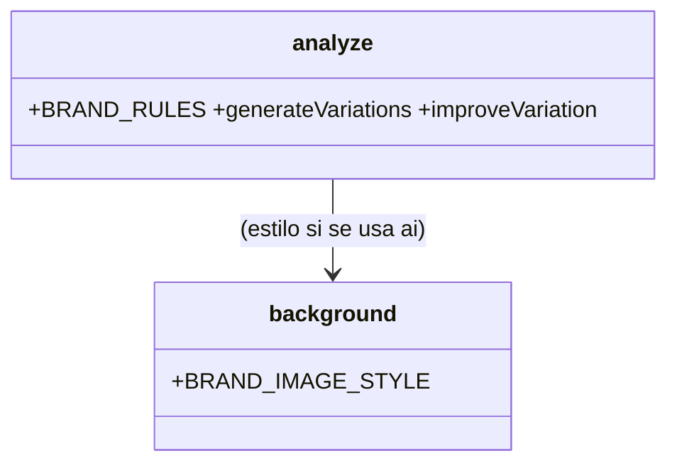

# Rebrand — Remix demostrativo (Iteración 3/3)

## Requirements
Ajustar el remix para que el CONTENIDO encaje con la identidad clara y deje de sentirse genérico: reescribir `BRAND_RULES` (copy concreto/accionable, marcador cian/rosa, sin fondos ai abstractos → superficie de marca clara) y `BRAND_IMAGE_STYLE` (claro). Regenerar el post de NotebookLM para validar. Gate `npm run typecheck` + `npm run test` verdes; tipos/firmas intactos.

## Entities

Sin cambios de tipos; solo contenido de prompts + estilo de imagen.

## Approach
1. `BRAND_RULES` → identidad clara, copy concreto (pasos/ejemplos/prompts copiables), marcador cian/rosa, default sin background (superficie de marca), handle ia.punto.es. (HECHO)
2. `BRAND_IMAGE_STYLE` → claro (crema + acentos cian/rosa). (HECHO)
3. Validación viva: regenerar NotebookLM (manual con caption real) + render; comparar con mockups c3.

## Structure
- `src/ai/analyze.ts` (BRAND_RULES) y `src/render/background.ts` (BRAND_IMAGE_STYLE): solo strings.
- Sin cambios en firmas/tipos/plantillas.

## Operations
### Update - src/ai/analyze.ts (BRAND_RULES) — HECHO
Reescrito a identidad clara + copy concreto + regla "no background.ai, usa superficie de marca".
### Update - src/render/background.ts (BRAND_IMAGE_STYLE) — HECHO
Sufijo de estilo claro (crema + cian/rosa, editorial, sin objetos).
### Validate - Regenerar NotebookLM (live)
`npm run remix -- --caption="<caption real>" --out=carousels/real` + `npm run generate` de la mejor variación; revisar visual.
### Update - README + memoria de marca (cierre)
Actualizar nota de marca a la identidad clara; registrar en memoria del proyecto.

## Norms
1. Solo contenido de prompts/estilo; sin cambios estructurales ni de tipos.
2. Copy concreto/accionable; marcador cian/rosa; sin fondos oscuros/fotográficos.
3. Determinismo y gate intactos.

## Safeguards
1. **Functional**: el remix genera copy más concreto y slides con superficie de marca clara (sin ai abstracto).
2. **Gate**: typecheck + test verdes; tipos/firmas intactos.
3. **Validación**: regenerar NotebookLM y verificar que se ve como los mockups c3.
4. **Integración**: cambios acotados a analyze.ts (BRAND_RULES) y background.ts (BRAND_IMAGE_STYLE); README/memoria al cierre. NO tocar tipos/plantillas/render.
5. **No-objetivos**: captura automática de screenshots reales por slide (queda Annotated listo para el futuro).
