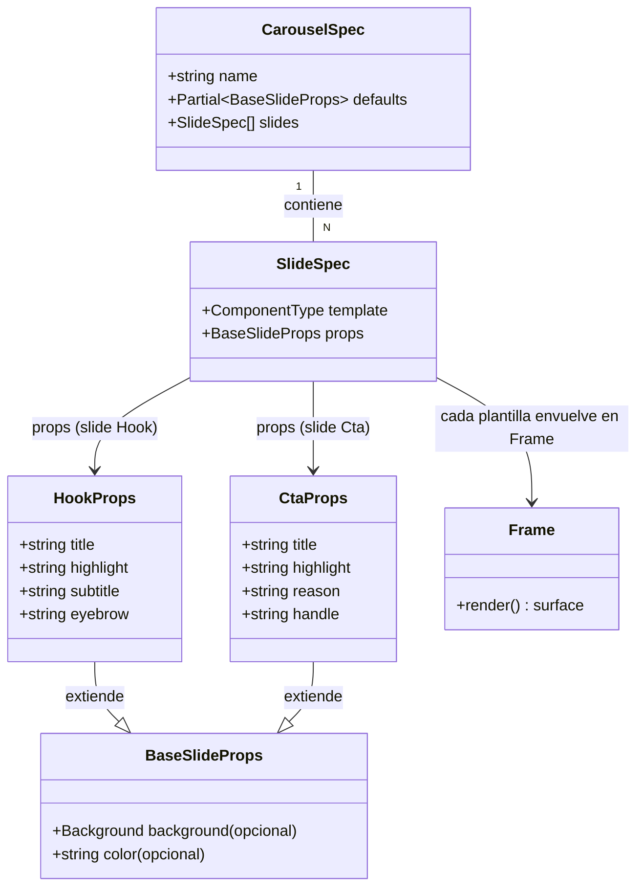

# Fix de contraste (fondos oscuros) y handle en el carrusel gold-standard

## Requirements

Restaurar la legibilidad y la corrección de marca del carrusel de referencia `carousels/ejemplo.ts` bajo la identidad CLARA (rebrand 2026-06): que TODOS sus slides usen la superficie crema de marca (texto tinta legible) y que el CTA muestre el handle correcto `@ia.punto.es`. Es una corrección de DATOS de la pieza de ejemplo; no modifica plantillas, theme ni el motor de render.

## Entities

Restricción conservadora: NO se crean ni modifican tipos/entidades. Solo cambian VALORES de props en la instancia `ejemplo.ts`. `HookProps`/`CtaProps`/`Frame`/`theme` quedan intactos.

## Approach

1. Corrección de datos (superficie de marca):
   - Quitar la prop `background` (gradiente navy) del slide Hook y del slide Cta en `carousels/ejemplo.ts`.
   - Al no declarar `background`, `Frame` aplica `brandSurfaceStyle` (crema + glow de pilar + grilla + grano), idéntico al slide Lead que ya se ve correcto.
   - Rationale: el texto es tinta oscura fija (`color ?? theme.colors.text`); un fondo oscuro rompe el contraste. La superficie de marca por defecto es la fuente de verdad de legibilidad.

2. Corrección de marca (handle):
   - Cambiar `handle: "ia.es"` → `handle: "ia.punto.es"` en el slide Cta.
   - Mantener la prop explícita (didáctico: `ejemplo.ts` es la pieza que se copia). No tocar el wordmark `ia.es` del logo en `Frame.tsx`.

3. Documentación:
   - Reescribir el comentario de cabecera desactualizado (líneas 12-17) para reflejar la identidad clara: superficie crema por defecto; los overrides válidos de `background` son `{ ai }`/`{ image }` (con scrim claro), nunca navy plano.

4. Verificación:
   - `npm run typecheck` + `npm run test` (gate) verde.
   - `npm run generate carousels/ejemplo.ts` y confirmar visualmente: slide-01 (Hook) y slide-06 (Cta) crema/legibles como slide-02; el Cta muestra `@ia.punto.es`.

## Structure

### Inheritance Relationships
1. `HookProps` y `CtaProps` extienden `BaseSlideProps` (incluye `background?`). Sin cambios.
2. Las plantillas (`Hook`, `Cta`, `Lead`) envuelven su contenido en `Frame`. Sin cambios.

### Dependencies
1. `carousels/ejemplo.ts` importa `Hook, Lead, Step, Cta` desde `src/templates/index.ts`. Sin cambios.
2. `Frame` depende de `theme` (`brandSurfaceStyle`, `backgroundStyle`). Sin cambios.
3. `renderCarousel` (`npm run generate`) consume el `CarouselSpec` de `ejemplo.ts`. Sin cambios.

### Layered Architecture
1. Capa de DATOS (contenido): `carousels/ejemplo.ts` — ÚNICO archivo que se modifica.
2. Capa de plantillas: `src/templates/*` — solo lectura, ya correcta.
3. Capa de tokens: `src/theme.ts` — solo lectura, ya correcta.
4. Capa de render: `src/render/*` — sin cambios; se usa para verificar.

## Operations

### Update Data — carousels/ejemplo.ts (slide Hook)
1. Responsibility: eliminar el fondo navy para heredar la superficie crema de marca.
2. Cambio:
   - Quitar la línea `background: { gradient: "linear-gradient(160deg,#0B1020 0%,#151D33 60%,#1C2640 100%)" },` del objeto `props` del slide `Hook`.
3. Resultado esperado: el Hook queda sin `background` → `Frame` pinta crema; titular tinta legible + `highlight` cian.

### Update Data — carousels/ejemplo.ts (slide Cta)
1. Responsibility: eliminar el fondo navy y corregir el handle.
2. Cambios:
   - Quitar la línea `background: { gradient: "linear-gradient(160deg,#0B1020 0%,#151D33 100%)" },` del `props` del slide `Cta`.
   - Cambiar `handle: "ia.es",` → `handle: "ia.punto.es",`.
3. Resultado esperado: Cta crema/legible; muestra `@ia.punto.es`.

### Update Docs — carousels/ejemplo.ts (comentario de cabecera)
1. Responsibility: reflejar la identidad clara.
2. Cambio: reescribir las líneas 12-17 del bloque de comentario:
   - Antes: "El fondo por defecto es el navy de marca; también puedes usar: { color: '#0B1020' } …".
   - Después: la superficie por defecto es la de marca (crema editorial, la pinta `Frame`); NO fijar fondos oscuros; los únicos overrides válidos son `{ ai: "…", overlay: 0.5 }` o `{ image: "ruta.png" }` (fotográficos con scrim claro).

### Verify — render + inspección
1. Correr `npm run typecheck` y `npm run test` → verde.
2. Correr `npm run generate carousels/ejemplo.ts`.
3. Leer `output/ejemplo/slide-01.png` y `slide-06.png`: fondo crema, texto legible, Cta con `@ia.punto.es`.

## Norms
1. Contenido vs. plantilla: los ajustes de una pieza concreta van en su `CarouselSpec` (`carousels/*.ts`), NO en las plantillas.
2. Fondos bajo identidad clara: por defecto NO declarar `background`; si se necesita imagen, usar `{ ai }`/`{ image }` con `overlay` (scrim claro). Prohibido `color`/`gradient` oscuros.
3. Handle de marca: siempre `ia.punto.es` (sin `@` en la prop; la plantilla antepone `@`). El wordmark `ia.es` del logo es intocable.
4. Comentarios: deben reflejar la identidad vigente; los comentarios desactualizados se corrigen junto al código.
5. Idioma/estilo: mantener el copy y comentarios existentes en español, sin reformatear lo no relacionado.

## Safeguards
1. Functional Constraints: tras el cambio, `ejemplo.ts` debe seguir teniendo 6 slides (Hook, Lead, 3×Step, Cta) con el mismo copy y el mismo `pillar: "noticia"`; solo cambian `background` (eliminado en Hook/Cta) y `handle` (Cta).
2. Alcance de archivos: SOLO se modifica `carousels/ejemplo.ts`. No tocar `src/templates/*`, `src/theme.ts` ni `src/render/*`.
3. Marca: el Cta renderiza exactamente `@ia.punto.es`; el wordmark `ia.es` (Frame.tsx:85) permanece sin cambios.
4. Contraste: ningún slide de `ejemplo.ts` debe declarar un `background` con `color`/`gradient` oscuro; todos heredan la superficie crema.
5. Integration Constraints: el `CarouselSpec` sigue exportándose por defecto y tipando contra `CarouselSpec`; compatible con `generate` y `reel`.
6. Quality Gate: `npm run typecheck` (0 errores) + `npm run test` (todos ok) + verificación visual del PNG re-renderizado.
7. Data Constraints: la prop `handle` no lleva `@` (lo añade la plantilla); el valor exacto es `ia.punto.es`.
8. Sin regresión de copy: no alterar títulos, subtítulos, pasos ni `highlight` existentes.
