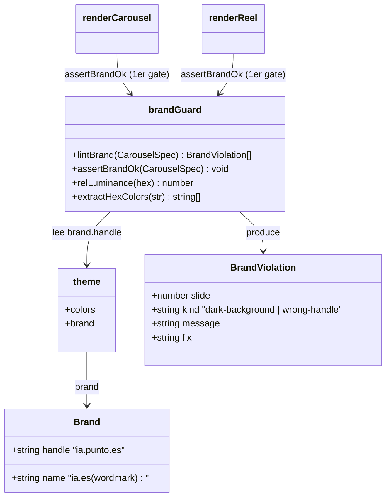

# Prevención de regresiones de marca: guard anti-fondo-oscuro + handle único

## Requirements

Hacer estructuralmente imposible shipear un carrusel que viole la identidad clara: (1) centralizar el handle de marca en una constante única (`theme.brand.handle = "ia.punto.es"`) usada por todas las plantillas y el remix; (2) un guard determinista que detecte fondos oscuros (`color`/`gradient` de baja luminancia) y handles incorrectos y **bloquee el render** (fail-closed) en `renderCarousel` y `renderReel`; (3) cobertura en el gate del repo (`npm run test`).

## Entities

Restricción conservadora: se AÑADE `theme.brand` (no se rompe nada existente) y un módulo nuevo `brandGuard.ts`. No se modifican tipos de `Background`/`BaseSlideProps`.

## Approach

1. Constante de marca (fuente de verdad):
   - Añadir `brand: { name: "ia.es", handle: "ia.punto.es" }` a `theme` en `src/theme.ts`.
   - `Cta.tsx`: `@{handle ?? theme.brand.handle}`.
   - `analyze.ts` (BRAND_RULES): interpolar `${theme.brand.handle}` en vez del literal.
   - Actualizar el comentario de cabecera desactualizado de `theme.ts` (identidad clara).

2. Guard determinista (`src/templates/brandGuard.ts`, util puro):
   - `relLuminance(hex)`: luminancia relativa WCAG de un hex (#rgb o #rrggbb).
   - `extractHexColors(str)`: extrae todos los hex de un string (color o gradiente).
   - `MIN_BG_LUMINANCE = 0.5`.
   - `lintBrand(spec)`: por cada slide, fondo efectivo = `{ ...defaults, ...props }.background`. Si es `color`/`gradient` y la stop MÁS oscura tiene luminancia < umbral → violación `dark-background`. `ai`/`image` exentos. Si `props.handle` está definido y != `theme.brand.handle` → violación `wrong-handle`. Devuelve `BrandViolation[]`.
   - `assertBrandOk(spec)`: si `lintBrand` no está vacío, imprime las violaciones y lanza Error (fail-closed, sin env de escape).
   - `printBrandViolations(name, violations)`.

3. Wire en render (fail-closed, primer gate):
   - `renderCarousel`: `assertBrandOk(spec)` antes del gate de viralidad.
   - `renderReel`: `assertBrandOk(spec)` al inicio.

4. Gate/tests (`test/smoke.ts`): luminancia; lintBrand marca dark gradient/color y wrong handle; NO marca ai/image ni handle correcto; considera defaults; `ejemplo.ts` importado → 0 violaciones.

## Structure

### Inheritance Relationships
1. `BrandViolation` es una interface plana (sin herencia).
2. `theme.brand` es un objeto literal dentro de `theme as const`.

### Dependencies
1. `brandGuard.ts` depende de `theme` (brand.handle) y de tipos `CarouselSpec`/`SlideSpec`/`Background`.
2. `renderCarousel.ts` y `renderReel.ts` dependen de `brandGuard.assertBrandOk`.
3. `Cta.tsx` y `analyze.ts` dependen de `theme.brand.handle`.

### Layered Architecture
1. Tokens: `src/theme.ts` (añade `brand`).
2. Util de marca: `src/templates/brandGuard.ts` (nuevo, puro).
3. Render: `src/render/renderCarousel.ts`, `src/reel/renderReel.ts` (invocan el guard).
4. Plantilla/remix: `src/templates/Cta.tsx`, `src/ai/analyze.ts` (usan la constante).
5. Gate: `test/smoke.ts` (tests puros).

## Operations

### Update — src/theme.ts (constante de marca + comentario)
1. Añadir dentro de `theme` (antes de `colors` o tras `fonts`) la propiedad:
   `brand: { name: "ia.es", handle: "ia.punto.es" }` con comentario: name = wordmark del logo; handle = cuenta IG (sin @).
2. Actualizar el comentario de cabecera del archivo (líneas ~3-8) de "navy + cian, Anton, 60-30-10" a la identidad clara (crema + tinta, PlayfairDisplay/Inter/JetBrainsMono, acentos cian/rosa).

### Create — src/templates/brandGuard.ts
1. Responsibility: detectar violaciones de marca en un CarouselSpec (determinista, sin render).
2. Exports:
   - `MIN_BG_LUMINANCE = 0.5`
   - `relLuminance(hex: string): number` — normaliza #rgb→#rrggbb, aplica la fórmula WCAG (linealización + 0.2126/0.7152/0.0722). Hex inválido → 1 (no marca).
   - `extractHexColors(input: string): string[]` — regex `/#([0-9a-fA-F]{6}|[0-9a-fA-F]{3})\b/g`.
   - `interface BrandViolation { slide: number; kind: "dark-background" | "wrong-handle"; message: string; fix: string }`
   - `lintBrand(spec: CarouselSpec): BrandViolation[]` — itera slides; fondo efectivo desde `{ ...spec.defaults, ...slide.props }`; para `color`/`gradient` toma `Math.min(...luminancias)`; si < umbral → dark-background. Para `handle` en props: si definido y != `theme.brand.handle` → wrong-handle. `index` 1-based.
   - `assertBrandOk(spec: CarouselSpec): void` — `const v = lintBrand(spec); if (v.length) { printBrandViolations(spec.name, v); throw new Error(...) }`.
   - `printBrandViolations(name: string, v: BrandViolation[]): void`.
3. Constraints: solo lectura del spec; no efectos colaterales salvo `console` en el printer.

### Update — src/templates/Cta.tsx (usar constante)
1. Cambiar `@{handle ?? "ia.punto.es"}` → `@{handle ?? theme.brand.handle}`.

### Update — src/ai/analyze.ts (BRAND_RULES usa constante)
1. Importar `theme` y reemplazar el literal `"ia.punto.es"` de BRAND_RULES por `${theme.brand.handle}`.

### Update — src/render/renderCarousel.ts (gate de marca)
1. Importar `assertBrandOk` de `../templates/brandGuard.ts`.
2. Al inicio de `renderCarousel`, antes del `scoreCarousel`: `assertBrandOk(spec)`.

### Update — src/reel/renderReel.ts (gate de marca)
1. Importar `assertBrandOk`.
2. Al inicio de `renderReel`, antes de renderizar: `assertBrandOk(spec)`.

### Update — test/smoke.ts (tests puros)
1. `relLuminance`: crema (#FBFAF7) alto (>0.8), tinta (#0B1020) bajo (<0.05), navy (#0B1020/#1C2640) < umbral.
2. `lintBrand`: marca un slide con `background: { gradient: navy }` (dark-background) y uno con `handle: "ia.es"` (wrong-handle); NO marca `background: { ai }`, `background: { image }`, ni `handle: "ia.punto.es"`; respeta `defaults.background`.
3. `theme.brand.handle === "ia.punto.es"`.
4. `ejemplo.ts` (import) → `lintBrand(spec).length === 0`.

### Verify — gate
1. `npm run typecheck` (0 errores).
2. `npm run test` (todos ok, incl. nuevos).
3. Sanidad: `npm run generate carousels/ejemplo.ts` renderiza (pasa el guard). Un spec con fondo navy debe lanzar y NO renderizar.

## Norms
1. Fuente de verdad: valores de marca (handle/name) viven SOLO en `theme.brand`; prohibido re-hardcodear literales.
2. Guard puro: `brandGuard.ts` no importa render ni hace I/O de archivos; solo lee el spec y `theme`.
3. Fail-closed: violaciones de marca lanzan; sin env de escape (a diferencia del gate de contenido).
4. Exención por tipo: `ai`/`image` nunca se marcan por oscuridad (llevan scrim claro).
5. Estilo: seguir el patrón de `slideText.ts` (util puro en `templates/`), comentarios en español, sin reformatear lo ajeno.

## Safeguards
1. Functional Constraints: `lintBrand` devuelve `[]` para `carousels/ejemplo.ts` (ya limpio) y para specs con solo `ai`/`image`/sin background y handle correcto.
2. `assertBrandOk` DEBE lanzar (y no renderizar) ante ≥1 violación; `renderCarousel` y `renderReel` lo invocan como primer gate.
3. Marca: el guard compara `handle` contra `theme.brand.handle` exactamente ("ia.punto.es"); el wordmark `ia.es` (Frame.tsx) no se toca.
4. Contraste: umbral `MIN_BG_LUMINANCE = 0.5`; se evalúa la stop más oscura de `color`/`gradient`.
5. Alcance de archivos: `src/theme.ts`, `src/templates/brandGuard.ts` (nuevo), `src/templates/Cta.tsx`, `src/ai/analyze.ts`, `src/render/renderCarousel.ts`, `src/reel/renderReel.ts`, `test/smoke.ts`. NO se modifican `carousels/estudiar-3-ias.ts` ni `carousels/mentiras-ia.ts` (follow-up).
6. Backward-compat: añadir `theme.brand` no rompe consumidores; `Cta`/BRAND_RULES mantienen el mismo valor renderizado.
7. Quality Gate: `npm run typecheck` + `npm run test` verde.
8. Regresión: test que fija `ejemplo.ts` en 0 violaciones (candado del fix de la iteración 1).
