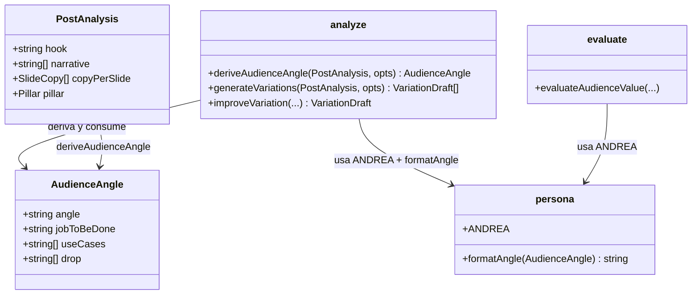

# Reencuadre a la audiencia (Andrea) como paso del proceso de remix

## Requirements

Que el remix escriba TODAS las variaciones desde el ángulo de la audiencia de la marca (persona "Andrea"), no traduciendo el post fuente. Se añade un paso previo que deriva un "ángulo para Andrea" del análisis y se inyecta ese ángulo + la persona en la generación y en la mejora. El generador pasa a usar la MISMA persona con la que juzga el gate de valor (fuente única).

## Entities

Restricción conservadora: no se tocan los tipos de plantillas ni `VariationDraft`. `AudienceAngle` y `ANDREA` son nuevos en `persona.ts`. `angle` es opcional en las firmas (retrocompat).

## Approach

1. Persona compartida (`src/ai/persona.ts`):
   - Mover `ANDREA` desde `evaluate.ts` a `persona.ts` y exportarla; `evaluate.ts` la importa.
   - `export interface AudienceAngle { angle; jobToBeDone; useCases[]; drop[] }`.
   - `export function formatAngle(a: AudienceAngle): string` — bloque de prompt puro (testeable).

2. Paso de ángulo (`analyze.ts`):
   - `deriveAudienceAngle(analysis, { es })`: llamada LLM (system = editor ia.es + `ANDREA`; user = análisis → ángulo). Reencuadra temas técnicos/ajenos a la aplicación más útil para Andrea. Degradable: si falla, el caller sigue sin ángulo.

3. Generación desde el ángulo (`analyze.ts`):
   - `generateVariations(analysis, { es, count, angle? })` e `improveVariation(analysis, draft, suggestions, { es, angle? })` inyectan `ANDREA` + `formatAngle(angle)` (si hay) + mandato: cada slide responde "¿cómo lo aplico HOY en mi trabajo (marketing pyme)?".

4. Orquestación (`remix/cli.ts`):
   - Tras `analyzePost`: `const angle = await deriveAudienceAngle(...)` (try/catch → undefined), loguearlo, pasarlo a generación y a cada `improveVariation`.

## Structure

### Inheritance Relationships
1. `AudienceAngle` interface plana. Sin herencia.

### Dependencies
1. `persona.ts` no depende de nada del dominio (solo tipos). `analyze.ts` y `evaluate.ts` dependen de `persona.ts`.
2. `analyze.deriveAudienceAngle` depende de `getClient`/`getModel` (client.ts) y `extractJson`.
3. `remix/cli.ts` depende de `deriveAudienceAngle` + firmas extendidas.

### Layered Architecture
1. Persona/tipos: `src/ai/persona.ts` (nuevo).
2. Generación IA: `src/ai/analyze.ts` (deriveAudienceAngle + inyección).
3. Evaluación IA: `src/ai/evaluate.ts` (importa ANDREA).
4. Orquestación: `src/remix/cli.ts` (deriva y threadea el ángulo).
5. Gate: `test/smoke.ts` (test puro de formatAngle + persona compartida).

## Operations

### Create — src/ai/persona.ts
1. `export const ANDREA = \`…\`` — mover el texto EXACTO desde `evaluate.ts`.
2. `export interface AudienceAngle { angle: string; jobToBeDone: string; useCases: string[]; drop: string[] }`.
3. `export function formatAngle(a: AudienceAngle): string` — devuelve un bloque:
   `ÁNGULO PARA LA AUDIENCIA (Andrea) — escribe TODAS las variaciones desde aquí, reencuadrando el tema a SU trabajo (no traduzcas el post):\n- Ángulo: …\n- Lo que Andrea logra: …\n- Casos de uso (marketing pyme): a · b\n- Suelta del original: x · y`. Arrays vacíos → "(—)".

### Update — src/ai/evaluate.ts
1. Quitar el `const ANDREA` local; `import { ANDREA } from "./persona.ts";`. Sin otros cambios de lógica.

### Update — src/ai/analyze.ts
1. `import { ANDREA, formatAngle, type AudienceAngle } from "./persona.ts";` y `extractJson` desde client.ts (si no está ya).
2. `export async function deriveAudienceAngle(analysis: PostAnalysis, opts: { es: SpanishVariant }): Promise<AudienceAngle>`:
   - system: `${ANDREA}\n\nEres estratega de contenido de ia.es: reencuadras cualquier tema de IA al mundo de Andrea. Respondes SOLO con JSON válido.`
   - user: análisis (JSON) + "Define el ÁNGULO para reencuadrar ESTE tema al trabajo de Andrea (marketing en pyme, NO técnica): job-to-be-done, 2-4 casos de uso concretos de marketing pyme, y qué del post NO le sirve (drop). Si el tema es técnico/ajeno, reencuádralo a la aplicación más útil para ella. Devuelve SOLO JSON {angle, jobToBeDone, useCases:[], drop:[]}".
   - Normaliza a `AudienceAngle` (strings/arrays con defaults) vía `extractJson`.
3. `generateVariations(analysis, { es, count, angle? })`: si `angle`, insertar `formatAngle(angle)` + `ANDREA` + mandato antes de "Genera EXACTAMENTE N…".
4. `improveVariation(analysis, draft, suggestions, { es, angle? })`: idem inyección para que la corrección conserve el ángulo.

### Update — src/remix/cli.ts
1. Importar `deriveAudienceAngle`.
2. Tras `analyzePost`: `let angle; try { angle = await deriveAudienceAngle(analysis, { es: opts.es }); console.log("   ángulo (Andrea): " + angle.angle); } catch { /* degradar */ }`.
3. `generateVariations(analysis, { es: opts.es, count: 2, angle })`.
4. En el loop: `improveVariation(analysis, best, suggestions, { es: opts.es, angle })`.

### Update — test/smoke.ts
1. `formatAngle` produce el bloque con las 4 partes y "(—)" para arrays vacíos.
2. `ANDREA` importada desde persona.ts es no vacía y menciona "Andrea" y "marketing".

### Verify — gate
1. `npm run typecheck` (0 errores).
2. `npm run test` (todos ok, incl. nuevos).

## Norms
1. Persona única: `ANDREA` vive SOLO en `persona.ts`; prohibido duplicarla.
2. `formatAngle` puro (sin I/O), para testear sin red.
3. `deriveAudienceAngle` degradable: el caller nunca rompe si falla (try/catch → undefined).
4. Retrocompat: `angle` opcional; sin `angle` el prompt es el actual.
5. Estilo: comentarios en español; no reformatear lo ajeno; mantener el shape JSON de salida de generación intacto.

## Safeguards
1. Functional: con `angle`, los prompts de generación y mejora contienen `ANDREA` + el bloque de `formatAngle`; sin `angle`, idénticos al comportamiento previo.
2. Persona compartida: existe UNA sola definición de `ANDREA` (en persona.ts); `evaluate.ts` y `analyze.ts` la importan.
3. Degradación: si `deriveAudienceAngle` lanza, el remix continúa (variaciones sin ángulo) — nunca aborta por esto.
4. Costo: el ángulo se deriva UNA vez por remix (no por variación ni por intento).
5. Backward-compat: firmas extendidas con parámetro opcional; callers existentes (tests) siguen compilando.
6. Alcance de archivos: `src/ai/persona.ts` (nuevo), `src/ai/evaluate.ts`, `src/ai/analyze.ts`, `src/remix/cli.ts`, `test/smoke.ts`. No se tocan plantillas, theme, render ni el guard.
7. Quality Gate: `npm run typecheck` + `npm run test` verde.
8. Sin cambio de salida estructural: `generateVariations`/`improveVariation` siguen devolviendo el mismo shape (`VariationDraft[]`).
